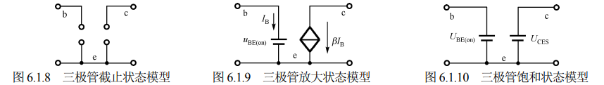

$$ \overline{\beta}\approx\frac{I_{\mathrm{C}}}{I_{\mathrm{B}}}=\frac{\left|I_{1}\right|}{\left|I_{2}\right|}=\frac{1.5}{0.03}=50 $$

## 6.1.3 三极管的共射特性曲线

图 6.1.5 所示为基本共发射极放大电路特性测试电路。图中，电源 $V_{BB}$ 和电阻 $R_{b}$ 接入基极-发射极回路，称为输入回路；电源 $V_{CC}$ 和电阻 $R_{c}$ 在集电极-发射极回路，称为输出回路。由于发射极是两个回路的公共端，故称此电路为共发射极放大电路，也称共射电路。

三极管的输入特性和输出特性曲线描述的是各电极之间电压、电流的关系，用于对三极管的性能、参数和三极管电路的分析估算。

### 1. 输入特性曲线

共发射极连接时的输入特性曲线描述了当管压降 $u_{CE}$ 为某个数值时，输入电流 $i_{B}$ 和输入电压 $u_{BE}$ 之间的关系为

$$ i_{B}=f(u_{BE})\big|_{u_{CE}= 常数 } $$

图 6.1.6 所示为测得的 NPN 型硅三极管的输入特性曲线。简单地看，输入特性曲线类似于二极管的伏安特性曲线，也有一段死区电压，只有发射结外加电压大于死区电压时，三极管才会出现 $i_{B}$。硅管的死区电压约为 0.5V，锗管的死区电压约为 0.1V。在正常工作情况下，NPN 型硅管的发射结电压 $u_{BE}$ 为 0.6～0.7V，锗管的发射结电压 $u_{BE}$ 为 0.2～0.3V。而对于 PNP 型，硅管的发射结电压 $u_{BE}$ 为 -0.6～-0.7V，锗管的发射结电压 $u_{BE}$ 为 -0.2～-0.3V。

*图 6.1.5 基本共发射极放大电路特性测试电路*

*图 6.1.6 输入特性曲线*

当 $u_{CE}=0V$ 时，相当于集电极与发射极短路，即发射结与集电结并联，其输入特性曲线相当于并联的两个二极管的正向特性。

当 $u_{CE}$ 增大时，曲线右移，也就是在相同输入电压 $u_{BE}$ 下，电流 $i_{B}$ 减小，$u_{CE}$ 的变化对曲线移动影响很小。实际上，当 $u_{CE}$ 增大到一定值后，曲线不再明显右移。$u_{CE}>1V$ 后，所有输入特性曲线基本上是重合的。

一般用 $u_{CE}=1V$ 的曲线近似表示 $u_{CE}>1V$ 的所有曲线。

### 2. 输出特性曲线

共发射极连接时的输出特性曲线描述了当输入电流 $i_{B}$ 为某一数值时，集电极电流 $i_{C}$ 与管压降 $u_{CE}$ 之间的关系，即

$$ i_{C}=f(u_{CE})\big|_{i_{B}= 常数 } $$

对于每一个确定的 $i_{B}$，都有一条曲线，所以输出特性曲线是一簇曲线，如图 6.1.7 所示。由图可以看出三极管有 3 个工作区：截止区、放大区和饱和区。

*图 6.1.7 三极管的输出特性曲线*

**（1）截止区**

$i_{B}=0$ 的曲线以下的区域称为截止区。$i_{B}=0$ 时，集电极电流用 $I_{CEO}$ 表示，其值很小，即在截止区，电流关系为

$$ i_{\mathrm{B}}=0,\quad i_{\mathrm{E}}=i_{\mathrm{C}}=I_{\mathrm{C E O}} $$

显然，三极管工作在截止区时没有电流放大能力，且各极电流近似为零，相当于开关断开状态。截止状态的直流等效模型如图 6.1.8 所示。

对于 NPN 型硅管而言，当 $u_{BE} < 0.5V$ 时，已开始截止，但是为了可靠截止，常使得 $u_{BE} \leq 0$，即截止时发射结和集电结均反偏。

**（2）放大区**

输出特性曲线的近似水平部分是放大区，也称为线性区。在放大区各极电流满足

$$ i_{c}=\beta i_{\mathrm{B}} $$

$$ i_{\mathrm{E}}=i_{\mathrm{B}}+i_{\mathrm{C}}=(1+\beta)i_{\mathrm{B}}\approx\beta i_{\mathrm{B}} $$

即 $i_{C}$ 几乎仅仅决定于 $i_{B}$，而与 $u_{CE}$ 无关，表现出 $i_{B}$ 对 $i_{C}$ 的控制作用。

如前所述，三极管工作在放大状态时，发射结正偏，集电结反偏。即对 NPN 型三极管而言，应使 $U_{BE} = U_{BE(on)}$，$U_{BC} < 0$，从电位来看，应该是 $V_C > V_B > V_E$；而对 PNP 型三极管而言，则是 $V_E > V_B > V_C$。其直流等效模型如图 6.1.9 所示，相当于 b、e 极间接一个恒压源，c、e 极间接一个 $I_B$ 控制的受控电流源 $\beta I_B$。

**（3）饱和区**

饱和区是指输出特性曲线中 $i_{C}$ 上升部分与纵轴之间的区域。在饱和区，对应于不同 $i_{B}$ 的输出特性曲线几乎重合，$i_{C}$ 不再受 $i_{B}$ 控制，只随 $u_{CE}$ 变化，即没有电流放大能力。

饱和时，发射结与集电结均处于正向偏置。在饱和状态时的 $u_{CE}$ 称为饱和压降，记做 $U_{CES}$，其值很小，对于 NPN 型硅管约为 0.3V，PNP 型锗管约为 -0.1V，若忽略不计，则三极管集电极与发射极之间相当于短路，相当于开关的闭合状态。其直流等效模型如图 6.1.10 所示，相当于在 b、e 极间接一个恒压源 $U_{BE(on)}$，c、e 极间接了一个恒压源 $U_{CES}$。

在模拟电路中，大多数情况下，应保证三极管工作在放大状态。而在开关电路或脉冲数字电路中，三极管主要工作于饱和状态或截止状态。

【例 6.1.3】有两个三极管分别接在放大电路中，已知其工作在放大区，今测得它们的引脚对地电位如图 6.1.11 所示，试判别三极管的 3 个引脚，说明是硅管还是锗管？是 NPN 还是 PNP 型三极管？

解：由前面的分析可知，判断方法如下：

（1）3 个电极的电位从低到高依次排序。

（2）中间电位对应的引脚是基极，即图 6.1.11(a) 的②脚和图 6.1.11(b) 的①脚为基极 b。

（3）与中间电位相差约一个导通电压 $U_{BE(on)}$ 的引脚是发射极 e。所以图 6.1.11(a) 的①脚和图 6.1.11(b) 的③脚为发射极。

*(a)*

*(b)*

*图 6.1.11 例 6.1.3 三极管引脚电位图*

（4）计算基极 b 与发射极 e 的电位差，确定管材料，即

$$ |V_{\mathrm{B}}-V_{\mathrm{E}}| \approx \begin{cases} 0.7 \mathrm{~V} & \text{(硅)} \\ 0.3 \mathrm{~V} & \text{(锗)} \end{cases} $$

可以判断出图 6.1.11(a) 为硅管，图 6.1.11(b) 为锗管。
