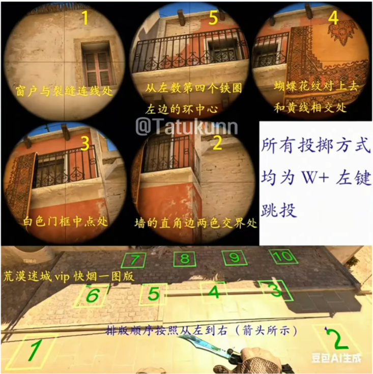
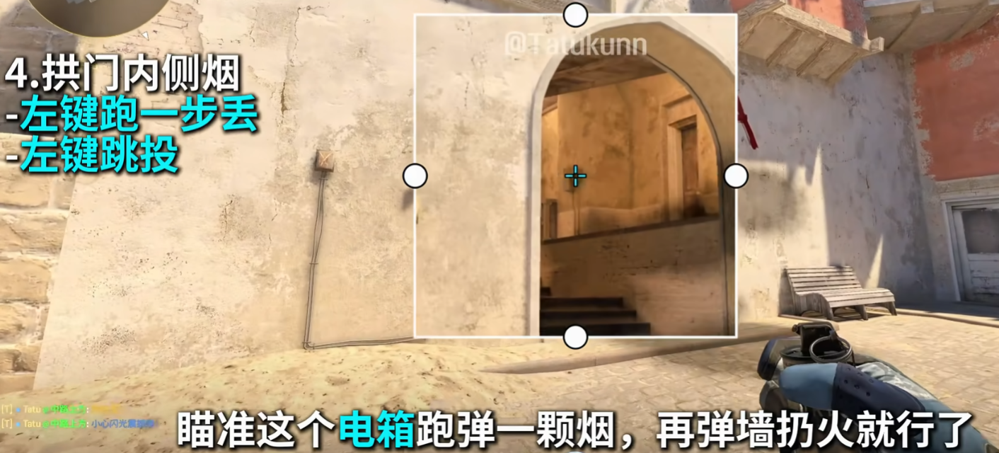

# CS2 荒漠迷城（Mirage）进攻方新手必学 10 颗道具 + 核心思路

> 适用地图：Mirage（荒漠迷城）| 立场：T（进攻方）| 难度：新手入门

---

## 一、核心战术思路

进攻方在荒漠迷城的核心逻辑：**先控中路，再打两翼**。

- **中路优先**：下水道 + 中路斜坡 + 拱门 是整张地图的控制中枢，谁拿到中路谁就掌握节奏
- **资源分配**：
  - 拱门 只需 **1~2 人** 控制（人多反而效率低，容易被道具劝退）
  - **B 小**才是重投区域，需要多人压制
  - **A 区**靠单挂 + 拱门烟掩护夹击
- **天梯默认阵型**（推荐）：**1 下水道 + 1 中路 + 1 A 区单挂 + 其余 B 小**

---

## 二、必学道具清单（按使用场景分组）

### 【VIP 区域】—— 防 VIP 直架、阻止 CT 从 VIP 跳下水道

#### 1. 最快 VIP 烟（默认必丢）


#### 2. VIP 满烟（Snax 同款，备用方案）
- 适用场景：**没有身位、不会丢最快烟**时使用
- 操作：
  1. 抵住图中位置
  2. 瞄准右上角
  3. 按 W 走到毛毯花纹的尖端
  4. 站立 → `W + 左键跳投`
- **优点**：不易被挡和混烟，容错率极高

#### 3. 拱门火（第一身位队友默认必丢）
- **作用**：阻止 CT 拱门前压、架车
- 操作：瞄准条子的下端 → **左键跑丢**
- **覆盖范围**：满烧拱门，连火台子上的敌人也能烧到

#### 4. 弹沙袋辅助闪（拱门火之后必丢）
- **作用**：致盲跳 VIP 前压、中路、跳皮小人位的 CT
- **操作要点**：**没有特定锚点**，只要弹到沙袋左边、不致盲队友即可
- **战术效果**：闪爆后中路队友同出 → 拿到沙袋 + 中坡控制权

---

### 【拱门区域】—— 1~2 人控拱门，把 CT 赶出去

#### 5. 拱门内侧烟（自助丢法，像李子）


#### 6. 拱门左边火
- 拱门内侧烟的配套火，弹墙扔出即可

> **进阶技巧**：没有火的情况下，搜完右边记得搜大远/小远左边的老六位

---

### 【VIP 跳下水道——必须警惕的点】

- 开局 VIP 跳下水道的人**经常存在**
- 天梯对面非常喜欢踩下水道
- 建议**每回合都安排像 sEnzu 一样的下水道控制位**
- 这样控中路会轻松很多

---

### 【B 小区域】—— 进攻核心突破口

#### 7. 弹沙袋伞（控完拱门后丢）
- 助队友到中坡 + B 小时，烟刚好爆开
- **省去控拱门队友丢烟的流程**，同时 A 走单也有意义
- **进阶用法**：可以学 d0nk 开局在 A 短左肩跳到拱门烟

#### 8. 跳窗闪（B 小进攻关键）
- **作用**：致盲 B 小直架和窗口架狙的人
- 操作：
  1. 抵住图中位置
  2. 瞄准黑点
  3. 左键投掷
- **使用时机**：丢完闪就要**直接跳窗下去干 B 小**，不能犹豫

#### 9. B2 上方随手闪
- 抵住位置 → 瞄准角 → 平移到棱角处，离上方还有一半距离 → 左键跳投
- 烟落到箱子上，露出的位置比较少
- 丢完烟往 B2 上方随便甩闪即可

---

### 【A 区包点】—— A 区最难处理的枪位

#### 10. 跳台下 K3 双烟（简化版，必学）
- **作用**：遮蔽跳台上下的 CT 视线
- 操作：
  1. 抵入木板
  2. 瞄准图中两个位置
  3. 左键跳投
- **特点**：速度稍慢，但**不容易混烟**，非常好用

#### 11. 进阶 Apex 跳台烟（可选）
- 抵住柱子中间
- 用警徽的右端瞄准柱子的左上角 → 左肩投掷
- 再瞄准图中位置 → 左键投掷跳台下烟
- **优点**：比 K3 更快、更方便

---

### 【A 区辅助道具】—— 单挂 A 区的道具配合

#### A2 下火
- **场景**：A 区最难处理的位置就是 A2 下 CT
- 操作：
  - **自助跑丢法**：在 A1 瞄准图中位置
  - **更自然的丢法**：在 A2 瞄准角 → 左键直接丢
- **战术价值**：可以阻止 CT 在 A2 下藏人

#### A 拱门辅助闪（进阶，遇到 AR 烟时用）
- 大概提出角门中间 → 瞄准灯柱上端 → 左键丢闪

#### 包点辅助闪（经典）
- **白近点**：瞄准两个柱子中间 → 左键跑跳头
- **白中远距离**（必须爆弹）：抵住图中位置，瞄准角平移到棱角处 → 左键跳投

---

## 三、完整进攻流程（实战打法）

### 标准开局（推荐新手）

```
第一步：丢 VIP 烟（等烟爆再出）
   ↓
第二步：位队友丢拱门火 + 弹沙袋辅助闪
   ↓
第三步：中路队友 + 下水道队友同出 → 拿沙袋/中坡控制权
   ↓
第四步：控拱门的 1~2 人丢拱门内侧烟 + 左边火 → 拱门清空
   ↓
第五步：弹沙袋伞爆开 → 队友借烟每美控制 B 小
   ↓
第六步：选择进攻路线（见下方）
```

### 控完 B 小后的三种进攻路线

| 路线 | 操作 | 适用情况 |
|------|------|----------|
| **路线一** | 下水道队友回 B2 + 队友直接进 B 小 → **夹击 B 区** | 常规进攻 B 区 |
| **路线二** | 跳上 VIP + 黑屋队友 → 控下 VIP → **夹击 A 区** | 中路控下后的标准打法 |
| **路线三** | 等拱门内层烟消散 → 投浆狗烟 + A 挂烟 → **A 拱门夹击 A 区** | A 区进攻 |

#### 浆狗烟丢法
- 瞄准柱子右边弹一下即可，非常简单

### 道具不足时的预苗顺序（小胖同款）

**没有 VIP 烟或拱门烟时的搜点路线**：

```
1. 先搜拱门右
2. 再搜 B 小
3. 走到左边再搜 VIP
4. 贴着左箱走（最好有队友帮看拱门左边防 CT 拉出偷人）
5. 贴左枪可规避拱门枪线
6. 最后搜黑屋
```

### 拱门单独搜点路线（洞口）

```
1. 搜完左边老六位
2. 跳到右边台子上走
3. 搜完左侧
4. 再贴着门右边搜浆狗
```

> **贴边走 B 小的小技巧**：只能看到小腿或小手臂，不用担心被打死

---

## 四、关键注意事项

1. **中路坡下千万别去多人**——挤在一起反而效率低
2. **B 小才是重投区域**——多去 B 小
3. **拱门只需 1~2 人控制**
4. **每回合最好安排固定人员控下水道**——防止 VIP 跳下水道偷人
5. **跳台 K3 烟容错较低**——抛物线高一点或低一点都容易呲烟，需要多练习
6. **拱门雷的额外价值**（弹幕补充）：对面有钱的话可以补一颗拱门雷，**踩火偷人必死，灭火偷人也要掉半血**
7. **2 楼下火最好让二楼上队友丢**——视角更好

---

## 五、进攻 B 区的常用道具总结（比赛级）

- B2 高闪 → 白车虎
- 跳窗闪 → 直接跳下去干 B 小
- 整体来说，**进攻 B 区的道具相对简单**，就这几个核心道具