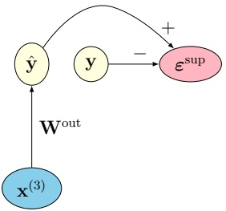

#paper
# Introduction to Predictive Coding Networks for Machine Learning
[原论文地址](https://arxiv.org/pdf/2506.06332)

*代码文件夹（本地）*：
[pcn_cifar10_notebook](file:///D:\code\pcn-intro/)

May 29, 2025

## 1 Introduction

预测编码最初用于解释视觉皮层的**非经典感受野效应**，后被推广为解释大脑皮层信息处理的统一理论框架——即通过**自由能原理**（free-energy principle）将"感知"和"行动"都归结为推理问题：生物体通过最小化"惊讶度"或"预测误差"来理解世界并作出反应。

从计算建模的角度看，预测编码网络为传统通过反向传播训练的前馈模型提供了一种替代方案。Whittington 和 Bogacz [31] 证明预测编码网络可以仅使用局部更新来逼近多层神经网络中的反向传播

预测编码也启发了无监督学习和自监督学习领域的创新。例如，Schmidhuber [25] 提出了**可预测性最小化原则**，呼应了预测编码的冗余削减目标。Lotter 等人 [15] 引入了用于视频帧预测的深度预测编码网络，利用无监督目标达到了当时的最优性能。此外，[11] 提出了”世界模型”**——一个学习智能体环境的潜在预测表征的网络——展示了层级预测和最小化惊讶度如何促进高效学习和规划。

这里引用的文献仅仅是预测编码浩瀚文献库中的一小部分样本。有兴趣的读者建议查阅这些文献的参考书目以获得更全面的覆盖，并在 arXiv 上搜索最新进展。此外，还有许多优秀的博客文章，如[17, 1]。

## 2 Network Architecture

### Model：参数说明
- 第 $l$ 层的变量记为 $\mathbf{x}^{(l)}$，是一个 $d_l$ 维的实数向量（每层的维度可以各不相同）。
- 除了 $L$ 层隐变量，还有一个**输入层** $\mathbf{x}^{(0)}$，维度为 $d_0$。

*下图的参数说明*：
1. $x^{(0)}$：输入
2. $x^{(1)} \sim x^{(3)}$：隐变量
3. $a$：预激活值（只乘以权重）
4. $\hat{x}$：预测值（经过激活函数）
5. $\varepsilon$：误差
6. 模型最终的预测值：$\hat y$
7. 标签：$y$
<div style="text-align: center;"></div>
<div style="text-align: center;color: limegreen; font-style: italic;">输出层</div>

<div style="text-align: center;"></div>
<div style="text-align: center;color: limegreen; font-style: italic;">主干网络</div>

### 具体算法

1. 每层隐变量随机初始化
2. 根据隐变量计算下层的预测值：

	• Preactivations（预激活）
$$ \mathbf{a}^{(l)}=\mathbf{W}^{(l)}\mathbf{x}^{(l+1)}\in\mathbb{R}^{d_{l}} $$
	• Predictions（$f^{(l)}$ 为非线性激活函数）
$$ \hat{\mathbf{x}}^{(l)}=f^{(l)}(\mathbf{a}^{(l)})\in\mathbb{R}^{d_{l}} $$
3. 计算误差

	• Prediction errors （隐变量 $-$ 上层的预测值）
$$ \boldsymbol{\varepsilon}^{(l)}=\mathbf{x}^{(l)}-\hat{\mathbf{x}}^{(l)}\in\mathbb{R}^{d_{l}} $$ 
最终需要最小化的损失函数就是每层误差的平方和：
$$ \mathcal{L}=\frac{1}{2}\sum_{l=0}^{L-1}\left\|\varepsilon^{(l)}\right\|^{2}. $$ 
4. 根据误差优化参数，寻找合适的隐变量和权重，具体优化方法见后文

> pcn的预测不是 从输入一步步传播到输出的
> 而是直接从最后一个隐变量输出：$\hat y = W^{out} * x^{(3)}$
> 其中最后一个隐变量 $x^{(3)}$ 在预测时 通过计算得出，而不是事先设定的


### 优化方法：交替最小化步骤

#### 1. 推理过程（inference process）
- **固定权重和输入**：暂时把权重 $\mathbf{W}$ 和输入 $\mathbf{x}^{(0)}$ 当作常量，不去改变它们。
- **推理过程（inference process）**：寻找一组最优的隐变量 $\mathbf{x}^* = (\mathbf{x}^{*(1)}, \ldots, \mathbf{x}^{*(L)})$，使得总预测误差最小。
$$ \mathbf{x}^{*}=\mathop{\operatorname{a r g}\operatorname*{m i n}}_{\mathbf{x}}\mathcal{L}(\mathbf{x};\mathbf{W},\mathbf{x}^{(0)})\;. $$
  - $\arg\min_{\mathbf{x}}$：找到使后面表达式最小的 $\mathbf{x}$ 值
  - $\mathcal{L}(\mathbf{x}; \mathbf{W}, \mathbf{x}^{(0)})$：以 $\mathbf{x}$ 为自变量，$\mathbf{W}$ 和 $\mathbf{x}^{(0)}$ 为参数的能量函数

#### 2. 学习过程（learning process）
固定隐变量，优化权重
- 梯度下降法求权重，使能量函数（损失）变得更小

通过这种方式，**推理**在一个固定的能量景观中执行下降，而**学习**则重塑该景观以更好地适应未来的推理。这种角色分工赋予了预测编码网络其标志性的双时间尺度动力学：快速推理，缓慢学习。

实践中，对于新的输入 $\mathbf{x}^{(0)}$ 和重新初始化的隐变量配置 $\mathbf{x}$，上述过程会重复执行。

**收敛性。** 已有若干工作从理论和实验上证明，预测编码网络中的交替优化过程——即先对隐变量执行推理步骤，再对生成权重进行学习更新——在充分假设条件下可收敛到损失的局部最小值 [31, 27, 7, 16, 2, 24]。并且文末的CIFAR-10应用将展示**快速收敛和良好泛化**的实例

**生成式层级结构。** 网络由堆叠的隐变量层构建而成。其思想是每一层以不同抽象层次表示数据，从原始感官输入逐步上升到更高阶的特征。预测自上而下流动（高层预测低层活动），误差自下而上流动。类似的过程被认为存在于大脑的多级感知层级中。PCN 不只是学习从输入到标签的判别映射，而是显式编码了一个关于低层活动如何由高层原因产生的生成模型，因此网络可以根据其隐变量信念，尝试重建感知数据应有的样子。

**关于混合预测编码的说明。** 在本文所介绍的算法和实现中，隐变量的初始值是随机的——无论是字面意义上还是比喻意义上。最近，一种有趣的混合预测编码模型被提出，其中隐变量 $\mathbf{x}^{(l)}$ 被初始化为另一个网络预测的值 $\boldsymbol{\xi}^{(l)}$ [29]。该第二个网络的预测沿自下而上方向流动——与 PCN 层级方向相反——通过”摊销”函数 $\mathbf{g}^{(l)} : \mathbb{R}^{d_{l-1}} \to \mathbb{R}^{d_l}$ 以前馈方式实现：$\boldsymbol{\xi}^{(l)} = \mathbf{g}^{(l)}(\boldsymbol{\xi}^{(l-1)})$，$1 \leq l \leq L$，从输入 $\boldsymbol{\xi}^{(0)} = \mathbf{x}^{(0)}$ 开始。这种构造反映了网络在接收到感官输入后，在标准 PCN 的精炼推理过程开始之前，对其后验信念的调整。本文后续部分不涉及该混合模型。

## 3 具体优化算法
>PCN也是用梯度下降的方式，但是不从全局损失计算梯度，而只是利用每层计算出的误差

### 3.1 Latent state update rule (inference)

**损失函数**（总能量）：
$$\mathcal{L} = \frac{1}{2}\sum_{l=0}^{L-1} \|\varepsilon^{(l)}\|^2 = \frac{1}{2}\sum_{l=0}^{L-1}\sum_j (\varepsilon_j^{(l)})^2$$
- *$\varepsilon^{(l)}$ 是一个向量， 而 $\varepsilon_j^{(l)}$ 则是一个具体的数值*
- 其中 $\varepsilon_j^{(l)} = x_j^{(l)} - \hat{x}_j^{(l)}$。$j$ 是当前层的维数

#### Case $1 \leq l < L$
取出含 $\mathbf{x}^{(l)}$ 的两个误差项：
$$
\begin{align}
\mathcal{L} &= \dfrac{1}{2}[(\varepsilon_i^{(l)})^2 + (\varepsilon_j^{(l-1)})^2] \\
\end{align}
$$
其中：
- $\varepsilon_i^{(l)} = x_i^{(l)} - \hat{x}_i^{(l)}$
- $\varepsilon_j^{(l-1)} = x_j^{(l-1)} - \underbrace{f^{(l-1)}(\mathbf{W}^{(l-1)}\mathbf{x}^{(l)})}_{\hat{x}_j^{(l-1)}}$

分别对两部分求导：
$$
\begin{aligned}
\frac{\partial\mathcal{L}}{\partial x_{i}^{(l)}}
&= \sum_{j}\varepsilon_{j}^{(l)}\frac{\partial\varepsilon_{j}^{(l)}}{\partial x_{i}^{(l)}} + \sum_{j}\varepsilon_{j}^{(l-1)}\frac{\partial\varepsilon_{j}^{(l-1)}}{\partial x_{i}^{(l)}} \\
&= \varepsilon_{i}^{(l)} - \sum_{j}\varepsilon_{j}^{(l-1)}\frac{\partial\hat{x}_{j}^{(l-1)}}{\partial x_{i}^{(l)}}
\end{aligned}
$$
where
$$ \begin{aligned}
\frac{\partial\hat{x}_{j}^{(l-1)}}{\partial x_{i}^{(l)}}
&=\frac{\partial}{\partial x_{i}^{(l)}}(f^{(l-1)}(a_{j}^{(l-1)}))\\
&=f^{(l-1)^{\prime}}(a_{j}^{(l-1)})W_{j i}^{(l-1)}. 
\end{aligned}
$$
总体（逐元素形式）：
$$\frac{\partial\mathcal{L}}{\partial x_{i}^{(l)}} = \varepsilon_{i}^{(l)} - \sum_{j}\varepsilon_{j}^{(l-1)} \cdot f^{(l-1)^{\prime}}(a_{j}^{(l-1)})W_{j i}^{(l-1)}$$
向量形式如下：
$$ \begin{array}{r l r}{\nabla_{\mathbf{x}^{(l)}}\mathcal{L}=\boldsymbol{\varepsilon}^{(l)}-\mathbf{W}^{(l-1)\top}\left(f^{(l-1)^{\prime}}(\mathbf{a}^{(l-1)})\odot\boldsymbol{\varepsilon}^{(l-1)}\right)}&{{}}&{(1\leq l<L)}\end{array} $$
- $\odot$：逐元素相乘 (Hadamard)
- $\mathbf{x}^{(l)}$ and $\nabla_{\mathbf{x}^{(l)}}\mathcal{L}$ have the **same shape**.

#### Case $l=L$ 
由定义知，$\varepsilon^{(L)}$ 不存在，所以在损失函数中与 $\mathbf{x}_i^{(L)}$ 有关的项只有：
$$\mathcal{L} = \dfrac{1}{2}(\varepsilon_i^{(L-1)})^2$$
Hence,
$$ \frac{\partial\mathcal{L}}{\partial x_{i}^{(L)}}=\sum_{j}\varepsilon_{j}^{(L-1)}\frac{\partial\varepsilon_{j}^{(L-1)}}{\partial x_{i}^{(L)}}=-\sum_{j}\varepsilon_{j}^{(L-1)}\frac{\partial\hat{x}_{j}^{(L-1)}}{\partial x_{i}^{(L)}}=-\sum_{j}\varepsilon_{j}^{(L-1)}f^{(L-1)^{\prime}}(a_{j}^{(L-1)})W_{j i}^{(L-1)}\;. $$ 
In vector form,
$$ \nabla_{\mathbf{x}^{(L)}}\mathcal{L}=-\mathbf{W}^{(L-1)\top}\left(f^{(L-1)^{\prime}}(\mathbf{a}^{(L-1)})\odot\boldsymbol{\varepsilon}^{(L-1)}\right) $$ 
which is similar to  $1 \leq l < L$ except for the missing first term: there is no prediction error for the top layer.

#### 合并两种情况
Introducing the convenient constant
为简化表达，设顶层误差为0：$$ \boldsymbol{\varepsilon}^{(L)}=\mathbf{0} $$the inference update rule for the gradient descent algorithm becomes compactly
两种情况即可合并为一种
$$ \begin{array}{r l r}&{}&{\left|\mathbf{x}^{(l)}\leftarrow\mathbf{x}^{(l)}-\eta_{\mathrm{i n f e r}}\left(\pmb{\varepsilon}^{(l)}-\mathbf{W}^{(l-1)\top}\left(f^{(l-1)^{\prime}}(\mathbf{a}^{(l-1)})\odot\pmb{\varepsilon}^{(l-1)}\right)\right)\right|\qquad(1\leq l\leq L)}\end{array} $$

- where  $\eta_{infer} > 0$ is an inference rate of choice.（学习率）

在推断过程中，首先利用当前网络状态计算所有预测误差和反馈项，然后才对隐变量 $\mathbf{x}^{(l)}$ 进行更新。这确保了每次更新步骤都基于一致的能量景观，并避免在同一次迭代中使用部分更新的状态。从概念上讲，这对应于一种同步更新方案，其中所有神经元都基于同一网络快照计算其下一状态。

### 3.2 Weight update rule (learning)

权重 $\mathbf{W}^{(l)}$ 只对 $\varepsilon^{(l)}$ 有影响，所以 $\mathcal{L}$ 可以简化为：
$$\mathcal{L} = \dfrac{1}{2}(\varepsilon^{(l)})^2$$
- 其中，$\boldsymbol{\varepsilon}^{(l)} = \mathbf{x}^{(l)} - f^{(l)}(\mathbf{W}^{(l)}\mathbf{x}^{(l+1)})$

所以对权重求导：
$$ \frac{\partial\mathcal{L}}{\partial W_{ij}^{(l)}}=\sum_{k}\varepsilon_{k}^{(l)}\frac{\partial\varepsilon_{k}^{(l)}}{\partial W_{ij}^{(l)}}=-\sum_{k}\varepsilon_{k}^{(l)}\frac{\partial}{\partial W_{ij}^{(l)}}(f^{(l)}(a_{k}^{(l)})) $$ 
which yields
$$ \frac{\partial\mathcal{L}}{\partial W_{i j}^{(l)}}=-\sum_{k}\varepsilon_{k}^{(l)}f^{(l)^{\prime}}(a_{k}^{(l)})\delta_{i k}x_{j}^{(l+1)}=-\varepsilon_{i}^{(l)}f^{(l)^{\prime}}(a_{i}^{(l)})x_{j}^{(l+1)}. $$ 
As before, using the convention that the matrices  $\mathbf{W}^{(l)}$ and $\nabla_{\mathbf{W}^{(l)}} \mathcal{L}$ have the same shape, we arrive at the gradient
$$ \nabla_{\mathbf{W}^{(l)}}\mathcal{L}=-\left(f^{(l)^{\prime}}(\mathbf{a}^{(l)})\odot\boldsymbol{\varepsilon}^{(l)}\right)\mathbf{x}^{(l+1)\top}\;. $$ 
In particular, the learning update rule via gradient descent is
$$ \begin{array}{r l r l}&{\left|\mathbf{W}^{(l)}\leftarrow\mathbf{W}^{(l)}+\eta_{\mathrm{l e a r n}}\left(f^{(l)^{\prime}}(\mathbf{a}^{(l)})\odot\boldsymbol{\varepsilon}^{(l)}\right)\mathbf{x}^{(l+1)\top}\right|}&&{\quad(0\leq l<L)}\end{array} $$ 
with a learning rate of  $\eta_{learn} > 0$.

Notice that the quantities
$$ \mathbf{h}^{(l)}=f^{(l)^{\prime}}(\mathbf{a}^{(l)})\odot\boldsymbol{\varepsilon}^{(l)}\qquad(0\leq l<L) $$

are central, as they appear in the expressions of the gradients with respect to both the latents and the weights. They could be called gain-modulated errors; see the subsection below.

### 3.3 Locality of the updates（更新的局部性）

预测编码最初的动机之一是其潜在的生物学合理性（biological plausibility）：即大脑可以利用局部计算实现类似于深层层级学习的功能。**局部性**（locality）通常指一个计算是否仅依赖于来自给定层及其直接相邻层的信息。这一概念对于计算效率和生物学合理性都很重要。

权重矩阵 $\mathbf{W}^{(l)}$ 的学习更新在强意义上是**局部**的：它仅依赖于第 $l+1$ 层（突触前）的局部活动 $\mathbf{x}^{(l+1)}$ 和第 $l$ 层（突触后）的局部预测误差 $\boldsymbol{\varepsilon}^{(l)}$，这使得它与 Hebbian 式可塑性机制兼容——这种机制常被概括为"一起放电的神经元，连接在一起"（neurons that fire together, wire together）。

相比之下，虽然隐变量 $\mathbf{x}^{(l)}$ 的推理更新也仅依赖于相邻层，但它需要获取从下层广播上来的误差信号 $\boldsymbol{\varepsilon}^{(l-1)}$，并经过 $\mathbf{W}^{(l-1)}$ 中自上而下权重的调制。因此，推理更新是**层级局部**（layer-local）的，但并非**神经元局部**（neuron-local）的，因为一个神经元的更新依赖于下层其他神经元误差的加权和。

从生物学角度看，学习更新 $\delta W_{ij}^{(l)} = -\eta_{\text{learn}}\varepsilon_i^{(l)}f^{(l)^{\prime}}(a_i^{(l)})x_j^{(l+1)}$ 被认为比推理更新更具合理性。这里，$\varepsilon_i^{(l)}$ 是突触后神经元 $i$ 处的预测误差，$a_i^{(l)} = \sum_m W_{im}^{(l)}x_m^{(l+1)}$ 是其预激活值，$x_j^{(l+1)}$ 是突触前神经元 $j$ 的活动。预激活表示神经元 $i$ 接收到的总突触输入——本质上是它的膜电位或驱动电流。无论是在生物神经元还是人工神经元中，这种求和都是作为神经激活的一部分自然完成的。神经元无需访问其他神经元的状态；它只需整合通过树突接收到的输入。因此，$f^{(l)^{\prime}}(a_i^{(l)})$ 可以解释为施加在神经元自身内部状态上的局部增益或非线性。这使得完整的权重更新在强意义上是**神经元局部**的：它仅依赖于神经元 $j \to i$ 之间突触可获取的信息，包括突触前活动、突触后误差以及突触后神经元的内部量。

## 4 Base Algorithms

### 4.1 Unsupervised learning in PCNs
> 无监督学习 没有输出层
> 单纯根据输入来优化参数，最终不知道输入的类别
> 比如人反复看一张图，而不告诉他这是猫还是狗。最终他只是对这张图更熟悉了，而不知道是猫还是狗

该算法在具有 $L$ 层潜变量 $\mathbf{x}^{(1)},\ldots,\mathbf{x}^{(L)}$ 的预测编码网络中实现无监督学习，其中输入变量 $\mathbf{x}^{(0)}$ 被钳制（固定）为输入数据；回顾第 1 节中的图 1。如前所述，潜变量通过迭代更新来推断，以最小化全局预测误差能量，从随机初始状态开始。每一步推断都使用网络的一致快照：在所有潜状态更新之前，先计算所有预测误差和梯度。

每一层 $l$ 接收来自第 $l+1$ 层的自上而下预测，该预测通过一个已学习的权重矩阵 $\mathbf{W}^{(l)}$ 和非线性函数 $f^{(l)}$ 传递。推断完成后，权重利用基于最终预测误差的局部 Hebbian 式学习规则进行更新。

**单样本训练（Per-sample training）**。此处描述的基础算法展示了对单个输入样本的一次完整推断-学习循环。训练过程通过在数据集上对大量样本重复此循环来进行。对每个样本，潜变量被推断一次，权重更新一次。
对于后面讨论的**小批量训练（Mini-batch training）**，推断循环可以对当前批量中的样本并行运行，随后的权重更新可以使用该批次上的平均梯度来进行。

> **训练**：先更新隐状态，后更新权重
> **推理**：更新隐状态，而不更新权重

**备注：** 该模型还支持**随时推断（anytime inference）**：对于容易预测的输入，只需更少的步骤即可收敛；而对于模糊或不确定的情况，则可以执行额外的推断步骤来改善预测结果。这种自适应特性为嵌入式或神经形态硬件部署提供了潜在的节能空间。
按照这一思路，可以对算法进行修改：设置一个足够大的最大步数 ，然后运行推断循环，直到执行了  步或检测到收敛为止。这里的收敛可以定义为，例如，所有隐变量的最新更新（或更长耐心窗口内的更新）的范数低于某个预设阈值。用机器学习的术语来说，这可以表述为**带样本级早停的推断（sample-wise early stopping）**。

### 4.2 Supervised learning extension

增加一个输出层：
$$\hat{\mathbf{y}}=\mathbf{W}^{\mathrm{out}}\mathbf{x}^{(L)}$$

where $\mathbf{W}^{\text{out}} \in \mathbb{R}^{d_{\text{out}} \times d_L}$. Given a target label $\mathbf{y} \in \mathbb{R}^{d_{\text{out}}}$, we define a **supervised error**：
$$\varepsilon^{\mathrm{sup}}=\hat{\mathbf{y}}-\mathbf{y}.$$

The loss function (energy) now becomes
$$\mathcal{L}+\mathcal{L}_{\mathrm{sup}}$$
where $\mathcal{L}_{\mathrm{sup}} = \frac{1}{2} \|\boldsymbol{\varepsilon}^{\mathrm{sup}}\|^2$ is the supervised energy.

<div style="text-align: center;"></div>

在推断过程中，监督误差会反向传播到顶层潜在表示 $\mathbf{x}^{(L)}$。这**完全不会**改变下层潜在变量 $\mathbf{x}^{(l)}$ 或生成权重 $\mathbf{W}^{(l)}$（其中 $0 \leq l < L$）的更新规则。由于 $\nabla_{\mathbf{x}^{(L)}} \mathcal{L}_{\mathrm{sup}} = \mathbf{W}^{\mathrm{out}\top} \boldsymbol{\varepsilon}^{\mathrm{sup}}$，顶层潜在变量的推断更新规则被修改为
$$\left|\mathbf{x}^{(L)}\gets\mathbf{x}^{(L)}-\eta_{\mathrm{infer}}\left(\mathbf{W}^{\mathrm{out}\top}\boldsymbol{\varepsilon}^{\mathrm{sup}}-\mathbf{W}^{(L-1)\top}\left(f^{(L-1)^{\prime}}(\mathbf{a}^{(L-1)})\odot\boldsymbol{\varepsilon}^{(L-1)}\right)\right)\right|.$$
相当于把顶层误差设置为 $\boldsymbol{\varepsilon}^{(L)} = \mathbf{W}^{\mathrm{out}\top} \boldsymbol{\varepsilon}^{\mathrm{sup}}$ （原先是0）

## 5 Application: Supervised Learning on CIFAR-10
代码文件夹（本地）：
[pcn_cifar10_notebook](file:///D:\code\pcn-intro/)

### Define latent layer
```python
class PCNLayer(nn.Module):
    def __init__(self,
                 in_dim,   # d_{l+1}  - dimension of layer above
                 out_dim,  # d_l      - dimension of current layer
                 activation_fn=torch.relu, # nonlinearity f^(l)
                 activation_deriv=lambda a: (a > 0).float() # derivative f^(l)'
                 ):
        super().__init__()
        self.W = nn.Parameter(torch.empty(out_dim, in_dim)) # W^(l)
        nn.init.xavier_uniform_(self.W)
        self.activation_fn     = activation_fn
        self.activation_deriv  = activation_deriv

    def forward(self, x_above):
        with autocast(device_type='cuda'):
            a     = x_above @ self.W.T      # A^(l) = X^(l+1) @ {W^(l)}^T
            x_hat = self.activation_fn(a)   # \hat X^(l) = f^(l)(A^(l))
            return x_hat, a
```

### Define network structure
```python
class PredictiveCodingNetwork(nn.Module):
    def __init__(self,
                 dims,        # [d_0,...,d_L]  - list of layer dimensions
                 output_dim   # d_out          - readout layer dimension
                 ):
        super().__init__()
        self.dims = dims
        self.L = len(dims) - 1            # L  - number of latent layers
        self.layers = nn.ModuleList([     # Build latent layers
            PCNLayer(in_dim=dims[l+1],    # Layer l reads from layer l+1
                     out_dim=dims[l])
            for l in range(self.L)        # l = 0,...,L-1
        ])
        # Build readout layer: maps top latent X^(L) to
        # predicted output \hat Y
        # Note: nn.Linear applies (batch, in_features) @ weight.T under the hood,
        # which corresponds exactly to X^(L) @ (W^out)^T
        self.readout = nn.Linear(dims[-1], output_dim, bias=False)


    def init_latents(self, batch_size, device):
        # returns [X^(1),...,X^(L)] as random normals
        return [
           torch.randn(batch_size, d, device=device, requires_grad=False)
           for d in self.dims[1:]
        ]

    def compute_errors(self, inputs_latents):
        # Compute predictions from input and latent variables
        # Argument: inputs_latents - list of tensors [X^(0), X^(1),...,X^(L)] shaped [(B,d_0),...,(B,d_L)]
        # Returns: two lists of tensors shaped [(B,d_0),...,(B,d_{L-1})]
        errors, gain_modulated_errors = [], []
        for l, layer in enumerate(self.layers):       # l = 0,...,L-1
            # Call to layer returns:
            #   a = X^(l+1) @ W^(l).T  (preactivations A^(l))
            #   x_hat = f^(l)(a)       (predictions \hat X^(l))
            x_hat, a  = layer(inputs_latents[l + 1])
            err       = inputs_latents[l] - x_hat # 隐藏变量 - 上层传下来的预测值
            gm_err    = err * layer.activation_deriv(a)
            errors.append(err)                               # E^(l) - prediction errors
            gain_modulated_errors.append(gm_err)             # H^(l) - gain-modulated errors
        return errors, gain_modulated_errors
```

### 计算误差
```python
# 从每个隐藏层计算
errors, gain_modulated_errors = model.compute_errors(inputs_latents)。
# 输出层单独计算（因为不过激活函数）
y_hat           = model.readout(inputs_latents[-1]) # X^(L) @ W^out.T
eps_sup         = y_hat - y_batch
eps_L           = eps_sup @ weights[-1]
errors_extended = errors + [eps_L]
```

### 更新隐变量(inference)：
```python
for l in range(1, model.L + 1):  # l=1,...,L
	# 计算梯度
	grad_Xl = errors_extended[l] - gain_modulated_errors[l-1] @ weights[l-1]
	# 更新参数
	inputs_latents[l] -= eta_infer * grad_Xl
```

### 更新权重(learning)：
```python
for l in range(model.L): # l=0,...,L-1
	# 计算梯度
	grad_Wl = -(gain_modulated_errors[l].T @ inputs_latents[l+1]) / B
	# 更新参数
	weights[l] -= eta_learn * grad_Wl
```


## References

[1] Nick Alonso. Predictive coding: A brief introduction and review for machine learning researchers, 2022. Blog post. URL: https://neuralnetnick.com/2022/12/28/.

[2] Nick Alonso, Beren Millidge, Jeff Krichmar, and Emre Neftci. A theoretical framework for inference learning. In Proceedings of the 36th International Conference on Neural Information Processing Systems, volume 36, pages 37335–37348, 2022. URL: https://dl.acm.org/doi/10.5555/3600270.3602976.

[3] Horace B. Barlow. Possible principles underlying the transformation of sensory messages. In W. A. Rosenblith, editor, Sensory Communication, pages 217–234. MIT Press, Cambridge, MA, 1961.

[4] Andre M. Bastos, W. Martin Usrey, Rick A. Adams, George R. Mangun, Pascal Fries, and Karl J. Friston. Canonical microcircuits for predictive coding. Neuron, 76(4):695–711, 2012. doi:10.1016/j.neuron.2012.10.038.

[5] C. Caucheteux, A. Gramfort, and JR King. Evidence of a predictive coding hierarchy in the human brain listening to speech. Nature Human Behaviour, 7:430–441, 2023. doi:10.1038/s41562-022-01516-2.

[6] Mike Davies, Narayan Srinivasa, Tsung-Han Lin, Gautham Chinya, Yongqiang Cao, Sri Harsha Choday, George Dimou, Harish Joshi, Nabil Imam, Shweta Jain, et al. Loihi: A neuromorphic manycore processor with on-chip learning. IEEE Micro, 38(1):82–99, 2018. doi:10.1109/MM.2018.112130359.

[7] Simon Frieder and Thomas Lukasiewicz. (Non-)Convergence results for predictive coding networks. In Kamalika Chaudhuri, Stefanie Jegelka, Le Song, Csaba Szepesvari, Gang Niu, and Sivan Sabato, editors, Proceedings of the 39th International Conference on Machine Learning, volume 162 of Proceedings of Machine Learning Research, pages 6793–6810, 2022. URL: https://proceedings.mlr.press/v162/frieder22a.html.

[8] Karl Friston. A theory of cortical responses. Philosophical Transactions of the Royal Society B: Biological Sciences, 360(1456):815–836, 2005. doi:10.1098/rstb.2005.1622.

[9] Karl Friston. The free-energy principle: a unified brain theory? Nature Reviews Neuroscience, 11(2):127–138, 2010. doi:10.1038/nrn2787.

[10] Richard L. Gregory. Perceptions as hypotheses. Philosophical Transactions of the Royal Society of London B: Biological Sciences, 290(1038):181–197, 1980. doi:10.1098/rstb.1980.0090.

[11] David Ha and Jürgen Schmidhuber. World models. CoRR, abs/1803.10122, 2018. URL: http://arxiv.org/abs/1803.10122.

[12] Hermann von Helmholtz. Treatise on Physiological Optics, Volume III: Concerning the perceptions in general. Dover, New York, 1867. Translated by J. P. C. Southall, 3rd ed., 1962.

[13] Georg B. Keller and Thomas D. Mrsic-Flogel. Predictive processing: A canonical cortical computation. Neuron, 100(2):424–435, 2018. doi:10.1016/j.neuron.2018.10.003.

[14] Alex Krizhevsky. Learning multiple layers of features from tiny images. Technical report, University of Toronto, 2009. URL: https://www.cs.toronto.edu/~kriz/learning-features-2009-TR.pdf.

[15] William Lotter, Gabriel Kreiman, and David Cox. Deep predictive coding networks for video prediction and unsupervised learning. In International Conference on Learning Representations (ICLR), 2017. URL: https://arxiv.org/abs/1605.08104.

[16] Ankur Mali, Tommaso Salvatori, and Alexander Ororbia. Tight stability, convergence, and robustness bounds for predictive coding networks. 2024. doi:10.48550/arXiv.2410.04708.

[17] Beren Millidge. Predictive coding as backprop and natural gradients, 2020. Blog post. URL: https://www.beren.io/2020-09-12-Predictive-Coding-As-Backprop-And-Natural-Gradients/.

[18] Beren Millidge, Anil K. Seth, and Christopher L. Buckley. Predictive coding: a theoretical and experimental review. 2021. URL: https://arxiv.org/abs/2107.12979.

[19] Beren Millidge, Alexander Tschantz, and Christopher L. Buckley. Predictive coding approximates backprop along arbitrary computation graphs. Neural Computation, 34:1329–1368, 2022. doi:10.1162/neco_a_01497.

[20] Monadillo. An introduction to predictive coding networks for machine learning, 2025. GitHub repository containing the following supplements to this document: Python notebook and model weights. URL: https://github.com/Monadillo/pcn-intro.

[21] David Mumford. On the computational architecture of the neocortex. ii. the role of cortico-cortical loops. Biological Cybernetics, 66(3):241–251, 1992. doi:10.1007/BF00198477.

[22] Antony W. N'dri, William Gebhardt, Céline Teulière, Fleur Zeldenrust, Rajesh P. N. Rao, Jochen Triesch, and Alexander Ororbia. Predictive coding with spiking neural networks: a survey. 2024. URL: https://arxiv.org/abs/2409.05386.

[23] Rajesh P. N. Rao and Dana H. Ballard. Predictive coding in the visual cortex: a functional interpretation of some extra-classical receptive-field effects. Nature neuroscience, 2(1):79–87, 1999. doi:10.1038/4580.

[24] Tommaso Salvatori, Yuhang Song, Yordan Yordanov, Beren Millidge, Zhenghua Xu, Lei Sha, Cornelius Emde, Rafal Bogacz, and Thomas Lukasiewicz. A stable, fast, and fully automatic learning algorithm for predictive coding networks. In International Conference on Learning Representations, 2024. doi:10.48550/arXiv.2212.00720.

[25] Jürgen Schmidhuber. Learning factorial codes by predictability minimization. Neural Computation, 4(6):863–879, 1992. doi:10.1162/neco.1992.4.6.863.

[26] Stewart Shipp. Neural elements for predictive coding. Frontiers in Psychology, 7:1792, 2016. doi:10.3389/fpsyg.2016.01792.

[27] Yuhang Song, Thomas Lukasiewicz, Zhenghua Xu, and Rafal Bogacz. Can the brain do back propagation? — exact implementation of backpropagation in predictive coding networks. In H. Larochelle, M. Ranzato, R. Hadsell, M.F. Balcan, and H. Lin, editors, Advances in Neural Information Processing Systems, volume 33, pages 22566–22579. Curran Associates, Inc., 2020. URL: https://proceedings.neurips.cc/paper_files/paper/2020/file/fec87a37cdecc1c6ecf8181c0aa2d3bf-Paper.pdf.

[28] M.W. Spratling. Reconciling predictive coding and biased competition models of cortical function. Frontiers in Computational Neuroscience, 2:4, 2008. doi:10.3389/neuro.10.004.2008.

[29] Alexander Tschantz, Beren Millidge, Anil K. Seth, and Christopher L. Buckley. Hybrid predictive coding: Inferring, fast and slow. PLOS Computational Biology, 19(8):1–31, 082023. doi:10.1371/journal.pcbi.1011280.

[30] K. S. Walsh, D. P. McGovern, A. Clark, and R. G. O'Connell. Evaluating the neurophysiological evidence for predictive processing as a model of perception. Ann N Y Acad Sci, 464(1):242–268, 3 2020. doi:10.1111/nyas.14321.

[31] James C. R. Whittington and Rafal Bogacz. An approximation of the error backpropagation algorithm in a predictive coding network with local hebbian synaptic plasticity. Neural Computation, 29:1229–1262, 2017. doi:10.1162/NECO_a_00949.

