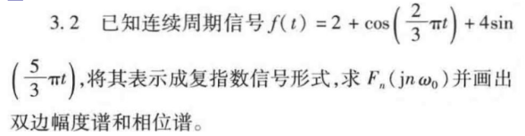
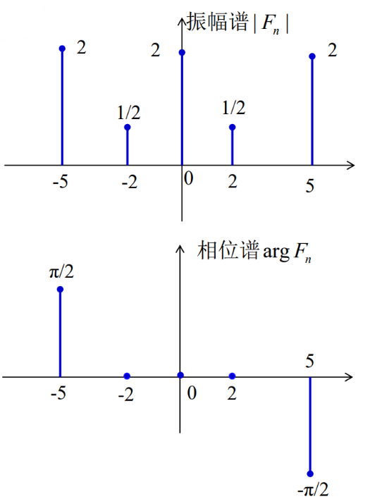

#review 


### 3.1 题解答
**题目：** 已知连续周期信号 $f(t)$ 如习图 3-1 所示，分别求其三角形式和指数形式的傅里叶级数，并粗略画出频谱图。

**分析与计算：**
从图中可以看出，这是一个周期性的矩形脉冲信号（方波）。
- 周期 $T = 2$，故基波角频率 $\omega_0 = \frac{2\pi}{T} = \pi$。
- 在一个周期 $t \in [0, 2)$ 内的表达式为：
$$ f(t) = \begin{cases} 1, & 0 \le t < 1 \\ 0, & 1 \le t < 2 \end{cases} $$

**1. 三角形式的傅里叶级数：**
- 直流分量 $a_0$：
$$ a_0 = \frac{1}{T} \int_0^T f(t) dt = \frac{1}{2} \int_0^1 1 dt = \frac{1}{2} $$
- 余弦系数 $a_n$：
$$ a_n = \frac{2}{T} \int_0^T f(t) \cos(n\omega_0 t) dt = \frac{2}{2} \int_0^1 \cos(n\pi t) dt = \left[ \frac{\sin(n\pi t)}{n\pi} \right]_0^1 = 0 $$
- 正弦系数 $b_n$：
$$ b_n = \frac{2}{T} \int_0^T f(t) \sin(n\omega_0 t) dt = \int_0^1 \sin(n\pi t) dt = \left[ -\frac{\cos(n\pi t)}{n\pi} \right]_0^1 = \frac{1 - \cos(n\pi)}{n\pi} $$
  当 $n$ 为偶数时，$b_n = 0$；当 $n$ 为奇数时，$b_n = \frac{2}{n\pi}$。
  
**三角形式级数：**
$$ f(t) = \frac{1}{2} + \sum_{k=1}^{\infty} \frac{2}{(2k-1)\pi} \sin((2k-1)\pi t) $$

**2. 指数形式的傅里叶级数：**
根据转换关系 $c_0 = a_0$，$c_n = \frac{1}{2}(a_n - jb_n)$：
- $c_0 = \frac{1}{2}$
- $c_n = -j \frac{1-\cos(n\pi)}{2n\pi}$。即 $n$ 为偶数时为 0，$n$ 为奇数时为 $-j\frac{1}{n\pi}$。
**指数形式级数：**
$$ f(t) = \frac{1}{2} + \sum_{n=-\infty, n \ne 0}^{\infty} \left( -j\frac{1-\cos(n\pi)}{2n\pi} \right) e^{jn\pi t} $$

*(频谱图画图说明：双边幅度谱在 $n=0$ 处为 $0.5$，奇数次谐波 $n$ 处幅度为 $\frac{1}{|n|\pi}$。)*

---

### 3.2 题解答


**分析与计算：**
包含两个角频率 $\omega_1 = \frac{2\pi}{3}$ 和 $\omega_2 = \frac{5\pi}{3}$。它们的最大公约数即为**基波角频率** $\Omega_0 = \frac{\pi}{3}$。
因此 $\omega_1 = 2\Omega_0$，$\omega_2 = 5\Omega_0$。
利用欧拉公式展开：
$$ \cos(2\Omega_0 t) = \frac{1}{2}e^{j2\Omega_0 t} + \frac{1}{2}e^{-j2\Omega_0 t} $$
$$ \sin(5\Omega_0 t) = \frac{1}{2j}(e^{j5\Omega_0 t} - e^{-j5\Omega_0 t}) = -\frac{j}{2}e^{j5\Omega_0 t} + \frac{j}{2}e^{-j5\Omega_0 t} $$
代入原式：
$$ f(t) = 2 + \frac{1}{2}e^{j2\Omega_0 t} + \frac{1}{2}e^{-j2\Omega_0 t} - 2je^{j5\Omega_0 t} + 2je^{-j5\Omega_0 t} $$
写成复指数形式 $f(t) = \sum F_n e^{jn\Omega_0 t}$，可得非零傅里叶系数：
- $F_0 = 2$
- $F_2 = \frac{1}{2}$, $\quad F_{-2} = \frac{1}{2}$
- $F_5 = -2j = 2e^{-j\frac{\pi}{2}}$, $\quad F_{-5} = 2j = 2e^{j\frac{\pi}{2}}$

**双边频谱数据：**


---

### 3.3 题解答


 **确定基本参数**
1. **周期**：$T = 8$
2. **基波角频率（基频）**： $\omega_0 = \frac{2\pi}{T} = \frac{2\pi}{8} = \frac{\pi}{4}\text{ rad/s}$

### 二、 展开成三角型傅里叶级数

周期信号的指数型傅里叶级数表达式为：
$$f(t) = \sum_{n=-\infty}^{\infty} F_n e^{j n \omega_0 t}$$

代入非零系数和 $\omega_0 = \frac{\pi}{4}$：
$$f(t) = F_{-3} e^{-j 3 \frac{\pi}{4} t} + F_{-1} e^{-j \frac{\pi}{4} t} + F_1 e^{j \frac{\pi}{4} t} + F_3 e^{j 3 \frac{\pi}{4} t}$$
$$f(t) = -4j e^{-j \frac{3\pi}{4} t} + 2 e^{-j \frac{\pi}{4} t} + 2 e^{j \frac{\pi}{4} t} + 4j e^{j \frac{3\pi}{4} t}$$

利用欧拉公式合并同频项：
- 对于基波项（$n=1$）：
  $$2 e^{j \frac{\pi}{4} t} + 2 e^{-j \frac{\pi}{4} t} = 2 \left( e^{j \frac{\pi}{4} t} + e^{-j \frac{\pi}{4} t} \right) = 4 \cos\left(\frac{\pi}{4} t\right)$$
- 对于三次谐波项（$n=3$）：
  $$4j e^{j \frac{3\pi}{4} t} - 4j e^{-j \frac{3\pi}{4} t} = 4j \left( e^{j \frac{3\pi}{4} t} - e^{-j \frac{3\pi}{4} t} \right) = 4j \cdot \left( 2j \sin\left(\frac{3\pi}{4} t\right) \right) = -8 \sin\left(\frac{3\pi}{4} t\right)$$

由此得到 $f(t)$ 的初级三角展开：
$$f(t) = 4 \cos\left(\frac{\pi}{4} t\right) - 8 \sin\left(\frac{3\pi}{4} t\right)$$

为了将其写成标准的三角型傅里叶级数形式：
$$f(t) = A_0 + \sum_{n=1}^{\infty} A_n \cos(n \omega_0 t + \varphi_n)$$

我们可以利用三角恒等式 $-\sin(x) = \cos\left(x + \frac{\pi}{2}\right)$，将三次谐波的正弦项转换为余弦项：
$$-8 \sin\left(\frac{3\pi}{4} t\right) = 8 \cos\left(\frac{3\pi}{4} t + \frac{\pi}{2}\right)$$

因此，**$f(t)$ 的三角型傅里叶级数展开式**为：
$$f(t) = 4 \cos\left(\frac{\pi}{4} t\right) + 8 \cos\left(\frac{3\pi}{4} t + \frac{\pi}{2}\right)$$

---

### 三、 求单边谱系数 $A_n$ 与相角 $\varphi_n$

单边幅度谱系数 $A_n$ 与相位谱系数 $\varphi_n$ 也可以通过复傅里叶系数 $F_n$ 与三角型系数的转换公式直接求得。对于 $n \ge 1$：
$$F_n = \frac{1}{2} A_n e^{j \varphi_n} \implies A_n = 2 |F_n|, \quad \varphi_n = \arg(F_n)$$

计算如下：
1. **直流分量**（$n=0$）：
   $$A_0 = F_0 = 0$$
2. **基波分量**（$n=1$）：
   $$A_1 = 2 |F_1| = 2 \times 2 = 4$$
   $$\varphi_1 = \arg(F_1) = \arg(2) = 0$$
3. **二次谐波分量**（$n=2$）：
   $$A_2 = 0$$
4. **三次谐波分量**（$n=3$）：
   $$A_3 = 2 |F_3| = 2 \times |4j| = 8$$
   $$\varphi_3 = \arg(F_3) = \arg(4j) = \frac{\pi}{2} \quad (\text{或 } 90^\circ)$$
5. **高次谐波分量**（$n \ge 4$）：
   $$A_n = 0$$

---

### 四、 单边幅度谱和相位谱图

单边频谱只画出 $n \ge 0$ （或相应正角频率 $\omega \ge 0$）的部分。横轴可以使用谐波次数 $n$，也可以使用角频率 $\omega = n\omega_0 = n \frac{\pi}{4}$。

#### 1. 单边幅度谱 $A_n$（或 $A(\omega)$）
在 $n=1$（$\omega = \frac{\pi}{4}$）处，谱线高度为 $4$；在 $n=3$（$\omega = \frac{3\pi}{4}$）处，谱线高度为 $8$；其余频点高度均为 $0$。

```text
       A_n (幅度)
        ^
      8 |                     | (n=3, w = 3pi/4)
      7 |                     |
      6 |                     |
      5 |                     |
      4 |          | (n=1,    |
      3 |          |  w=pi/4) |
      2 |          |          |
      1 |          |          |
      0 +----------+----------+-----------> n (或 w)
        0          1          3
        0        pi/4       3pi/4
```

#### 2. 单边相位谱 $\varphi_n$（或 $\varphi(\omega)$）
在 $n=1$（$\omega = \frac{\pi}{4}$）处，相位为 $0$；在 $n=3$（$\omega = \frac{3\pi}{4}$）处，相位为 $\frac{\pi}{2}$（即 $90^\circ$）。

```text
    phi_n (相位)
        ^
   pi/2 |                     | (n=3, w = 3pi/4)
        |                     |
        |                     |
      0 +----------*----------+-----------> n (或 w)
        0          1          3
        0        pi/4       3pi/4
```
*(注：对于幅度为0的频点，相位一般画为0或不画谱线)*
### 3.13题


这是图片中第 3.13 题的详细解答过程：

**题目：**
求周期信号 $f(t)$ 的傅里叶级数表达式。已知在一个周期内 $f(t) = e^{-t}, -1 < t < 1, T = 2$。

**分析与计算：**
根据题目信息，信号周期 $T = 2$，因此基波角频率为：
$$ \omega_0 = \frac{2\pi}{T} = \frac{2\pi}{2} = \pi $$

**1. 计算指数形式傅里叶级数系数 $c_n$：**
根据公式 $c_n = \frac{1}{T} \int_{-T/2}^{T/2} f(t) e^{-jn\omega_0 t} \, dt$，代入已知条件：
$$ c_n = \frac{1}{2} \int_{-1}^{1} e^{-t} e^{-jn\pi t} \, dt $$
合并指数项：
$$ c_n = \frac{1}{2} \int_{-1}^{1} e^{-(1 + jn\pi)t} \, dt $$
进行定积分计算：
$$ c_n = \frac{1}{2} \left[ \frac{-1}{1 + jn\pi} e^{-(1 + jn\pi)t} \right]_{-1}^{1} $$
$$ c_n = \frac{-1}{2(1 + jn\pi)} \left[ e^{-(1 + jn\pi)} - e^{(1 + jn\pi)} \right] $$

利用欧拉公式展开复指数部分 $e^{\pm jn\pi} = \cos(\pm n\pi) + j\sin(\pm n\pi) = (-1)^n$，可得：
$$ e^{-(1 + jn\pi)} = e^{-1} \cdot e^{-jn\pi} = e^{-1}(-1)^n $$
$$ e^{(1 + jn\pi)} = e^1 \cdot e^{jn\pi} = e(-1)^n $$

代回原式：
$$ c_n = \frac{-1}{2(1 + jn\pi)} \left[ e^{-1}(-1)^n - e(-1)^n \right] $$
提取公因式 $(-1)^n$：
$$ c_n = \frac{(-1)^n}{1 + jn\pi} \cdot \frac{e - e^{-1}}{2} $$

**2. 写出傅里叶级数表达式：**
将求得的系数代入指数形式傅里叶级数展开式 $f(t) = \sum_{n=-\infty}^{\infty} c_n e^{jn\omega_0 t}$ 中，得到最终结果：

$$ f(t) = \sum_{n=-\infty}^{\infty} \left[ \frac{(-1)^n (e - e^{-1})}{2(1 + jn\pi)} \right] e^{jn\pi t} $$
