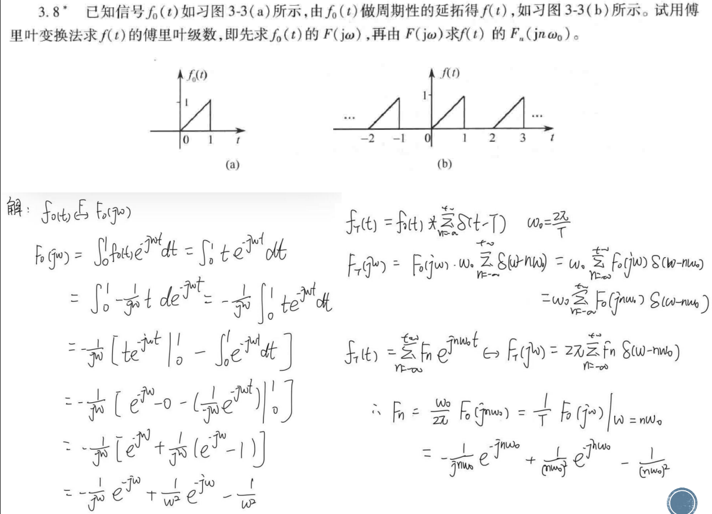

#review 

## 题2

### 第一步：求 $f_0(t)$ 的傅里叶变换 $F(j\Omega)$
从图(a)可以看出，单脉冲信号 $f_0(t)$ 的数学表达式为：
$f_0(t) = \begin{cases} t, & 0 \le t \le 1 \\ 0, & \text{其他} \end{cases}$

根据傅里叶变换的定义式：
$F(j\Omega) = \int_{-\infty}^{\infty} f_0(t) e^{-j\Omega t} dt = \int_{0}^{1} t e^{-j\Omega t} dt$

使用分部积分法求解：
$\int_{0}^{1} t e^{-j\Omega t} dt = \left[ t \cdot \frac{e^{-j\Omega t}}{-j\Omega} \right]_0^1 - \int_{0}^{1} \frac{e^{-j\Omega t}}{-j\Omega} dt$
$= -\frac{1}{j\Omega} e^{-j\Omega} + \frac{1}{j\Omega} \left[ \frac{e^{-j\Omega t}}{-j\Omega} \right]_0^1$
$= -\frac{1}{j\Omega} e^{-j\Omega} - \frac{1}{(j\Omega)^2} (e^{-j\Omega} - 1)$

因为 $(j\Omega)^2 = -\Omega^2$，代入化简得：
$$F(j\Omega) = \frac{e^{-j\Omega} - 1 + j\Omega e^{-j\Omega}}{\Omega^2}$$

### 第二步：求周期信号 $f(t)$ 的傅里叶级数 $F_n$

信号的周期为 $T = 2$，因此基频为 $\Omega_0 = \frac{2\pi}{T} = \pi$。

根据理论，周期信号的傅里叶级数系数 $F_n$ 与其单周期截断信号的傅里叶变换 $F(j\Omega)$ 之间的关系为：
$F_n = \frac{1}{T} F(j n \Omega_0)$

将 $T = 2$ 和 $\Omega_0 = \pi$ 代入，得到：
$F_n = \frac{1}{2} F(j n \pi)$

把 $F(j\Omega) = \frac{e^{-j\Omega} - 1 + j\Omega e^{-j\Omega}}{\Omega^2}$ 中 $\Omega = n\pi$ 代入（当 $n \neq 0$ 时）：
$$F_n = \frac{1}{2} \cdot \frac{e^{-jn\pi} - 1 + jn\pi e^{-jn\pi}}{(n\pi)^2}$$

利用 $e^{-jn\pi} = (-1)^n$ 继续化简：
$$F_n = \frac{(-1)^n(1 + jn\pi) - 1}{2(n\pi)^2}$$

**当 $n = 0$ 时（即直流分量）**，可以直接通过计算平均值得到：
$F_0 = \frac{1}{T} \int_{0}^{T} f(t) dt = \frac{1}{2} \int_{0}^{1} t dt = \frac{1}{2} \left[ \frac{1}{2}t^2 \right]_0^1 = \frac{1}{4}$

## 题3

### (1) 求系统的频率响应 $H(j\Omega)$ 和冲激响应 $h(t)$

**1. 求频率响应 $H(j\Omega)$**
对微分方程两边同时取傅里叶变换。根据傅里叶变换的微分性质 $\mathcal{F}[y^{(n)}(t)] = (j\Omega)^n Y(j\Omega)$，我们得到：
$$(j\Omega)^2 Y(j\Omega) + 4(j\Omega)Y(j\Omega) + 3Y(j\Omega) = F(j\Omega)$$

提取公因式 $Y(j\Omega)$：
$$[(j\Omega)^2 + 4j\Omega + 3] Y(j\Omega) = F(j\Omega)$$

系统的频率响应 $H(j\Omega)$ 定义为输出频谱与输入频谱之比：
$$H(j\Omega) = \frac{Y(j\Omega)}{F(j\Omega)} = \frac{1}{(j\Omega)^2 + 4j\Omega + 3}$$

对分母进行因式分解：
$$H(j\Omega) = \frac{1}{(j\Omega + 1)(j\Omega + 3)}$$

**2. 求冲激响应 $h(t)$**
为了求傅里叶逆变换，我们需要将 $H(j\Omega)$ 展开为部分分式：
$$\frac{1}{(j\Omega + 1)(j\Omega + 3)} = \frac{A}{j\Omega + 1} + \frac{B}{j\Omega + 3}$$
通过通分求解 $A$ 和 $B$：
$$A(j\Omega + 3) + B(j\Omega + 1) = 1$$
- 令 $j\Omega = -1$，得 $2A = 1 \implies A = \frac{1}{2}$
- 令 $j\Omega = -3$，得 $-2B = 1 \implies B = -\frac{1}{2}$

所以：
$$H(j\Omega) = \frac{1/2}{j\Omega + 1} - \frac{1/2}{j\Omega + 3}$$

根据常用傅里叶变换对 $\mathcal{F}^{-1}\left[\frac{1}{j\Omega + a}\right] = e^{-at}U(t)$，对其求傅里叶逆变换，得到冲激响应：
$$h(t) = \frac{1}{2}e^{-t}U(t) - \frac{1}{2}e^{-3t}U(t)$$

---

### (2) 若激励 $f(t) = e^{-2t}U(t)$，求系统的零状态响应 $y_f(t)$

**1. 求解输入信号的频域表达式**
已知激励 $f(t) = e^{-2t}U(t)$，对其求傅里叶变换：
$$F(j\Omega) = \frac{1}{j\Omega + 2}$$

**2. 求解输出的频域表达式 $Y_f(j\Omega)$**
根据频域乘积定理，零状态响应的频谱为：
$$Y_f(j\Omega) = H(j\Omega) F(j\Omega)$$
代入已知表达式：
$$Y_f(j\Omega) = \frac{1}{(j\Omega + 1)(j\Omega + 3)} \cdot \frac{1}{j\Omega + 2} = \frac{1}{(j\Omega + 1)(j\Omega + 2)(j\Omega + 3)}$$

**3. 部分分式展开求逆变换**
将 $Y_f(j\Omega)$ 展开为三个部分分式：
$$Y_f(j\Omega) = \frac{A}{j\Omega + 1} + \frac{B}{j\Omega + 2} + \frac{C}{j\Omega + 3}$$

使用留数法（遮挡法）快速求解常数：
- $A = \left. \frac{1}{(j\Omega + 2)(j\Omega + 3)} \right|_{j\Omega = -1} = \frac{1}{(1)(2)} = \frac{1}{2}$
- $B = \left. \frac{1}{(j\Omega + 1)(j\Omega + 3)} \right|_{j\Omega = -2} = \frac{1}{(-1)(1)} = -1$
- $C = \left. \frac{1}{(j\Omega + 1)(j\Omega + 2)} \right|_{j\Omega = -3} = \frac{1}{(-2)(-1)} = \frac{1}{2}$

因此：
$$Y_f(j\Omega) = \frac{1/2}{j\Omega + 1} - \frac{1}{j\Omega + 2} + \frac{1/2}{j\Omega + 3}$$

最后，对每一项求傅里叶逆变换，得到系统的零状态响应：
$$y_f(t) = \left( \frac{1}{2}e^{-t} - e^{-2t} + \frac{1}{2}e^{-3t} \right) U(t)$$

---

## 题4

以下是画圈题目（第2小题）的详细解答步骤：

### 1. 求系统的频率响应函数 $H(j\omega)$
对方程两边进行傅里叶变换（或令 $s = j\omega$ 代入系统函数）：
$$j\omega Y(j\omega) + 2Y(j\omega) = -j\omega F(j\omega) + 2F(j\omega)$$
提取公因式：
$$Y(j\omega)(j\omega + 2) = F(j\omega)(2 - j\omega)$$
由此可得系统的频率响应函数为：
$$H(j\omega) = \frac{Y(j\omega)}{F(j\omega)} = \frac{2 - j\omega}{2 + j\omega}$$

### 2. 分解激励信号并计算各分量的响应
激励信号 $f(t) = 3 + \cos(2t)$ 可以看作是由直流分量（$\omega = 0$）和交流分量（$\omega = 2$）组成的。我们分别计算这两部分的响应。

**① 直流分量：$f_1(t) = 3$ （此时频率 $\omega = 0$）**
将 $\omega = 0$ 代入 $H(j\omega)$：
$$H(j0) = \frac{2 - j0}{2 + j0} = \frac{2}{2} = 1$$
所以，直流分量引起的稳态响应为：
$$y_{ss1}(t) = 3 \times H(j0) = 3 \times 1 = 3$$

**② 交流分量：$f_2(t) = \cos(2t)$ （此时频率 $\omega = 2$）**
将 $\omega = 2$ 代入 $H(j\omega)$：
$$H(j2) = \frac{2 - j2}{2 + j2}$$
为了求出其幅度和相位，我们进行复数化简（分子分母同乘共轭复数）：
$$H(j2) = \frac{(2 - j2)^2}{(2 + j2)(2 - j2)} = \frac{4 - j8 - 4}{2^2 + 2^2} = \frac{-j8}{8} = -j$$
复数 $-j$ 可以表示为极坐标形式：
*   幅度 $|H(j2)| = 1$
*   相位 $\angle H(j2) = -\frac{\pi}{2}$

所以，交流分量引起的稳态响应为：
$$y_{ss2}(t) = 1 \times \cos\left(2t - \frac{\pi}{2}\right) = \sin(2t)$$

### 3. 叠加求全响应
根据线性系统的叠加定理，系统的总稳态响应 $y_{ss}(t)$ 等于各分量响应之和：
$$y_{ss}(t) = y_{ss1}(t) + y_{ss2}(t)$$
$$y_{ss}(t) = 3 + \sin(2t)$$
