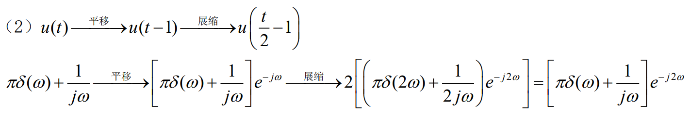
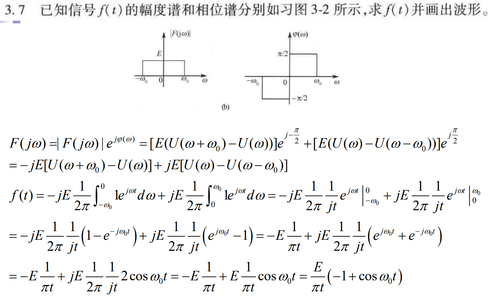
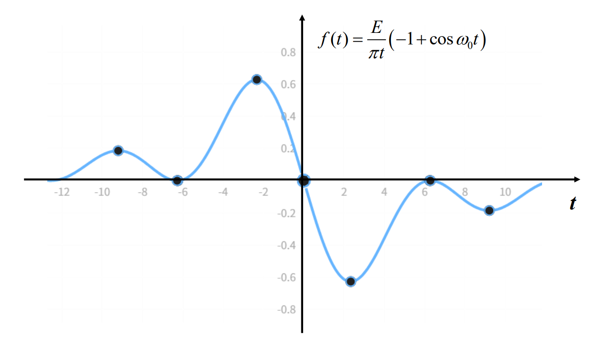
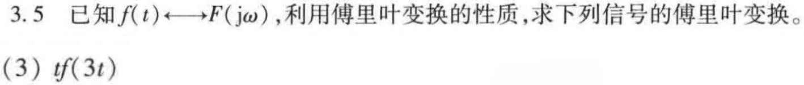

## 题1

这里为您提供该图片中各小题的详细求解步骤和傅里叶变换结果。

我们将采用傅里叶变换的标准定义：
$$F(\omega) = \mathcal{F}\{f(t)\} = \int_{-\infty}^{\infty} f(t) e^{-j\omega t} dt$$

---

### **(1) 求解 $f_1(t) = e^{-3t}[U(t+2) - U(t-3)]$**

**分析：**
信号 $U(t+2) - U(t-3)$ 是一个在 $[-2, 3)$ 区间内为 $1$，其余地方为 $0$ 的矩形窗函数。因此，积分区间被限制在 $[-2, 3]$。

**计算步骤：**
$$F_1(\omega) = \int_{-2}^{3} e^{-3t} e^{-j\omega t} \, dt = \int_{-2}^{3} e^{-(3+j\omega)t} \, dt$$

计算该定积分：
$$F_1(\omega) = \left[ \frac{e^{-(3+j\omega)t}}{-(3+j\omega)} \right]_{-2}^{3}$$
$$F_1(\omega) = -\frac{1}{3+j\omega} \left( e^{-3(3+j\omega)} - e^{-(-2)(3+j\omega)} \right)$$
$$F_1(\omega) = \frac{e^{6+2j\omega} - e^{-9-3j\omega}}{3+j\omega}$$

---

### **(2) 求解 $f_2(t) = U(t/2 - 1)$**

$$\delta(a\omega) = \frac{1}{|a|}\delta(\omega)$$
$$\delta(2\omega) = \frac{1}{2}\delta(\omega)$$

**分析：**
首先简化阶跃信号的自变量：
$$t/2 - 1 \ge 0 \implies t \ge 2$$
因此，该信号等价于时延后的单位阶跃信号：
$$f_2(t) = U(t-2)$$

**计算步骤：**
已知单位阶跃信号 $U(t)$ 的傅里叶变换为：
$$\mathcal{F}\{U(t)\} = \pi \delta(\omega) + \frac{1}{j\omega}$$

根据时移性质 $\mathcal{F}\{g(t-t_0)\} = G(\omega)e^{-j\omega t_0}$，此处 $t_0 = 2$：
$$F_2(\omega) = \left( \pi \delta(\omega) + \frac{1}{j\omega} \right) e^{-j2\omega}$$

利用冲激函数的性质 $g(\omega)\delta(\omega) = g(0)\delta(\omega)$，可得 $e^{-j2(0)}\delta(\omega) = \delta(\omega)$。将其展开化简为：
$$F_2(\omega) = \pi \delta(\omega) + \frac{e^{-j2\omega}}{j\omega}$$

---

### **(4) 求解 $f_4(t) = e^{-jt}\delta(t-2)$**

**分析：**
根据冲激函数的相乘性质 $g(t)\delta(t-t_0) = g(t_0)\delta(t-t_0)$，在此处 $t_0 = 2$：
$$f_4(t) = e^{-j(2)}\delta(t-2) = e^{-j2}\delta(t-2)$$

**计算步骤：**
由于 $e^{-j2}$ 是常数，且已知单位冲激时延信号的傅里叶变换为 $\mathcal{F}\{\delta(t-2)\} = e^{-j2\omega}$，因此：
$$F_4(\omega) = e^{-j2} \cdot e^{-j2\omega} = e^{-j2(\omega+1)}$$

---

### **(5) 求解 $f_5(t) = e^{-2(t-1)}U(t)$**

**分析：**
将指数部分展开：
$$f_5(t) = e^{-2t + 2} U(t) = e^2 \cdot e^{-2t} U(t)$$

**计算步骤：**
已知单边指数信号的傅里叶变换公式为：
$$\mathcal{F}\{e^{-at}U(t)\} = \frac{1}{a + j\omega} \quad (\text{其中 } a > 0)$$

在此处 $a = 2$，常数系数为 $e^2$：
$$F_5(\omega) = e^2 \cdot \frac{1}{2 + j\omega} = \frac{e^2}{2+j\omega}$$

---

### **(6) 求解 $f_6(t) = e^{-2(t-1)}\delta(t-1)$**

**分析：**
同样利用冲激函数的相乘性质 $g(t)\delta(t-t_0) = g(t_0)\delta(t-t_0)$，此处 $t_0 = 1$：
$$f_6(t) = e^{-2(1-1)}\delta(t-1) = e^0 \delta(t-1) = \delta(t-1)$$

**计算步骤：**
信号简化为 $\delta(t-1)$，直接进行傅里叶变换：
$$F_6(\omega) = e^{-j\omega}$$

## 题2

### 1. 确定频谱函数 $F(j\omega)$

根据习图 3-2 所示的幅度谱 $|F(j\omega)|$ 和相位谱 $\varphi(\omega)$，可以写出它们在频域的数学表达式：

* **幅度谱：**
  $$|F(j\omega)| = \begin{cases} E, & -\omega_0 \le \omega \le \omega_0 \\ 0, & \text{其他} \end{cases}$$

* **相位谱：**
  $$\varphi(\omega) = \begin{cases} \frac{\pi}{2}, & 0 < \omega \le \omega_0 \\ -\frac{\pi}{2}, & -\omega_0 \le \omega < 0 \\ 0, & \text{其他} \end{cases}$$

根据复数形式的频谱公式 $F(j\omega) = |F(j\omega)| e^{j \varphi(\omega)}$，将上述两式结合：
* 当 $0 < \omega \le \omega_0$ 时：
  $$F(j\omega) = E e^{j \pi/2} = jE$$
* 当 $-\omega_0 \le \omega < 0$ 时：
  $$F(j\omega) = E e^{-j \pi/2} = -jE$$
* 当 $|\omega| > \omega_0$ 时：
  $$F(j\omega) = 0$$

因此，$F(j\omega)$ 可以表示为：
$$F(j\omega) = \begin{cases} jE, & 0 < \omega \le \omega_0 \\ -jE, & -\omega_0 \le \omega < 0 \\ 0, & \text{其他} \end{cases}$$

---

### 2. 求解时域信号 $f(t)$

利用傅里叶逆变换定义式：
$$f(t) = \frac{1}{2\pi} \int_{-\infty}^{\infty} F(j\omega) e^{j\omega t} d\omega$$

将 $F(j\omega)$ 带入积分：
$$f(t) = \frac{1}{2\pi} \left[ \int_{-\omega_0}^{0} (-jE) e^{j\omega t} d\omega + \int_{0}^{\omega_0} (jE) e^{j\omega t} d\omega \right]$$

分别计算这两部分积分：
* 第一部分：
  $$\int_{-\omega_0}^{0} (-jE) e^{j\omega t} d\omega = -jE \left[ \frac{e^{j\omega t}}{jt} \right]_{-\omega_0}^{0} = -\frac{E}{t} (1 - e^{-j\omega_0 t})$$
* 第二部分：
  $$\int_{0}^{\omega_0} (jE) e^{j\omega t} d\omega = jE \left[ \frac{e^{j\omega t}}{jt} \right]_{0}^{\omega_0} = \frac{E}{t} (e^{j\omega_0 t} - 1)$$

将两部分相加并代入原式：
$$f(t) = \frac{1}{2\pi} \cdot \frac{E}{t} \left( e^{j\omega_0 t} + e^{-j\omega_0 t} - 2 \right)$$

根据欧拉公式 $e^{j\omega_0 t} + e^{-j\omega_0 t} = 2 \cos(\omega_0 t)$，上式可化简为：
$$f(t) = \frac{E}{2\pi t} \left( 2 \cos(\omega_0 t) - 2 \right) = \frac{E}{\pi t} \left( \cos(\omega_0 t) - 1 \right)$$

### 3. 波形分析与绘制

## 题3

### 方法一：先利用尺度变换性质，再利用时域相乘性质

1. **尺度变换性质（Time-Scaling Property）：**
   若已知 $f(t) \longleftrightarrow F(j\omega)$，根据尺度变换性质：
   $$f(at) \longleftrightarrow \frac{1}{|a|} F\left(j\frac{\omega}{a}\right)$$
   令 $a = 3$，可得：
   $$f(3t) \longleftrightarrow \frac{1}{3} F\left(j\frac{\omega}{3}\right)$$

2. **频域微分性质（时域乘以 $t$）：**
   根据时域乘以 $t$ 的性质：
   $$t x(t) \longleftrightarrow j \frac{\mathrm{d}}{\mathrm{d}\omega} X(j\omega)$$
   在此处，我们设 $x(t) = f(3t)$，对应的 $X(j\omega) = \frac{1}{3} F\left(j\frac{\omega}{3}\right)$。
   
   因此，信号 $t f(3t)$ 的傅里叶变换为：
   $$\mathcal{F}\{t f(3t)\} = j \frac{\mathrm{d}}{\mathrm{d}\omega} \left[ \frac{1}{3} F\left(j\frac{\omega}{3}\right) \right]$$

3. **求导计算（链式法则）：**
   设 $F'(j\omega) = \frac{\mathrm{d}}{\mathrm{d}\omega} F(j\omega)$。根据复合函数求导法则，对 $F\left(j\frac{\omega}{3}\right)$ 关于 $\omega$ 求导时，需要乘以自变量的导数 $\frac{1}{3}$：
   $$\mathcal{F}\{t f(3t)\} = j \cdot \frac{1}{3} \cdot \left[ \frac{1}{3} F'\left(j\frac{\omega}{3}\right) \right] = \frac{j}{9} F'\left(j\frac{\omega}{3}\right)$$

---

### 方法二：先利用频域微分性质，再利用尺度变换性质

1. **引入辅助信号：**
   设辅助信号 $g(t) = t f(t)$。根据频域微分性质，其傅里叶变换为：
   $$g(t) = t f(t) \longleftrightarrow G(j\omega) = j \frac{\mathrm{d}}{\mathrm{d}\omega} F(j\omega)$$

2. **变形待求信号：**
   将待求信号 $t f(3t)$ 写成关于 $g(t)$ 的形式：
   $$t f(3t) = \frac{1}{3} \big[ 3t f(3t) \big] = \frac{1}{3} g(3t)$$

3. **进行尺度变换：**
   因为 $g(t) \longleftrightarrow G(j\omega)$，根据尺度变换性质：
   $$g(3t) \longleftrightarrow \frac{1}{3} G\left(j\frac{\omega}{3}\right)$$
   所以有：
   $$\mathcal{F}\{t f(3t)\} = \mathcal{F}\left\{ \frac{1}{3} g(3t) \right\} = \frac{1}{3} \cdot \left[ \frac{1}{3} G\left(j\frac{\omega}{3}\right) \right] = \frac{1}{9} G\left(j\frac{\omega}{3}\right)$$

4. **代回辅助信号的变换：**
   将 $G(j\omega) = j \frac{\mathrm{d}}{\mathrm{d}\omega} F(j\omega)$ 代入上式（即将变量 $\omega$ 替换为 $\frac{\omega}{3}$）：
   $$\mathcal{F}\{t f(3t)\} = \frac{j}{9} \left. \frac{\mathrm{d} F(j\Omega)}{\mathrm{d}\Omega} \right|_{\Omega = \frac{\omega}{3}}$$

---

### 最终结果
两种方法所得结果一致，信号 $t f(3t)$ 的傅里叶变换为：
$$\mathcal{F}\{t f(3t)\} = \frac{j}{9} F'\left(j\frac{\omega}{3}\right)$$
*(其中 $F'(j\omega) = \frac{\mathrm{d} F(j\omega)}{\mathrm{d}\omega}$)*