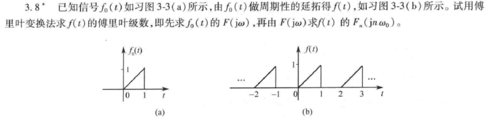

## 题2

### 第一步：求 $f_0(t)$ 的傅里叶变换 $F(j\Omega)$
从图(a)可以看出，单脉冲信号 $f_0(t)$ 的数学表达式为：
$f_0(t) = \begin{cases} t, & 0 \le t \le 1 \\ 0, & \text{其他} \end{cases}$

根据傅里叶变换的定义式：
$F(j\Omega) = \int_{-\infty}^{\infty} f_0(t) e^{-j\Omega t} dt = \int_{0}^{1} t e^{-j\Omega t} dt$

使用分部积分法求解：
$\int_{0}^{1} t e^{-j\Omega t} dt = \left[ t \cdot \frac{e^{-j\Omega t}}{-j\Omega} \right]_0^1 - \int_{0}^{1} \frac{e^{-j\Omega t}}{-j\Omega} dt$
$= -\frac{1}{j\Omega} e^{-j\Omega} + \frac{1}{j\Omega} \left[ \frac{e^{-j\Omega t}}{-j\Omega} \right]_0^1$
$= -\frac{1}{j\Omega} e^{-j\Omega} - \frac{1}{(j\Omega)^2} (e^{-j\Omega} - 1)$

因为 $(j\Omega)^2 = -\Omega^2$，代入化简得：
$$F(j\Omega) = \frac{e^{-j\Omega} - 1 + j\Omega e^{-j\Omega}}{\Omega^2}$$

### 第二步：求周期信号 $f(t)$ 的傅里叶级数 $F_n$

信号的周期为 $T = 2$，因此基频为 $\Omega_0 = \frac{2\pi}{T} = \pi$。

>根据理论，周期信号的傅里叶级数系数 $F_n$ 与其单周期截断信号的傅里叶变换 $F(j\Omega)$ 之间的关系为：
$F_n = \frac{1}{T} F(j n \Omega_0)$

将 $T = 2$ 和 $\Omega_0 = \pi$ 代入，得到：
$F_n = \frac{1}{2} F(j n \pi)$

把 $F(j\Omega) = \frac{e^{-j\Omega} - 1 + j\Omega e^{-j\Omega}}{\Omega^2}$ 中 $\Omega = n\pi$ 代入（当 $n \neq 0$ 时）：
$$F_n = \frac{1}{2} \cdot \frac{e^{-jn\pi} - 1 + jn\pi e^{-jn\pi}}{(n\pi)^2}$$

利用 $e^{-jn\pi} = (-1)^n$ 继续化简：
$$F_n = \frac{(-1)^n(1 + jn\pi) - 1}{2(n\pi)^2}$$

**当 $n = 0$ 时（即直流分量）**，可以直接通过计算平均值得到：
$F_0 = \frac{1}{T} \int_{0}^{T} f(t) dt = \frac{1}{2} \int_{0}^{1} t dt = \frac{1}{2} \left[ \frac{1}{2}t^2 \right]_0^1 = \frac{1}{4}$
