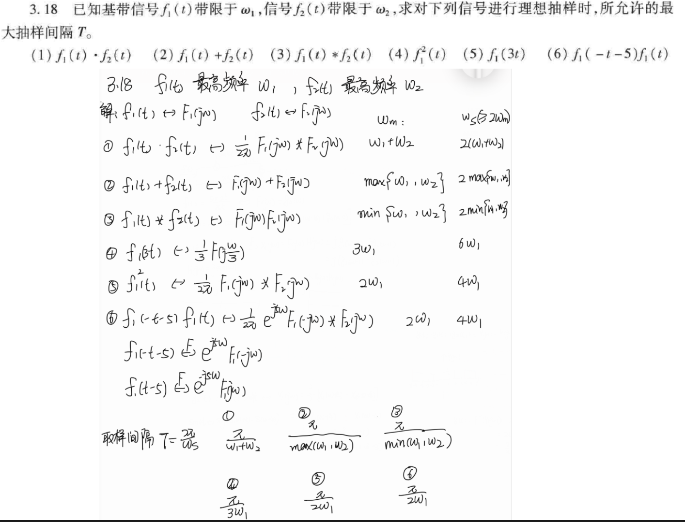
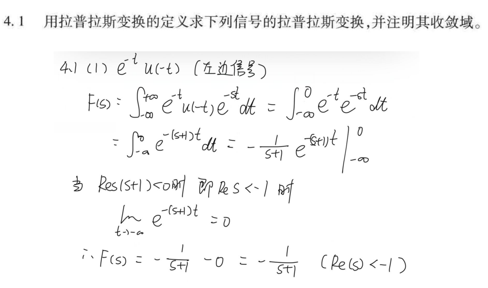
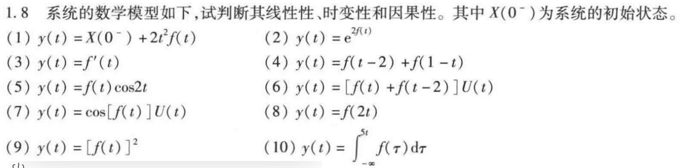
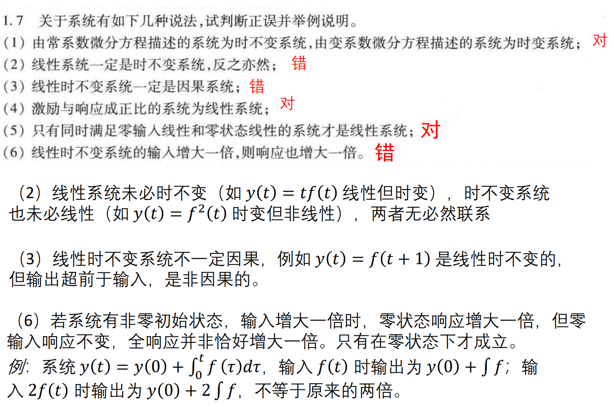

#review

## 题1

按照您的要求，我们在复频域（s域）内对该系统进行求解。

### 1. 建立 s 域模型并列出微分方程

首先，将系统框图中的各个部分转换到复频域（拉普拉斯域）：
*   输入信号 $f(t)$ 的拉普拉斯变换为 $F(s)$。
*   输出信号 $y(t)$ 的拉普拉斯变换为 $Y(s)$。
*   积分器 $\int$ 在 s 域中的传递函数为 $\frac{1}{s}$。

设第一个积分器的输出信号（即第二个积分器的输入信号）在 s 域中为 $X(s)$。

根据系统框图，我们可以列出以下 s 域代数方程：
1.  **由第二个积分器可得：**
    $$Y(s) = X(s) \cdot \frac{1}{s}$$
    由此推出：
    $$X(s) = sY(s)$$

2.  **由第一个积分器及其前面的综合点（相加器）可得：**
    相加器的输出为 $F(s) - X(s)$，经过积分器后得到 $X(s)$：
    $$X(s) = [F(s) - X(s)] \cdot \frac{1}{s}$$

将式 1 代入式 2 中，消去中间变量 $X(s)$：
$$sY(s) = [F(s) - sY(s)] \cdot \frac{1}{s}$$

等式两边同乘 $s$：
$$s^2Y(s) = F(s) - sY(s)$$

移项整理，将含有 $Y(s)$ 的项放在一起：
$$s^2Y(s) + sY(s) = F(s)$$

假设系统的初始状态为零（求微分方程和传递函数时的标准假设），对上式进行拉普拉斯逆变换 ($s \rightarrow \frac{d}{dt}$, $s^2 \rightarrow \frac{d^2}{dt^2}$)，即可得到系统的时域微分方程：
$$y''(t) + y'(t) = f(t)$$

## 题2

## 题3

## 题5

下面是第一题的求解：

**（1）因果性**
输出 $y(t)$ 只取决于当前时刻 $t$ 的输入 $f(t)$ 和初始状态 $X(0^-)$，与未来输入无关。

$\therefore$ **因果**

**（2）时变性**
设输入 $f(t)$ 产生的响应为：
$$y(t) = X(0^-) + 2t^2f(t)$$

将输入时移 $t_0$，得 $f_1(t) = f(t - t_0)$，其响应为：
$$y_1(t) = X(0^-) + 2t^2f_1(t) = X(0^-) + 2t^2f(t - t_0)$$

而将原输出直接时移 $t_0$：
$$y(t - t_0) = X(0^-) + 2(t - t_0)^2f(t - t_0)$$

比较得：
$$y_1(t) \neq y(t - t_0)$$

$\therefore$ **时变**

**（3）线性**
*不考虑初始状态$X(0^-)$*

将全响应分解为零输入响应与零状态响应：
- 零输入响应：$y_{zi}(t) = X(0^-)$
- 零状态响应：$y_{zs}(t) = 2t^2f(t)$

**检验零状态线性：**

设 $f_1(t)$、$f_2(t)$ 产生的零状态响应分别为：
$$y_{zs1}(t) = 2t^2f_1(t), \quad y_{zs2}(t) = 2t^2f_2(t)$$

对线性组合输入 $f_3(t) = af_1(t) + bf_2(t)$：
$$\begin{aligned} y_{zs3}(t) &= 2t^2\bigl[af_1(t) + bf_2(t)\bigr] \\ &= a \cdot 2t^2f_1(t) + b \cdot 2t^2f_2(t) \\ &= ay_{zs1}(t) + by_{zs2}(t) \end{aligned}$$

满足叠加性与齐次性，零状态响应线性。

**检验零输入线性：**

$y_{zi}(t) = X(0^-)$ 关于初始状态显然满足线性。

$\therefore$ **线性**（时变）.

## 题6
