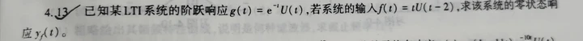

#course 

## 题1

### 前置知识点
对于LTI系统，其全响应 $y(t)$ 可以分解为零输入响应 $y_{zi}(t)$（仅由初始状态决定）和零状态响应 $y_{zs}(t)$（仅由外部激励决定）：
$$y(t) = y_{zi}(t) + y_{zs}(t)$$
*其中，零状态响应 $y_{zs}(t)$与激励（输入）线性相关，零输入响应 $y_{zi}(t)$与初始状态线性相关。*

### 已知条件分析：
根据题意有：
1. 激励为 $f(t)$ 时：
   $$y_{zi}(t) + y_{zs}(t) = (2e^{-3t} + \sin 2t)U(t) \quad \text{--- (式1)}$$
2. 激励为 $2f(t)$ 时（根据线性性质，零状态响应变为 $2y_{zs}(t)$，零输入响应不变）：
   $$y_{zi}(t) + 2y_{zs}(t) = (e^{-3t} + 2\sin 2t)U(t) \quad \text{--- (式2)}$$

**求解基础响应：**
*   由 (式2) - (式1) 可得零状态响应：
$$y_{zs}(t) = (-e^{-3t} + \sin 2t)U(t)$$
*   将 $y_{zs}(t)$ 代回 (式1) 可得零输入响应：
$$y_{zi}(t) = 3e^{-3t}U(t)$$

---

### **解答 (1)：初始状态不变，激励为 $f(t-1)$**
*   **零输入响应**：因为初始状态不变，所以零输入响应与原来相同。
    $$y'_{zi}(t) = y_{zi}(t) = 3e^{-3t}U(t)$$
*   **零状态响应**：根据 LTI 系统的**时不变性**，当激励延迟 1 个单位变成 $f(t-1)$ 时，零状态响应也相应延迟 1 个单位。
    $$y'_{zs}(t) = y_{zs}(t-1) = [-e^{-3(t-1)} + \sin 2(t-1)]U(t-1)$$
*   **全响应**：
    $$y_{全1}(t) = y'_{zi}(t) + y'_{zs}(t) = 3e^{-3t}U(t) + [-e^{-3(t-1)} + \sin(2t-2)]U(t-1)$$

---

### **解答 (2)：初始状态是原来的两倍，激励为 $2f(t)$**
*   **零输入响应**：由于零输入响应对初始状态呈线性关系，初始状态加倍，零输入响应也加倍。
    $$y''_{zi}(t) = 2y_{zi}(t) = 2 \times 3e^{-3t}U(t) = 6e^{-3t}U(t)$$
*   **零状态响应**：激励为 $2f(t)$ 时，零状态响应加倍（题干条件已给出）。
    $$y''_{zs}(t) = 2y_{zs}(t) = 2 \times (-e^{-3t} + \sin 2t)U(t) = (-2e^{-3t} + 2\sin 2t)U(t)$$
*   **全响应**：将两者相加。
    $$y_{全2}(t) = y''_{zi}(t) + y''_{zs}(t)$$
    $$y_{全2}(t) = 6e^{-3t}U(t) + (-2e^{-3t} + 2\sin 2t)U(t)$$
    $$y_{全2}(t) = (4e^{-3t} + 2\sin 2t)U(t)$$

## 题3

### (1) 求系统的频率响应 $H(j\Omega)$ 和冲激响应 $h(t)$

**1. 求频率响应 $H(j\Omega)$**
对微分方程两边同时取傅里叶变换。根据傅里叶变换的微分性质 $\mathcal{F}[y^{(n)}(t)] = (j\Omega)^n Y(j\Omega)$，我们得到：
$$(j\Omega)^2 Y(j\Omega) + 4(j\Omega)Y(j\Omega) + 3Y(j\Omega) = F(j\Omega)$$

提取公因式 $Y(j\Omega)$：
$$[(j\Omega)^2 + 4j\Omega + 3] Y(j\Omega) = F(j\Omega)$$

系统的频率响应 $H(j\Omega)$ 定义为输出频谱与输入频谱之比：
$$H(j\Omega) = \frac{Y(j\Omega)}{F(j\Omega)} = \frac{1}{(j\Omega)^2 + 4j\Omega + 3}$$

对分母进行因式分解：
$$H(j\Omega) = \frac{1}{(j\Omega + 1)(j\Omega + 3)}$$

**2. 求冲激响应 $h(t)$**
为了求傅里叶逆变换，我们需要将 $H(j\Omega)$ 展开为部分分式：
$$\frac{1}{(j\Omega + 1)(j\Omega + 3)} = \frac{A}{j\Omega + 1} + \frac{B}{j\Omega + 3}$$
通过通分求解 $A$ 和 $B$：
$$A(j\Omega + 3) + B(j\Omega + 1) = 1$$
- 令 $j\Omega = -1$，得 $2A = 1 \implies A = \frac{1}{2}$
- 令 $j\Omega = -3$，得 $-2B = 1 \implies B = -\frac{1}{2}$

所以：
$$H(j\Omega) = \frac{1/2}{j\Omega + 1} - \frac{1/2}{j\Omega + 3}$$

根据常用傅里叶变换对 $\mathcal{F}^{-1}\left[\frac{1}{j\Omega + a}\right] = e^{-at}U(t)$，对其求傅里叶逆变换，得到冲激响应：
$$h(t) = \frac{1}{2}e^{-t}U(t) - \frac{1}{2}e^{-3t}U(t)$$

---

### (2) 若激励 $f(t) = e^{-2t}U(t)$，求系统的零状态响应 $y_f(t)$

**1. 求解输入信号的频域表达式**
已知激励 $f(t) = e^{-2t}U(t)$，对其求傅里叶变换：
$$F(j\Omega) = \frac{1}{j\Omega + 2}$$

**2. 求解输出的频域表达式 $Y_f(j\Omega)$**
根据频域乘积定理，零状态响应的频谱为：
$$Y_f(j\Omega) = H(j\Omega) F(j\Omega)$$
代入已知表达式：
$$Y_f(j\Omega) = \frac{1}{(j\Omega + 1)(j\Omega + 3)} \cdot \frac{1}{j\Omega + 2} = \frac{1}{(j\Omega + 1)(j\Omega + 2)(j\Omega + 3)}$$

**3. 部分分式展开求逆变换**
将 $Y_f(j\Omega)$ 展开为三个部分分式：
$$Y_f(j\Omega) = \frac{A}{j\Omega + 1} + \frac{B}{j\Omega + 2} + \frac{C}{j\Omega + 3}$$

使用留数法（遮挡法）快速求解常数：
- $A = \left. \frac{1}{(j\Omega + 2)(j\Omega + 3)} \right|_{j\Omega = -1} = \frac{1}{(1)(2)} = \frac{1}{2}$
- $B = \left. \frac{1}{(j\Omega + 1)(j\Omega + 3)} \right|_{j\Omega = -2} = \frac{1}{(-1)(1)} = -1$
- $C = \left. \frac{1}{(j\Omega + 1)(j\Omega + 2)} \right|_{j\Omega = -3} = \frac{1}{(-2)(-1)} = \frac{1}{2}$

因此：
$$Y_f(j\Omega) = \frac{1/2}{j\Omega + 1} - \frac{1}{j\Omega + 2} + \frac{1/2}{j\Omega + 3}$$

最后，对每一项求傅里叶逆变换，得到系统的零状态响应：
$$y_f(t) = \left( \frac{1}{2}e^{-t} - e^{-2t} + \frac{1}{2}e^{-3t} \right) U(t)$$

---

## 题4

以下是画圈题目（第2小题）的详细解答步骤：

### 1. 求系统的频率响应函数 $H(j\omega)$
对方程两边进行傅里叶变换（或令 $s = j\omega$ 代入系统函数）：
$$j\omega Y(j\omega) + 2Y(j\omega) = -j\omega F(j\omega) + 2F(j\omega)$$
提取公因式：
$$Y(j\omega)(j\omega + 2) = F(j\omega)(2 - j\omega)$$
由此可得系统的频率响应函数为：
$$H(j\omega) = \frac{Y(j\omega)}{F(j\omega)} = \frac{2 - j\omega}{2 + j\omega}$$

### 2. 分解激励信号并计算各分量的响应
激励信号 $f(t) = 3 + \cos(2t)$ 可以看作是由直流分量（$\omega = 0$）和交流分量（$\omega = 2$）组成的。我们分别计算这两部分的响应。

> [!tip] Tip
> 
> $$\mathcal{F}[\cos(2t)+3] = \pi\big[\delta(\omega - 2) + \delta(\omega + 2)\big]+6\pi\delta(\omega)$$
> 也可以直接用$H(j\omega)$与上式相乘，最后化成sin

**① 直流分量：$f_1(t) = 3$ （此时频率 $\omega = 0$）**
将 $\omega = 0$ 代入 $H(j\omega)$：
$$H(j0) = \frac{2 - j0}{2 + j0} = \frac{2}{2} = 1$$
所以，直流分量引起的稳态响应为：
$$y_{ss1}(t) = 3 \times H(j0) = 3 \times 1 = 3$$

**② 交流分量：$f_2(t) = \cos(2t)$ （此时频率 $\omega = 2$）**
将 $\omega = 2$ 代入 $H(j\omega)$：
$$H(j2) = \frac{2 - j2}{2 + j2}$$
为了求出其幅度和相位，我们进行复数化简（分子分母同乘共轭复数）：
$$H(j2) = \frac{(2 - j2)^2}{(2 + j2)(2 - j2)} = \frac{4 - j8 - 4}{2^2 + 2^2} = \frac{-j8}{8} = -j$$
复数 $-j$ 可以表示为极坐标形式：
*   幅度 $|H(j2)| = 1$
*   相位 $\angle H(j2) = -\frac{\pi}{2}$

所以，交流分量引起的稳态响应为：
$$y_{ss2}(t) = 1 \times \cos\left(2t - \frac{\pi}{2}\right) = \sin(2t)$$

### 3. 叠加求全响应
根据线性系统的叠加定理，系统的总稳态响应 $y_{ss}(t)$ 等于各分量响应之和：
$$y_{ss}(t) = y_{ss1}(t) + y_{ss2}(t)$$
$$y_{ss}(t) = 3 + \sin(2t)$$

## 题5

### 方法一：拉普拉斯变换法（推荐）

这种方法通过将时域信号转换到复频域（s域）进行代数运算，通常能避免复杂的积分过程。

**1. 求系统的传递函数 $H(s)$**
已知系统的阶跃响应为 $g(t) = e^{-t}U(t)$。
首先求阶跃响应的拉普拉斯变换 $G(s)$：
$$G(s) = \mathcal{L}\{e^{-t}U(t)\} = \frac{1}{s+1}$$
系统的传递函数 $H(s)$ 与阶跃响应变换 $G(s)$ 的关系为 $H(s) = sG(s)$ （因为冲激响应 $h(t) = g'(t)$）：
$$H(s) = s \cdot \frac{1}{s+1} = \frac{s}{s+1}$$

**2. 求输入信号的拉普拉斯变换 $F(s)$**
已知输入信号 $f(t) = tU(t-2)$。
为了利用拉普拉斯变换的延迟性质 $\mathcal{L}\{x(t-t_0)U(t-t_0)\} = e^{-st_0}X(s)$，我们需要将 $f(t)$ 配凑成 $(t-2)$ 的形式：
$$f(t) = (t - 2 + 2)U(t-2) = (t-2)U(t-2) + 2U(t-2)$$
对其进行拉普拉斯变换：
$$F(s) = \mathcal{L}\{(t-2)U(t-2)\} + \mathcal{L}\{2U(t-2)\} = \frac{1}{s^2}e^{-2s} + \frac{2}{s}e^{-2s}$$
$$F(s) = e^{-2s} \left( \frac{1}{s^2} + \frac{2s}{s^2} \right) = e^{-2s}\frac{2s+1}{s^2}$$

**3. 求零状态响应的拉普拉斯变换 $Y_f(s)$**
在 s 域中，零状态响应 $Y_f(s) = F(s) \cdot H(s)$：
$$Y_f(s) = \left( e^{-2s}\frac{2s+1}{s^2} \right) \cdot \left( \frac{s}{s+1} \right) = e^{-2s}\frac{2s+1}{s(s+1)}$$

**4. 拉普拉斯反变换求时域响应 $y_f(t)$**
首先对有理分式部分进行部分分式展开：
$$\frac{2s+1}{s(s+1)} = \frac{A}{s} + \frac{B}{s+1}$$
代入计算得：
$A = \left. \frac{2s+1}{s+1} \right|_{s=0} = \frac{1}{1} = 1$
$B = \left. \frac{2s+1}{s} \right|_{s=-1} = \frac{-2+1}{-1} = 1$
因此：
$$Y_f(s) = e^{-2s} \left( \frac{1}{s} + \frac{1}{s+1} \right) = \frac{e^{-2s}}{s} + \frac{e^{-2s}}{s+1}$$
对各项分别求拉普拉斯反变换：
$$y_f(t) = \mathcal{L}^{-1}\left\{ \frac{e^{-2s}}{s} \right\} + \mathcal{L}^{-1}\left\{ \frac{e^{-2s}}{s+1} \right\}$$
$$y_f(t) = U(t-2) + e^{-(t-2)}U(t-2)$$
提取公因式，得到最终结果：
$$y_f(t) = [1 + e^{-(t-2)}]U(t-2)$$

---
