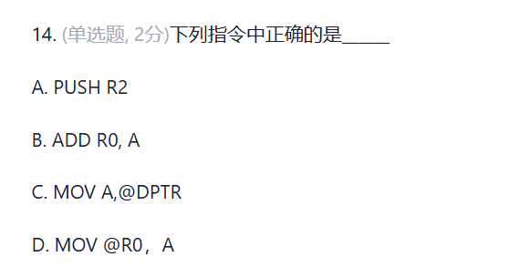
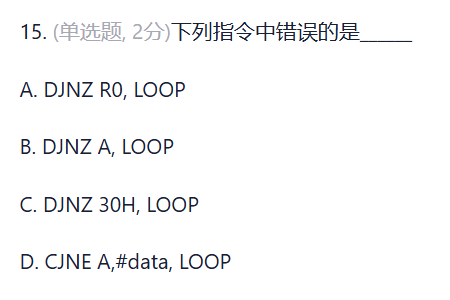
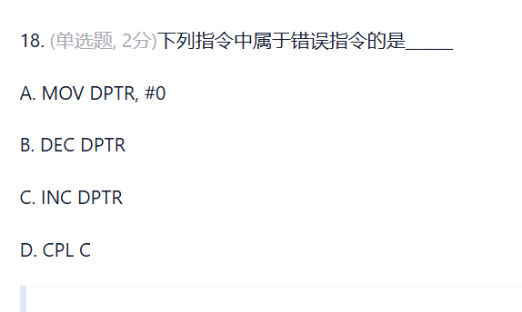

## 题1


该题的正确答案是 **D. 不确定**。

### 详细分析如下：

1. **执行 `MOV P1, #0FH` 指令**：
   * 该指令向 P1 口的锁存器写入数据 `0000 1111B`（即 `0FH`）。
   * **高4位（P1.7 ~ P1.4）** 被写入 `0`，此时其内部场效应管（FET）导通，将引脚强制拉低为低电平（0）。
   * **低4位（P1.3 ~ P1.0）** 被写入 `1`。在 8051 单片机准双向 I/O 口的结构中，如果要将引脚作为输入，必须先向对应的锁存器写入 `1`。此时内部场效应管截止，低4位引脚处于高阻输入状态，可由外部信号源来驱动其高低电平。

2. **执行 `MOV A, P1` 指令**：
   * 该指令是**读引脚**指令，它将读取 P1 端口各个引脚上的实际电平状态，并传送给累加器 A。
   * 对于**高4位（P1.7 ~ P1.4）**：由于其内部被锁存器强行拉低到地，所以读引脚时始终为 `0`。
   * 对于**低4位（P1.3 ~ P1.0）**：虽然它们被设置为了输入状态，但它们引脚上的真实电平**完全取决于外部输入电路的信号**。题目中并没有给出外部连接的信号是高电平还是低电平。

3. **结论**：
   * 累加器 A 中的内容高4位固定为 `0000`，而低4位为 `xxxx`（取决于外部输入信号，无法确定），所以累加器 A 中的具体数据是**不确定的**。

**故本题答案选择 D**。

## 题2

根据 8051 (MCS-51) 单片机汇编语言指令集的规范，正确答案是 **D. MOV @R0, A**。

以下是各选项的详细分析与错误原因：

### **A. PUSH R2 （错误）**
* **原因**：在 8051 中，堆栈操作指令 `PUSH` 和 `POP` 仅支持**直接寻址**（Direct Addressing）。不能直接使用寄存器名（如 `R2`）作为操作数。
* **正确写法**：如果需要将 `R2` 压栈，必须使用它在当前寄存器组中的直接地址（例如，若在寄存器组 0 中，`R2` 的地址为 `02H`，则写法为 `PUSH 02H`）。

### **B. ADD R0, A （错误）**
* **原因**：在 8051 的算术运算指令中，累加器 `A` 必须作为**目的操作数**（即写在左侧）。
* **正确写法**：`ADD A, R0`。

### **C. MOV A, @DPTR （错误）**
* **原因**：DPTR 是一个 16 位的指针寄存器，用于访问外部数据存储器或程序存储器。标准的 `MOV` 指令只能用于访问内部 RAM，无法与 `@DPTR` 配合使用。
* **正确写法**：
  * 若要访问外部数据 RAM，应使用：`MOVX A, @DPTR`。
  * 若要访问程序 ROM（查表），应使用：`MOVC A, @A+DPTR`。

### **D. MOV @R0, A （正确）**
* **原因**：这是 8051 极其常用的**寄存器间接寻址**指令。它将累加器 `A` 中的数据写入到内部 RAM 中以 `R0` 寄存器的值作为地址的存储单元中。

## 题3


根据 8051 (MCS-51) 单片机汇编语言指令集的规范，下列指令中**错误**的是 **B. DJNZ A, LOOP**。

以下是详细分析：

### **B. DJNZ A, LOOP （错误）**
* **原因**：在 8051 指令集中，**没有**针对累加器 `A` 的 `DJNZ`（减 1 不为 0 转移）指令。
* **正确替代方案**：如果需要对累加器 `A` 减 1 并判断是否为 0 跳转，必须分成两条指令执行：
  ```assembly
  DEC A
  JNZ LOOP
  ```

---

### **其他选项分析（均为正确指令）：**

* **A. DJNZ R0, LOOP （正确）**
  * 属于 `DJNZ Rn, rel` 寻址方式。用于对工作寄存器 `R0`～`R7` 进行减 1 并判断是否为 0 跳转。

* **C. DJNZ 30H, LOOP （正确）**
  * 属于 `DJNZ direct, rel` 寻址方式。`30H` 是内部 RAM 的直接地址，对该直接地址中的内容减 1 并判断是否为 0 跳转。

* **D. CJNE A, #data, LOOP （正确）**
  * 属于 `CJNE A, #data, rel`（比较不相等转移）指令。将累加器 `A` 的值与立即数 `#data` 进行比较，如果不相等则跳转到 `LOOP`。


## 题4


根据 8051 (MCS-51) 单片机汇编语言指令集的规范，下列指令中属于**错误指令**的是 **B. DEC DPTR**。

### **分析与原因**

* **B. DEC DPTR （错误）**
  * **原因**：在标准的 8051 指令集中，**有 16 位指针自增指令 `INC DPTR`，但没有对应的自减指令 `DEC DPTR`**。这是 8051 汇编笔试题中非常经典的一道考点陷阱。
  * **替代方案**：如果程序中需要对 DPTR 进行减 1 操作，无法直接通过一条指令完成，必须通过低 8 位 `DPL` 和高 8 位 `DPH` 分别进行逻辑判断和递减来实现。

---

### **其他选项分析（均为正确指令）**

* **A. MOV DPTR, #0 （正确）**
  * 属于双字节立即数送入双字节指针寄存器的指令（`MOV DPTR, #data16`）。在汇编编译器中，立即数 `#0` 会被自动扩展为 16 位的数据（即 `#0000H`），因此语法完全正确。

* **C. INC DPTR （正确）**
  * 属于标准的 16 位寄存器加 1 指令，用于对数据指针进行自增操作。

* **D. CPL C （正确）**
  * 属于位操作指令，用于对进位标志位（Carry flag）`C` 进行按位取反（Complement）操作。


## 题5

1. 指令是由**操作码**和**操作数**构成的；对于单字节指令，操作数隐含在**操作码**中。

2. 8051微控制器的指令按其功能可分为五大类：**数据传送类指令**、**算术运算类指令**、**逻辑运算类指令**、控制转移类指令、位操作类指令。

3. 在循环结构程序中，循环控制的实现方法有**计数控制**和**条件控制**。

## 题6


基于 8051 单片机的堆栈操作原理，我们可以通过以下步骤来逐步分析和求解：

### 1. 8051 的 `POP` 指令工作原理
在 8051 单片机中，执行 `POP direct`（出栈）指令时：
1. **第一步**：将当前堆栈指针 `SP` 所指向的内部 RAM 单元中的内容传送给目标寄存器。
2. **第二步**：堆栈指针 `SP` 的内容减 1（即 `SP = SP - 1`）。

---

### 2. 执行过程逐步分析

**初始状态：**
* $(SP) = 62H$
* $(62H) = 70H$
* $(61H) = 30H$

#### **第一步：执行 `POP DPH`**
1. 读取 `SP` 当前指向的地址（`62H`）处的内容，将其传送到 `DPH`（高 8 位数据指针）：
   $$DPH = (62H) = 70H$$
2. 堆栈指针 `SP` 减 1：
   $$SP = 62H - 1 = 61H$$

此时：$DPH = 70H$，$SP = 61H$。

#### **第二步：执行 `POP DPL`**
1. 读取 `SP` 当前指向的地址（`61H`）处的内容，将其传送到 `DPL`（低 8 位数据指针）：
   $$DPL = (61H) = 30H$$
2. 堆栈指针 `SP` 再次减 1：
   $$SP = 61H - 1 = 60H$$

此时：$DPL = 30H$，$SP = 60H$。

---

### 3. 结果合并
* **DPTR** 是由高位字节 `DPH` 和低位字节 `DPL` 拼接而成的 16 位寄存器。
  $$DPTR = DPH\_DPL = 7030H$$
* **SP** 最终的内容为：
  $$SP = 60H$$

---

### 答案
* DPTR的内容为：**7030H**
* SP的内容为：**60H**


