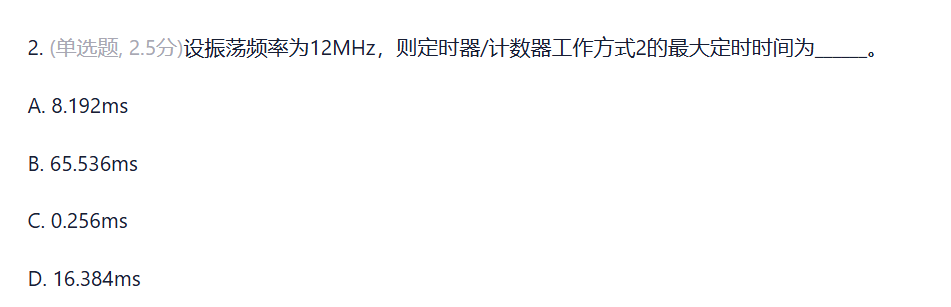

这道题的正确答案是 **C. 0.256ms**。

### 解析步骤如下：

1. **计算机器周期（Machine Cycle）：**
   在 8051 单片机中，一个机器周期等于 12 个振荡周期。
   根据题意，振荡频率 $f_{osc} = 12\text{ MHz}$，因此：
   $$\text{机器周期 } T_{cy} = \frac{12}{f_{osc}} = \frac{12}{12\text{ MHz}} = 1\text{ }\mu\text{s}$$

2. **确定定时器工作方式 2 的位数：**
   定时器/计数器工作方式 2（Mode 2）是 **8位自动重装载** 模式。
   8位计数器的最大计数值为：
   $$N_{max} = 2^8 = 256$$

3. **计算最大定时时间：**
   当计数初值为 0 时，定时器可以获得最大定时时间：
   $$T_{max} = 2^8 \times T_{cy} = 256 \times 1\text{ }\mu\text{s} = 256\text{ }\mu\text{s} = 0.256\text{ ms}$$

---

### 补充对比（其他选项对应的模式）：
* **A. 8.192ms**：对应**工作方式 0**（13位定时器），最大定时时间为 $2^{13} \times 1\text{ }\mu\text{s} = 8.192\text{ ms}$。
* **B. 65.536ms**：对应**工作方式 1**（16位定时器），最大定时时间为 $2^{16} \times 1\text{ }\mu\text{s} = 65.536\text{ ms}$。
* **C. 0.256ms**：对应**工作方式 2**（8位定时器），最大定时时间为 $2^8 \times 1\text{ }\mu\text{s} = 0.256\text{ ms}$。