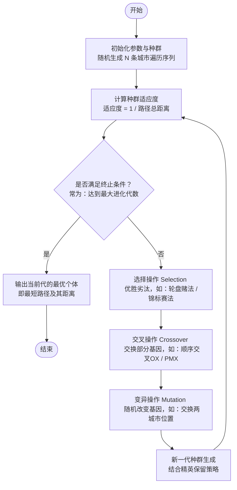

## 1. 旅行商问题（tsp问题）

**TSP问题**，全称是“旅行商问题”（Traveling Salesman Problem），是一个经典的**组合优化**问题。简单来说，就是问：

> 一个旅行商要走访若干个城市，每个城市恰好去一次，最后回到出发城市。如何规划路线，才能让总路程最短？

> [!NOTE]
> 旅行商问题一般在完全图（每对节点间都连接）上求解

举个例子：假设有 A、B、C、D 四个城市，它们之间的距离已知。TSP 要找到所有可能的走访顺序（比如 A→B→C→D→A，或 A→C→B→D→A 等）中，总距离最短的那一条闭环路线。

### 核心特征
- **输入**：一组城市及两两之间的距离（或成本）。
- **约束**：每个城市正好访问一次，且最后回到起点。
- **目标**：最小化总路程（或总成本）。

### 为什么它很重要且很难？
- **计算难度**：随着城市数量 `n` 增加，所有可能的路线数量是 `(n-1)! / 2`，增长极快（这叫“组合爆炸”）。例如：
  - 5个城市：12条可能路线
  - 10个城市：约18万条
  - 20个城市：约6×10¹⁶条，即使超级计算机也无法逐一检查。
- **问题性质**：TSP 属于著名的 **NP-困难** 问题。意思是，目前没有已知的“快速”（多项式时间）算法能保证对所有情况都找到绝对最优解。但针对实际规模（如几百个城市），可以用巧妙方法找到很好的近似解或最优解。

## 使用遗传算法（Genetic Algorithm, GA）求解旅行商问题（Traveling Salesperson Problem, TSP）

### 1. 遗传算法求解TSP流程图

---

### 2. 核心步骤详细说明（针对TSP问题）

在TSP问题中，遗传算法的每个标准步骤都需要针对“路径”的特点进行特殊设计，具体流程如下：

#### ① 编码与初始化种群 (Initialization)
* **编码方式**：通常采用**整数排列编码**。例如有5个城市，一条路径（染色体）可以表示为 `[1, 4, 2, 5, 3]`。
* **初始化**：随机生成 $N$ 个合法的排列，作为初始种群。每一个排列代表一条遍历所有城市的可能路径。

#### ② 计算适应度 (Fitness Evaluation)
* **路径长度计算**：根据染色体的城市序列，依次计算相邻城市间的距离，再加上最后一个城市回到起点的距离，得到总距离 $D$。
* **适应度函数**：遗传算法通常是“寻找最大适应度”。因为TSP是求最短距离，所以适应度函数常设为距离的倒数：$Fitness = \frac{1}{D}$。距离越短，适应度越大。

#### ③ 终止条件判断 (Termination Check)
* 检查算法是否达到了预设的终止条件（如：最大迭代次数达到500代，或者连续50代最优解没有发生变化）。如果满足，则算法结束，输出历史最优解。

#### ④ 选择操作 (Selection)
* 模拟自然界的“优胜劣汰”。常用的方法包括：
  * **轮盘赌选择 (Roulette Wheel)**：适应度越高的个体被选中的概率越大。
  * **锦标赛选择 (Tournament)**：随机挑出几个个体，选择其中最好的进入下一代。

#### ⑤ 交叉操作 (Crossover)
* 这一步是产生新解的核心。由于TSP要求每个城市**必须且只能出现一次**，不能像传统的二进制交叉那样随便截断组合（否则会出现重复城市或缺失城市）。
* **常用TSP交叉算子**：
  * **顺序交叉 (OX - Order Crossover)**：保留父代A的一段子序列，剩余位置按父代B中城市的出现顺序填充。
  * **部分映射交叉 (PMX)**：交换两段序列并建立映射关系以修复重复冲突。

#### ⑥ 变异操作 (Mutation)
* 为了防止算法陷入局部最优（早熟），需要进行小概率的变异。
* **常用TSP变异算子**：
  * **交换变异 (Swap)**：随机选中染色体中的两个城市，交换它们的位置。
  * **逆转变异 (Inversion/2-Opt)**：随机选中一段子序列，将其反转排列（这种方式在TSP中效果往往非常好）。

#### ⑦ 更新种群 (Update/Elitism)
* **精英保留策略 (Elitism)**：为了防止优秀的基因在交叉和变异中丢失，通常会把上一代适应度最高的一个或几个个体，不经过任何操作直接复制到下一代中。
* 新生成的子代和保留的精英组成新一轮种群，回到第②步继续循环计算。