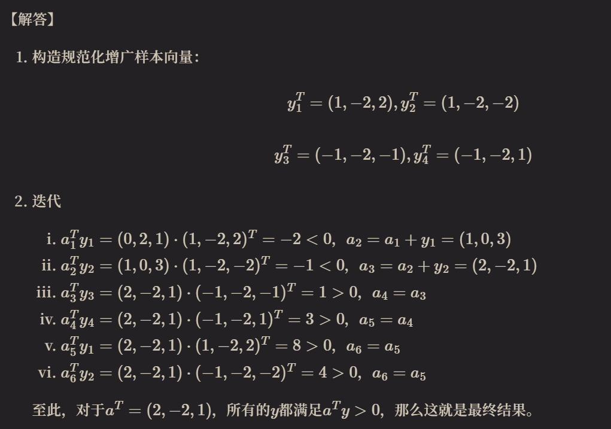

## 【讲解】 
问题的格式是：现有样本集 $\{x_1, \cdots, x_n\}$ 属于 $w_1, w_2$ 两类，寻找向量 $a$，使得：$\forall x \in w_1, a^Tx > 0$，且 $\forall x \in w_2, a^Tx < 0$。即使用一个仿射流形把样本分成两半，这时称样本是线性可分的。其具体操作步骤是：

1. **构造规范化增广样本向量。**

   这一步的关键是增广和规范化。因为一般线性流形的表达式是 $w^Tx + b$，但是我们要把这个 $b$ 包含在 $w$ 里面，就要把样本进行增广。*增广的操作步骤是给样本的坐标前面补充 1 个 1。*

   **规范化的意思是**，*如果样本是正例（属于 $w_1$），就保持不变；否则，它的每个坐标都变成相反数。*

   规范化增广样本向量记作 $\{y_1 \cdots y_n\}$

2. **在 $y$ 集合上循环迭代**：对于每个 $y_i$，计算 $a_k^Ty$，如果 $a_k^Ty \le 0$，则 $a_{k+1} = a_k + y$；否则，$a_{k+1} = a_k$。直到对于某个 $a$，所有的 $y$ 都满足 $a^Ty > 0$，那么这就是最终结果。

   *这实际上是梯度下降法的过程，推导略。*

## 【例子】
现有数据集：

1. 类别1：$x_1^T = (-2, 2)$, $x_2^T = (-2, -2)$
2. 类别2：$x_3^T = (2, 1)$, $x_4^T = (2, -1)$

初始化权：$a_0^T = (0, 2, 1)$，利用感知机准则求判别函数。

## 解答：

### 一、 构造规范化增广样本向量

为了将偏置项 $b$ 统一纳入权向量中进行计算，我们需要将二维样本向量增广为三维向量。根据题目中初始权值 $a_0^T = (0, 2, 1)$ 的维度（第一位为偏置对应项，第二、三位为特征对应项），我们采用以下增广方式：
$$y = \begin{pmatrix} 1 \\ x_1 \\ x_2 \end{pmatrix}$$

同时，为了统一分类决策条件（使所有样本均满足 $a^T y > 0$），需要对属于类别 2（$\omega_2$）的样本向量乘以 $-1$ 进行**规范化（Normalization）**处理：

*   **类别 1（正例，保持不变）**：
    $$y_1 = \begin{pmatrix} 1 \\ -2 \\ 2 \end{pmatrix}, \quad y_2 = \begin{pmatrix} 1 \\ -2 \\ -2 \end{pmatrix}$$
*   **类别 2（反例，乘以 $-1$）**：
    $$y_3 = -\begin{pmatrix} 1 \\ 2 \\ 1 \end{pmatrix} = \begin{pmatrix} -1 \\ -2 \\ -1 \end{pmatrix}, \quad y_4 = -\begin{pmatrix} 1 \\ 2 \\ -1 \end{pmatrix} = \begin{pmatrix} -1 \\ -2 \\ 1 \end{pmatrix}$$

---

### 二、 感知机准则迭代求解

感知机准则的更新规则如下（设学习率 $\eta = 1$）：
*   若 $a_k^T y_i \le 0$（样本被错分），则更新权重：$a_{k+1} = a_k + y_i$；
*   若 $a_k^T y_i > 0$（样本分类正确），则保持权重不变：$a_{k+1} = a_k$。

我们从初始权向量 $a_0 = (0, 2, 1)^T$ 开始，依次对样本 $y_1, y_2, y_3, y_4$ 进行循环迭代：

#### **第一轮迭代：**

1.  **测试样本 $y_1$：**
    $$a_0^T y_1 = (0, 2, 1) \cdot \begin{pmatrix} 1 \\ -2 \\ 2 \end{pmatrix} = 0 \times 1 + 2 \times (-2) + 1 \times 2 = -2 \le 0$$
    由于分类错误，更新权向量：
    $$a_1 = a_0 + y_1 = \begin{pmatrix} 0 \\ 2 \\ 1 \end{pmatrix} + \begin{pmatrix} 1 \\ -2 \\ 2 \end{pmatrix} = \begin{pmatrix} 1 \\ 0 \\ 3 \end{pmatrix}$$

2.  **测试样本 $y_2$：**
    $$a_1^T y_2 = (1, 0, 3) \cdot \begin{pmatrix} 1 \\ -2 \\ -2 \end{pmatrix} = 1 \times 1 + 0 \times (-2) + 3 \times (-2) = -5 \le 0$$
    由于分类错误，更新权向量：
    $$a_2 = a_1 + y_2 = \begin{pmatrix} 1 \\ 0 \\ 3 \end{pmatrix} + \begin{pmatrix} 1 \\ -2 \\ -2 \end{pmatrix} = \begin{pmatrix} 2 \\ -2 \\ 1 \end{pmatrix}$$

3.  **测试样本 $y_3$：**
    $$a_2^T y_3 = (2, -2, 1) \cdot \begin{pmatrix} -1 \\ -2 \\ -1 \end{pmatrix} = 2 \times (-1) + (-2) \times (-2) + 1 \times (-1) = 1 > 0$$
    分类正确，权向量保持不变：
    $$a_3 = a_2 = \begin{pmatrix} 2 \\ -2 \\ 1 \end{pmatrix}$$

4.  **测试样本 $y_4$：**
    $$a_3^T y_4 = (2, -2, 1) \cdot \begin{pmatrix} -1 \\ -2 \\ 1 \end{pmatrix} = 2 \times (-1) + (-2) \times (-2) + 1 \times 1 = 3 > 0$$
    分类正确，权向量保持不变：
    $$a_4 = a_3 = \begin{pmatrix} 2 \\ -2 \\ 1 \end{pmatrix}$$

---

#### **第二轮检验（验证收敛性）：**

为了确定 $a_4$ 是否是最终的解向量，我们需要将当前权向量 $a_4 = (2, -2, 1)^T$ 代入所有规范化样本进行全面检验：

*   对于 $y_1$：$a_4^T y_1 = (2, -2, 1) \cdot (1, -2, 2)^T = 2 + 4 + 2 = 8 > 0$ （正确）
*   对于 $y_2$：$a_4^T y_2 = (2, -2, 1) \cdot (1, -2, -2)^T = 2 + 4 - 2 = 4 > 0$ （正确）
*   对于 $y_3$：$a_4^T y_3 = (2, -2, 1) \cdot (-1, -2, -1)^T = -2 + 4 - 1 = 1 > 0$ （正确）
*   $\text{对于 } y_4$：$a_4^T y_4 = (2, -2, 1) \cdot (-1, -2, 1)^T = -2 + 4 + 1 = 3 > 0$ （正确）

由于所有规范化增广样本在当前权向量下均满足 $a^T y_i > 0$，算法已成功收敛。

最终求得的解向量为：
$$a = \begin{pmatrix} 2 \\ -2 \\ 1 \end{pmatrix}$$

---

### 三、 确定判别函数

将求得的解向量 $a$ 与增广向量 $y$ 做内积，还原回原始坐标空间：
$$d(x) = a^T y = 2 - 2x_1 + x_2$$

即，**最终求得的判别函数（Decision Function）**为：
$$d(x) = -2x_1 + x_2 + 2$$

#### **分类决策规则：**
*   若 $d(x) > 0$，则 $x$ 属于类别 1；
*   若 $d(x) < 0$，则 $x$ 属于类别 2。