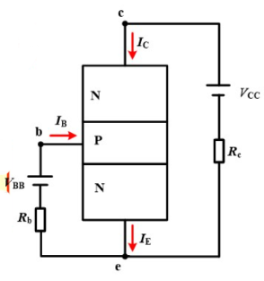
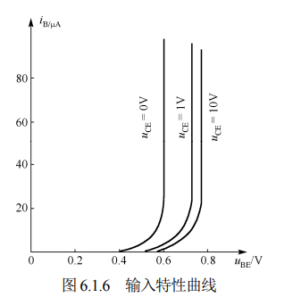

#circuit 

*等效电路图*

## 输入特性曲线
**物理意义**：它描述了在**集-射极电压 $U_{\text{CE}}$ 保持恒定**的前提下，**基极电流 $i_{\text{B}}$ 与发射结电压 $u_{\text{BE}}$ 之间的关系**。

因为实际上 $U_{CE}$ 不是定值，所以函数图有多个曲线：

### 曲线分析：核心问题与物理机制分析

#### 1.  $U_{\text{CE}}=0$ 时的曲线 $\approx$ PN 结的伏安特性
* **解答**：*此时的三极管相当于两个并联的 PN 结 (二极管)*。
* **物理机制分析**：
  当 $U_{\text{CE}} = 0$ 时，集电极与发射极在外部被短路。
  因此，两个 PN 结都处于正向偏置状态并发生并联导通，基极电流 $i_{\text{B}}$ 是这两个结的正向电流之和。

#### 2. 为什么随着 $U_{\text{CE}}$ 的增大，曲线会向右移动？
* **解答**：*更多的电子被集电极收集，$i_{\text{B}}$ 减小；在同样的 $u_{\text{BE}}$ 下，曲线右移*。
* **物理机制分析**：
  当 $U_{\text{CE}}$ 从 0 开始增大（例如到 $0.5\text{V}$）时，集电结开始承受反向偏置电压。
  集电结的反向电场增强，这使得发射区发射到基区的非平衡少数载流子（以 NPN 管为例即为电子）中，**有更大比例被集电极电场迅速拉入集电区（形成集电极电流 $i_{\text{C}}$）**。
  在基区中滞留并与空穴复合以形成基极电流 $i_{\text{B}}$ 的电子数量因此减少。结果是，在**相同的 $u_{\text{BE}}$ 电压下，基极电流 $i_{\text{B}}$ 会变小**。在坐标图上，这就表现为在相同的纵坐标 $i_{\text{B}}$ 下需要更大的横坐标 $u_{\text{BE}}$，即曲线整体向右移动。

#### 3. 为什么当 $U_{\text{CE}}$ 增大到一定值后，曲线右移就不明显了？
* **解答**：*大部分电子都被拉过去*。
* **物理机制分析**：
  当 $U_{\text{CE}}$ 增大到一定值（通常 $U_{\text{CE}} \ge 1\text{V}$）时，集电结的反向偏置电压已经足够大，其电场强度足以将发射区注入基区的大部分电子（大约 99% 以上）全部收集到集电极。
  此时，即使进一步增大 $U_{\text{CE}}$，集电极收集电子的能力也已达到饱和，基区中发生复合的比例（即产生 $i_{\text{B}}$ 的比例）基本不再发生改变。因此，基极电流 $i_{\text{B}}$ 不会随着 $U_{\text{CE}}$ 的继续增大而有明显的减少，各条输入特性曲线在图上表现为高度重合。

---

## 输出特性曲线

**共发射极**连接时的输出特性曲线 描述了当输入电流 $i_{B}$ 为某一数值时，集电极电流 $i_{C}$ 与管压降 $u_{CE}$ 之间的关系。
- 对于每一个确定的 $i_{B}$，都有一条曲线，所以输出特性曲线是一簇曲线
- 由图可以看出三极管有 3 个工作区：截止区、放大区和饱和区。

*图 6.1.7 三极管的输出特性曲线*

### 三个工作区
| 工作区域    | 发射结偏置 | 集电结偏置 | 特点与应用                                                 |
| ------- | ----- | ----- | ----------------------------------------------------- |
| **截止区** | 反偏/零偏 | 反偏    | $I_B \approx 0$, $I_C \approx 0$。三极管相当于开关断开。          |
| **放大区** | 正偏    | 反偏    | $I_C = \beta I_B$。具有线性放大作用，用作放大器。                     |
| **饱和区** | 正偏    | 正偏    | $I_C < \beta I_B$，$U_{CE}$ 很小（约0.2V~0.3V）。三极管相当于开关闭合。 |
*三个工作区的等效模型：*

#### 1. 截止区

> [!看图说话]
> 图中最下面的曲线：$i_B=0$，$i_C \approx 0$

$i_{B}=0$ 的曲线以下的区域称为截止区。$i_{B}=0$ 时，集电极电流用 $I_{CEO}$ 表示，其值很小，即在截止区，电流关系为
$$ i_{\mathrm{B}}=0,\quad i_{\mathrm{E}}=i_{\mathrm{C}}=I_{\mathrm{C E O}} $$

显然，三极管工作在截止区时没有电流放大能力，且**各极电流近似为零**，相当于开关断开状态。

> 对于 NPN 型硅管而言，当 $u_{BE} < 0.5V$ 时，已开始截止，但是为了可靠截止，常使得 $u_{BE} \leq 0$，即截止时发射结和集电结均反偏。

#### 2. 放大区

> [!看图说话]
> - $U_{CE}$足够大时，曲线几乎平行于x轴，表示$i_C$与$u_{CE}$无关
> - $i_B$等差变化时，曲线间隔几乎相同，即$i_C$正比于$i_B$

输出特性曲线的近似水平部分是放大区，也称为线性区。在放大区各极电流满足：
$$ i_{c}=\beta i_{\mathrm{B}} $$
$$ i_{\mathrm{E}}=i_{\mathrm{B}}+i_{\mathrm{C}}=(1+\beta)i_{\mathrm{B}}\approx\beta i_{\mathrm{B}} $$

即 $i_{C}$ 几乎仅仅决定于 $i_{B}$，而与 $u_{CE}$ 无关，表现出 $i_{B}$ 对 $i_{C}$ 的控制作用。

如前所述，三极管工作在放大状态时，发射结正偏，集电结反偏。若要让三极管处于放大状态：
对 NPN 型三极管而言，应使 $U_{BE} = U_{BE(on)}$，$U_{BC} < 0$，从电位来看，应该是 $V_C > V_B > V_E$；
而对 PNP 型三极管而言，则是 $V_E > V_B > V_C$。

#### 3. 饱和区

> [!看图说话]
> - 饱和区是指输出特性曲线中 $i_{C}$ 上升部分与纵轴之间的区域。
> - 在饱和区，对应于不同 $i_{B}$ 的输出特性曲线几乎重合，$i_{C}$ 不再受 $i_{B}$ 控制，只随 $u_{CE}$ 变化，即没有电流放大能力。

饱和时，发射结与集电结均处于正向偏置。在饱和状态时的 $u_{CE}$ 称为饱和压降，记做 $U_{CES}$，其值很小，对于 NPN 型硅管约为 0.3V，PNP 型锗管约为 -0.1V，若忽略不计，则三极管集电极与发射极之间相当于短路，相当于开关的闭合状态。

*在模拟电路中，大多数情况下，应保证三极管工作在放大状态。而在开关电路或脉冲数字电路中，三极管主要工作于饱和状态或截止状态。*
