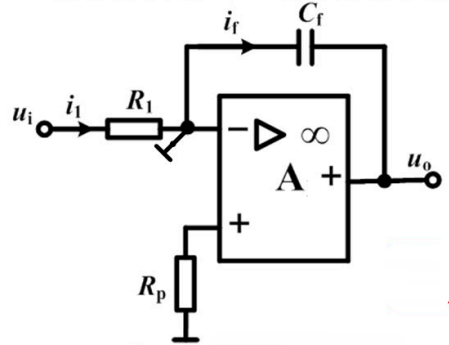

## 1. 反相比例运算电路

**输出与输入的关系**：
$$U_o = -\frac{R_f}{R_1} U_i$$

## 2. 同相比例运算电路

$$U_o = \left(1 + \frac{R_f}{R_1}\right) U_- = \left(1 + \frac{R_f}{R_1}\right) U_+ = \left(1 + \frac{R_f}{R_1}\right) U_i$$

## 3. 加法运算电路

$$-\frac{U_o}{R_f} = \frac{U_{i1}}{R_1} + \frac{U_{i2}}{R_2} + \frac{U_{i3}}{R_3}$$

## 4. 减法运算电路

### 单运放减法电路

当电路电阻满足条件 $\dfrac{R_f}{R_1} = \dfrac{R_3}{R_2}$：

$$U_o = -\frac{R_f}{R_1} (U_{i1} - U_{i2})$$

### 双运放减法运算电路

$$U_o = -R_5 \left(-\frac{R_2}{R_1 R_4} U_{i1} + \frac{U_{i2}}{R_3}\right)$$

## 5. 积分运算电路

积分运算电路：将反相比例运算电路中的反馈电阻 $R_f$ 换成电容 $C_f$，就构成了反相积分电路。

*图中凸出来的"T"字形元件是电键，用于复位，防止积分饱和*

由"虚断"和"虚短"：$i_f = i_1$
而：
$$i_1 = \frac{u_i}{R_1}, \quad i_f = -C_f \frac{du_o}{dt}$$
所以：
$$\frac{u_i}{R_1} = -C_f \frac{du_o}{dt}$$
整理得到：
$$u_o = -\frac{1}{R_1 C_f} \int u_i \, dt$$
通用公式：
$$u_o =  -\frac{1}{R_1 C_f} \int_{t_1}^{t_2} u_i \, dt + u_o(t_1)$$
若 $u_i$ 在 $t_1 \sim t_2$ 为常量，则：
$$u_o = -\frac{1}{R_1 C_f} \cdot u_i \cdot (t_2 - t_1) + u_o(t_1)$$

## 6. 微分运算电路

微分运算电路：将积分运算电路中的反馈电阻 $R_f$ 与电容 $C_f$ 位置互换，就构成了微分电路。

$$u_o = -i_f R_f = -i_1 R_f = -R_f C \frac{du_i}{dt}$$

此微分电路很少直接使用，若 $u_i = U_m \sin \omega t$，则：

$$u_o = -R_f C \omega U_m \cos \omega t$$

