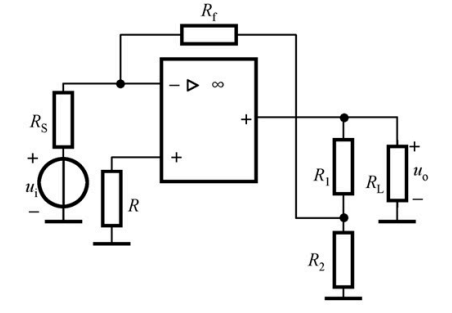

#circuit 

# 7.2 负反馈放大电路的工作组态

## 7.2.1 负反馈的分类

**（1）正反馈和负反馈**

- **正反馈**：反馈信号与输入信号相叠加（电压或电流），增大了净输入信号，能够提高放大倍数，但会使电路工作不稳定。实际电路中，正反馈常用于产生波形振荡电路。
- **负反馈**：反馈信号与输入信号相叠加（电压或电流），减小了净输入信号，降低了放大电路的放大倍数，但能够改善放大电路的各项性能。放大电路中常引入负反馈。

> [!判断方法（瞬时极性法）]
> 先设定输入信号在某一瞬时的极性为+，再沿信号通路逐级标出各点极性，最后比较反馈信号 $\dot{X}_f$ 与输入信号 $\dot{X}_i$ 作用在输入端的极性。
> - **正极性 → 正反馈**：反馈信号增强净输入信号（$\dot{X}_{id}=\dot{X}_i+\dot{X}_f$）。
> - **负极性 → 负反馈**：反馈信号削弱净输入信号（$\dot{X}_{id}=\dot{X}_i-\dot{X}_f$）。

#### （2）串联反馈和并联反馈
*观察输入端*
- **串联反馈**：反馈信号和输入信号以电压形式（串联）求和（KVL）。
通常表现为，反馈和输入接在**不同**节点

- **并联反馈**：反馈信号和输入信号以电流形式（并联）求和（KCL）。
通常表现为，反馈和输入接在**相同**节点

> [!判断方法（看输入端连接方式）]
> - **串联反馈**：反馈网络与信号源、基本放大电路的输入回路**串接**，反馈信号以电压 $\dot{U}_f$ 形式出现，输入关系满足 $\dot{U}_{id}=\dot{U}_i\pm\dot{U}_f$。电路特征：反馈信号与输入信号接在**不同**节点（如输入接基极、反馈接发射极）。
> - **并联反馈**：反馈网络与信号源、基本放大电路的输入端**并接**，反馈信号以电流 $\dot{I}_f$ 形式出现，输入关系满足 $\dot{I}_{id}=\dot{I}_i\pm\dot{I}_f$。电路特征：反馈信号与输入信号接在**相同**节点（如同时接在基极）。

#### （3）电压反馈和电流反馈
*观察输出端*
- **电压反馈**：反馈信号取自输出信号，以电压形式（并联）取出。稳定输出电压，具有恒压特性。
**反馈信号正比于输出电压 $\dot{U}_o$（$\dot{X}_f \propto \dot{U}_o$）**

- **电流反馈**：反馈信号取自输出信号，以电流形式（串联）取出。稳定输出电流，具有恒流特性。
**反馈信号正比于输出电流 $\dot{I}_o$（$\dot{X}_f \propto \dot{I}_o$）**

> [!判断方法]
> 令输出端短路（$\dot{U}_o=0$）
> **情况1**：反馈信号 $\dot{X}_f$ 随之消失 → 即为电压反馈。
> **情况2**：反馈信号 $\dot{X}_f$ 依然存在 → 即为电流反馈。
> 
> **或者令输出端断路，判断条件相反**

**（4）直流反馈和交流反馈**

- **直流反馈**：在放大电路中主要稳定静态工作点。
- **交流反馈**：在放大电路中改善动态指标。

**负反馈的分类树**：
- 负反馈
  - 交流反馈
    - 电压并联负反馈
    - 电压串联负反馈
    - 电流并联负反馈
    - 电流串联负反馈
  - 直流反馈
    - 稳定静态工作点

**负反馈的四种组态**
示例1：

示例2：

## 反馈组态判断举例

### 例1
判断图所示电路的反馈组态。

**答案：** 电流串联负反馈

**答案：** 电压并联负反馈

### 例2

**答案：** 直流电流并联负反馈

> 引入电压负反馈稳定输出电压，引入电流负反馈稳定输出电流！

### 例3

**答案：** 电流串联正反馈

### 例4

**答案：** 级间电压串联负反馈

### 例5

**答案：** 交直流电流串联负反馈

### 例6
图示电路有无引入反馈？是直流反馈还是交流反馈？是正反馈还是负反馈？若为交流负反馈，其组态为哪种？

**答案：** 交直流电流串联负反馈

> 1. 若从第三级射极输出，则电路引入了哪种组态的交流负反馈？
> 2. 若在第三级的射极加旁路电容，则反馈的性质有何变化？

---

### 例7

图示电路有无引入反馈？是直流反馈还是交流反馈？是正反馈还是负反馈？若为交流负反馈，其组态为哪种？

> 3. 若在第三级的射极加旁路电容，且在输出端和输入端跨接一电阻，则反馈的性质有何变化？

**答案：** 交直流电压并联负反馈

---

## 单选题

### 题1（1分）

如图所示电路，该电路交流反馈的组态是：

- A. 电压并联正反馈
- B. 电压并联负反馈
- C. 电流并联正反馈
- D. 电流并联负反馈
B

### 题2（1分）
如图所示电路，该电路交流反馈的组态是：

- A. 电压串联负反馈
- B. 电压串联正反馈
- C. 电压并联负反馈
- D. 电压并联正反馈
A

### 题3（1分）
如图所示电路，该电路级间交流反馈的组态是：

- A. 电压并联负反馈
- B. 电压并联正反馈
- C. 电压串联负反馈
- D. 电压串联正反馈
A

### 题4（1分）
如图所示电路，该电路交流反馈的组态是：

- A. 电压并联正反馈
- B. 电压并联负反馈
- C. 电流并联正反馈
- D. 电流并联负反馈
D