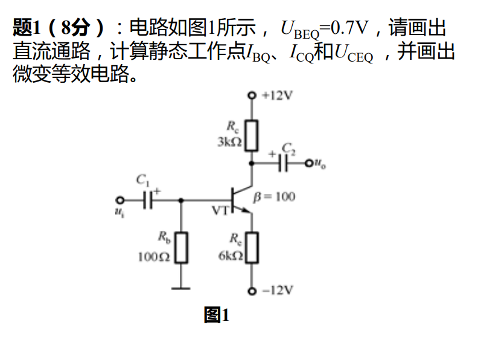
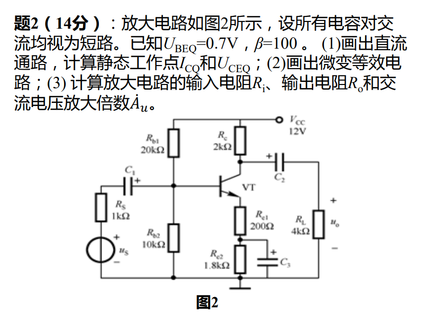

#review 
## 题1

这是一道经典的晶体管（BJT）基本共射极放大电路的直流通路分析题。

在进行直流分析时，电容 $C_1$ 和 $C_2$ 视为开路。我们假设该硅管的基极-发射极导通电压 $U_{BEQ} \approx 0.7\text{V}$。

**已知参数：**
- 电源电压 $V_{CC} = 12\text{V}$
- 基极电阻 $R_b = 500\text{k}\Omega$
- 集电极电阻 $R_c = 1\text{k}\Omega$
- 电流放大倍数 $\beta = 150$

**解题步骤：**

1. **计算基极静态电流 $I_{BQ}$：**
   根据输入回路的基尔霍夫电压定律（KVL）：
   $V_{CC} = I_{BQ} R_b + U_{BEQ}$
   $I_{BQ} = \frac{V_{CC} - U_{BEQ}}{R_b} = \frac{12\text{V} - 0.7\text{V}}{500\text{k}\Omega} = \frac{11.3}{500} \text{mA} = 0.0226\text{mA}$

2. **计算集电极静态电流 $I_{CQ}$（填空1）：**
   在放大区，集电极电流受基极电流控制：
   $I_{CQ} = \beta I_{BQ} = 150 \times 0.0226\text{mA} = 3.39\text{mA}$

3. **计算管压降 $U_{CEQ}$（填空2）：**
   根据输出回路的基尔霍夫电压定律（KVL）：
   $U_{CEQ} = V_{CC} - I_{CQ} R_c$
   $U_{CEQ} = 12\text{V} - (3.39\text{mA} \times 1\text{k}\Omega) = 12\text{V} - 3.39\text{V} = 8.61\text{V}$

**最终答案（保留两位小数）：**
- [填空1]：**3.39**
- [填空2]：**8.61**

---

## 题2

### 一、 画出直流通路

**画直流通路原则**：
1. **电容处理**：将阻直流通交流的耦合电容 $C_1$ 和 $C_2$ 视为**开路**。
2. **直流电源**：完整保留 $+12\text{V}$ 和 $-12\text{V}$ 直流偏置电源。

---

### 二、 计算静态工作点（$I_{\text{BQ}}$、$I_{\text{CQ}}$ 和 $U_{\text{CEQ}}$）

根据基极-发射极（B-E）回路的基尔霍夫电压定律（KVL），从地（0V）出发经过 $R_b$、B-E结、$R_e$ 到达 $-12\text{V}$ 电源：
$$0 - I_{\text{BQ}} R_b - U_{\text{BEQ}} - I_{\text{EQ}} R_e = -12\text{ V}$$

整理可得：
$$12\text{ V} - U_{\text{BEQ}} = I_{\text{BQ}} R_b + I_{\text{EQ}} R_e$$

因为 $I_{\text{EQ}} = (1 + \beta) I_{\text{BQ}}$，代入上式：
$$12 - 0.7 = I_{\text{BQ}} [R_b + (1 + \beta) R_e]$$

将已知数据代入：
* $U_{\text{BEQ}} = 0.7\text{ V}$
* $\beta = 100$
* $R_b = 100\ \Omega$
* $R_e = 6\text{ k}\Omega = 6000\ \Omega$

$$11.3 = I_{\text{BQ}} [100 + (1 + 100) \times 6000]$$
$$11.3 = I_{\text{BQ}} [100 + 606000] = 606100 \times I_{\text{BQ}}$$

#### 1. 计算基极静态电流 $I_{\text{BQ}}$：
$$I_{\text{BQ}} = \frac{11.3}{606100}\text{ A} \approx 1.864 \times 10^{-5}\text{ A} = 18.64\ \mu\text{A}$$

#### 2. 计算集电极静态电流 $I_{\text{CQ}}$：
$$I_{\text{CQ}} = \beta I_{\text{BQ}} = 100 \times 18.64\ \mu\text{A} = 1.864\text{ mA}$$
*(此时发射极电流 $I_{\text{EQ}} = (1 + \beta) I_{\text{BQ}} = 101 \times 18.64\ \mu\text{A} \approx 1.883\text{ mA}$)*

#### 3. 计算管压降 $U_{\text{CEQ}}$：
* **集电极静态电位 $V_{\text{CQ}}$**：
  $$V_{\text{CQ}} = 12\text{ V} - I_{\text{CQ}} R_c = 12 - 1.864\text{ mA} \times 3\text{ k}\Omega \approx 6.41\text{ V}$$
* **发射极静态电位 $V_{\text{EQ}}$**：
  $$V_{\text{EQ}} = -12\text{ V} + I_{\text{EQ}} R_e = -12 + 1.883\text{ mA} \times 6\text{ k}\Omega \approx -0.70\text{ V}$$
  *(也可由基极电位推导验证：$V_{\text{EQ}} = V_{\text{BQ}} - U_{\text{BEQ}} = -I_{\text{BQ}}R_b - 0.7 = -1.864\times 10^{-5}\times 100 - 0.7 \approx -0.70\text{ V}$，结果一致)*
* **静态管压降 $U_{\text{CEQ}}$**：
  $$U_{\text{CEQ}} = V_{\text{CQ}} - V_{\text{EQ}} = 6.41 - (-0.70) = 7.11\text{ V}$$

---

### 三、 画出微变等效电路

**画微变等效电路原则**：
1. **电容处理**：将耦合电容 $C_1$ 和 $C_2$ 视为**短路**，使输入信号 $u_i$ 直接加到基极，输出信号 $u_o$ 直接自集电极引出。
2. **直流电源**：直流电位 $+12\text{V}$ 和 $-12\text{V}$ 对交流信号而言均相当于**接地（GND）**。
3. **管子等效**：将三极管用小信号模型（输入电阻 $r_{be}$ 及受控电流源 $\beta i_b$）代替。由于发射极电阻 $R_e$ 无旁路电容，交流通路中 $R_e$ 仍接在发射极与地之间。

#### 1. 晶体管微变等效输入电阻 $r_{be}$ 的计算：
$$r_{be} = r_{bb'} + (1 + \beta) \frac{U_{\text{T}}}{I_{\text{EQ}}}$$
在常温下，温度电压当量 $U_{\text{T}} \approx 26\text{ mV}$。这里取三极管典型的基区体电阻 $r_{bb'} \approx 300\ \Omega$：
$$r_{be} \approx 300 + 101 \times \frac{26\text{ mV}}{1.883\text{ mA}} \approx 300 + 1395 = 1695\ \Omega \approx 1.7\text{ k}\Omega$$

---

## 题3

这是一道经典的晶体管放大电路分析题。我们将分步进行求解。

### **（1）画出直流通路，计算静态工作点 $I_{\text{CQ}}$ 和 $U_{\text{CEQ}}$**

**1. 直流通路分析：**
在直流情况下，电容视为开路（断开）。因此，$C_1$、$C_2$、$C_3$ 所在的支路全部断开。
*   输入信号源 $u_s$ 和 $R_s$ 被 $C_1$ 隔离，不参与直流计算。
*   负载 $R_L$ 被 $C_2$ 隔离，不参与直流计算。
*   发射极电阻 $R_{e1}$ 和 $R_{e2}$ 串联接入电路，因为 $C_3$ 断路。

**直流通路描述：**
电源 $V_{\text{CC}}$ 经过 $R_{b1}$ 和 $R_{b2}$ 分压为基极提供偏置电压；集电极接有电阻 $R_c$；发射极接有电阻 $R_{e1}$ 和 $R_{e2}$ 的串联。这是一个典型的**分压式偏置电路**。

**2. 静态工作点计算：**
首先判断是否可以使用近似计算方法。
条件：如果基极分压电路的电流远大于基极电流，即 $(1+\beta)(R_{e1}+R_{e2}) \gg R_{b1} \parallel R_{b2}$，则可以使用近似法。
*   $(1+\beta)(R_{e1}+R_{e2}) = (1+100) \times (0.2\text{k}\Omega + 1.8\text{k}\Omega) = 101 \times 2\text{k}\Omega = 202\text{k}\Omega$
*   $R_{b1} \parallel R_{b2} = \frac{20\text{k}\Omega \times 10\text{k}\Omega}{20\text{k}\Omega + 10\text{k}\Omega} \approx 6.67\text{k}\Omega$
显然 $202\text{k}\Omega \gg 6.67\text{k}\Omega$（远大于10倍），所以**采用近似法计算**非常合理。

*   **基极静态电位 $U_{\text{BQ}}$：**
    $$U_{\text{BQ}} \approx V_{\text{CC}} \frac{R_{b2}}{R_{b1} + R_{b2}} = 12\text{V} \times \frac{10\text{k}\Omega}{20\text{k}\Omega + 10\text{k}\Omega} = 4\text{V}$$
*   **发射极静态电位 $U_{\text{EQ}}$：**
    $$U_{\text{EQ}} = U_{\text{BQ}} - U_{\text{BEQ}} = 4\text{V} - 0.7\text{V} = 3.3\text{V}$$
*   **发射极静态电流 $I_{\text{EQ}}$ 和 集电极静态电流 $I_{\text{CQ}}$：**
    $$I_{\text{EQ}} = \frac{U_{\text{EQ}}}{R_{e1} + R_{e2}} = \frac{3.3\text{V}}{200\Omega + 1800\Omega} = \frac{3.3\text{V}}{2000\Omega} = 1.65\text{mA}$$
    $$I_{\text{CQ}} \approx I_{\text{EQ}} = 1.65\text{mA}$$
*   **管压降 $U_{\text{CEQ}}$：**
    $$U_{\text{CEQ}} = V_{\text{CC}} - I_{\text{CQ}}R_c - I_{\text{EQ}}(R_{e1} + R_{e2}) \approx V_{\text{CC}} - I_{\text{CQ}}(R_c + R_{e1} + R_{e2})$$
    $$U_{\text{CEQ}} = 12\text{V} - 1.65\text{mA} \times (2\text{k}\Omega + 0.2\text{k}\Omega + 1.8\text{k}\Omega) = 12\text{V} - 1.65\text{mA} \times 4\text{k}\Omega = 12\text{V} - 6.6\text{V} = 5.4\text{V}$$

---

### **（2）画出微变等效电路**

**微变等效电路画法规则：**
1.  **电容短路**：$C_1$、$C_2$、$C_3$ 对交流信号视为短路。
    *   $C_1$、$C_2$ 短路使得输入信号和负载接入电路。
    *   **关键点**：$C_3$ 短路会将与其并联的 $R_{e2}$ 短路掉。所以在交流通路中，发射极只连接了 $R_{e1}$ 到地。
2.  **直流电源置零**：$V_{\text{CC}}$ 端交流接地。
3.  **三极管模型替换**：将晶体管替换为输入电阻 $r_{be}$ 和受控电流源 $\beta i_b$ 的 H 参数小信号模型。

**微变等效电路描述（请自行在纸上画出）：**
*   **输入端**：信号源 $u_s$ 串联内阻 $R_s$ 连接到晶体管基极 (B)。
*   **基极 (B) 到地**：电阻 $R_{b1}$ 和 $R_{b2}$ 并联连接在基极和地之间（因为 $V_{\text{CC}}$ 接地了）。
*   **基极 (B) 到发射极 (E)**：连接晶体管内阻 $r_{be}$，电流 $i_b$ 流过。
*   **发射极 (E) 到地**：连接电阻 $R_{e1}$（注意 $R_{e2}$ 被 $C_3$ 短路了）。
*   **集电极 (C) 到发射极 (E)**：连接受控电流源 $\beta i_b$，方向从 C 指向 E。
*   **集电极 (C) 到地**：电阻 $R_c$ 和负载电阻 $R_L$ 并联连接在集电极和地之间。
*   **输出端**：输出电压 $u_o$ 是集电极 (C) 到地之间的电压。

---

### **（3）计算放大电路的输入电阻 $R_i$、输出电阻 $R_o$ 和交流电压放大倍数 $\dot{A}_u$**

在计算之前，需要先求出晶体管的输入电阻 $r_{be}$。
假设晶体管基区体电阻 $r_{bb'} \approx 300\Omega$，热电压 $U_T \approx 26\text{mV}$（常温下）。
$$r_{be} = r_{bb'} + (1+\beta)\frac{U_T}{I_{\text{EQ}}} = 300\Omega + (1+100)\frac{26\text{mV}}{1.65\text{mA}} \approx 300\Omega + 101 \times 15.76\Omega \approx 300\Omega + 1591\Omega = 1891\Omega \approx 1.89\text{k}\Omega$$

**1. 输入电阻 $R_i$：**
输入电阻是从放大器输入端（$C_1$ 之后）看进去的等效电阻。
$$R_i = R_{b1} \parallel R_{b2} \parallel R_{ib}$$

> [!NOTE]
> 这里可以看出，输入电阻包括除了$R_s$以外的所有等效电阻

其中，$R_{ib}$ 是从晶体管基极看进去的等效电阻。因为发射极带有未被旁路的电阻 $R_{e1}$，根据阻抗折算原则：
$$R_{ib} = r_{be} + (1+\beta)R_{e1} = 1.89\text{k}\Omega + (1+100) \times 0.2\text{k}\Omega = 1.89\text{k}\Omega + 20.2\text{k}\Omega = 22.09\text{k}\Omega$$
$$R_i = 20\text{k}\Omega \parallel 10\text{k}\Omega \parallel 22.09\text{k}\Omega \approx 6.67\text{k}\Omega \parallel 22.09\text{k}\Omega = \frac{6.67 \times 22.09}{6.67 + 22.09}\text{k}\Omega \approx \mathbf{5.12\text{k}\Omega}$$
*$R_{ib}$的计算参考[公式证明](#公式证明)*

**2. 输出电阻 $R_o$：**
输出电阻是从负载两端看回放大器的等效电阻。计算时令信号源 $u_s = 0$（保留内阻 $R_s$）。
此时基极电流 $i_b = 0$，受控电流源 $\beta i_b = 0$ 视为开路。从输出端看进去，只能看到集电极电阻 $R_c$。
$$R_o \approx R_c = \mathbf{2\text{k}\Omega}$$

**3. 交流电压放大倍数 $\dot{A}_u$：**
电压放大倍数定义为输出电压与输入电压（放大器输入端电压，非信号源电压）之比：$\dot{A}_u = \frac{\dot{U}_o}{\dot{U}_i}$。
*   输出电压：$\dot{U}_o = - \beta \dot{I}_b (R_c \parallel R_L)$
*   输入电压：$\dot{U}_i = \dot{I}_b \cdot r_{be} + (1+\beta)\dot{I}_b \cdot R_{e1} = \dot{I}_b [r_{be} + (1+\beta)R_{e1}]$

将两者相除得到：
$$\dot{A}_u = \frac{- \beta (R_c \parallel R_L)}{r_{be} + (1+\beta)R_{e1}}$$
代入数值计算：
*   $R_c \parallel R_L = 2\text{k}\Omega \parallel 4\text{k}\Omega = \frac{2 \times 4}{2 + 4}\text{k}\Omega \approx 1.33\text{k}\Omega$
*   分母即为刚才计算的 $R_{ib} = 22.09\text{k}\Omega$

$$\dot{A}_u = \frac{-100 \times 1.33\text{k}\Omega}{22.09\text{k}\Omega} = \frac{-133.3}{22.09} \approx \mathbf{-6.03}$$
*(负号表示输出电压与输入电压相位反相)*

---
**补充说明：**如果题目所指的“放大倍数”隐式地包含了信号源内阻的影响，即求**源电压放大倍数 $\dot{A}_{us}$** ($\frac{\dot{U}_o}{\dot{U}_s}$)，则计算如下：
$$\dot{A}_{us} = \dot{A}_u \cdot \frac{R_i}{R_s + R_i} = -6.03 \times \frac{5.12\text{k}\Omega}{1\text{k}\Omega + 5.12\text{k}\Omega} \approx -6.03 \times 0.837 \approx \mathbf{-5.05}$$
(通常情况下，$\dot{A}_u$ 特指 $\frac{\dot{U}_o}{\dot{U}_i}$，按 -6.03 答题即可)。

## 公式证明
这个公式 $R_{ib} = r_{be} + (1+\beta)R_{e1}$ 是计算**从晶体管基极（B）看进去的等效输入电阻**的经典公式。

要理解这个公式，我们需要结合**微变等效电路（小信号模型）**来进行推导，并理解其中的“阻抗折算”原理。

### 1. 物理意义
在交流通路中，由于电容 $C_3$ 把 $R_{e2}$ 短路了，所以发射极（E）到地之间只剩下一个电阻 $R_{e1}$。
$R_{ib}$ 就是交流信号从基极输入时，**晶体管本身**加上**发射极电阻 $R_{e1}$** 共同呈现给基极的总等效电阻。

### 2. 详细推导过程
根据欧姆定律，从基极看进去的等效电阻 $R_{ib}$ 等于**基极对地交流电压 $u_b$** 与**基极交流电流 $i_b$** 的比值：
$$R_{ib} = \frac{u_b}{i_b}$$

现在我们顺着电流的路径，从基极（B）走到地（GND），看看沿途产生了哪些电压降：
1.  **路径第一段（从基极 B 到发射极 E）：** 电流 $i_b$ 流过晶体管内部的基射极动态电阻 $r_{be}$，产生电压降 $u_{be} = i_b \cdot r_{be}$。
2.  **路径第二段（从发射极 E 到地 GND）：** 这一段接的是电阻 $R_{e1}$。**请注意，流过 $R_{e1}$ 的电流不是基极电流 $i_b$，而是发射极电流 $i_e$。**
    根据晶体管的电流关系（基尔霍夫电流定律），发射极电流等于基极电流加上集电极电流：
    $$i_e = i_b + i_c = i_b + \beta i_b = (1+\beta)i_b$$
    所以，在 $R_{e1}$ 上产生的电压降为：$u_{e} = i_e \cdot R_{e1} = (1+\beta)i_b \cdot R_{e1}$。

根据基尔霍夫电压定律（KVL），基极对地的总电压 $u_b$ 等于这两段电压降之和：
$$u_b = u_{be} + u_{e}$$
$$u_b = (i_b \cdot r_{be}) + \left[ (1+\beta)i_b \cdot R_{e1} \right]$$

提取公因式 $i_b$：
$$u_b = i_b \cdot \left[ r_{be} + (1+\beta)R_{e1} \right]$$

最后，代入最开始的等效电阻定义公式：
$$R_{ib} = \frac{u_b}{i_b} = \frac{i_b \cdot \left[ r_{be} + (1+\beta)R_{e1} \right]}{i_b} = \mathbf{r_{be} + (1+\beta)R_{e1}}$$

### 3. 直观理解（阻抗折算原则 / 反射原则）
这个公式揭示了电子电路中一个非常重要的概念：**阻抗的折算（Reflection）**。

*   **站在基极看发射极电阻：**
    虽然发射极真实接入的物理电阻只有 $R_{e1}$（这里是 200Ω），但是因为流过它的电流 $i_e$ 是基极输入电流 $i_b$ 的 $(1+\beta)$ 倍（大约 101 倍），它所产生的电压降也是基极电流直接流过时产生的电压降的 $(1+\beta)$ 倍。
*   **等效放大：**
    对于基极来说，它“感觉”到的阻力（电阻）不仅包含了本身的 $r_{be}$，发射极的电阻 $R_{e1}$ 还被**等效放大了 $(1+\beta)$ 倍**。

**总结：**
公式 $R_{ib} = r_{be} + (1+\beta)R_{e1}$ 就是告诉我们：**接在发射极上的电阻，从基极看过去时，其阻值要乘以 $(1+\beta)$ 倍。** 这个特性使得带有发射极未旁路电阻（$R_{e1}$）的放大电路具有**显著提高输入电阻**的优点（本题中，200Ω 的小电阻被折算成了高达 20.2kΩ 的等效电阻）。

