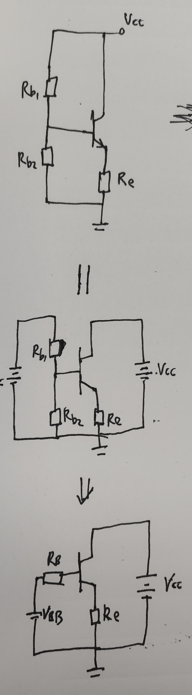
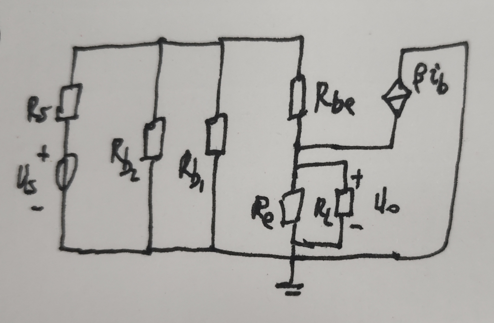

#review 
## 题目

这是一道典型的晶体管放大电路分析题。该电路是一个**共集电极放大电路**（也叫射极跟随器），因为输入信号从基极输入，输出信号从发射极取出，集电极接交流地。

下面分步骤进行解答：

### （1）求静态工作点 $I_{CQ}$ 和 $U_{CEQ}$

进行直流静态分析时，将所有的电容（$C_{b1}$, $C_{b2}$）视为开路。

基极电路由 $R_{b1}$ 和 $R_{b2}$ 组成分压偏置。为了简化计算，我们利用戴维南定理将基极电路等效为一个电压源 $V_{BB}$ 和一个内阻 $R_B$ 的串联。
*这里也可以直接列方程求解 --tz*

*   **等效基极电源电压 $V_{BB}$：**
    $$V_{BB} = V_{CC} \cdot \frac{R_{b2}}{R_{b1} + R_{b2}} = 12\text{V} \cdot \frac{30\text{k}\Omega}{60\text{k}\Omega + 30\text{k}\Omega} = 12 \cdot \frac{30}{90} = 4\text{V}$$

*   **等效基极电阻 $R_B$：**
    $$R_B = R_{b1} \parallel R_{b2} = \frac{60\text{k}\Omega \cdot 30\text{k}\Omega}{60\text{k}\Omega + 30\text{k}\Omega} = 20\text{k}\Omega$$

*   **列基极-发射极回路的基尔霍夫电压定律 (KVL) 方程：**
    $$V_{BB} = I_{BQ} \cdot R_B + U_{BEQ} + I_{EQ} \cdot R_e$$
    因为 $I_{EQ} = (1 + \beta) \cdot I_{BQ}$，代入上式得：
    $$V_{BB} = I_{BQ} \cdot R_B + U_{BEQ} + (1 + \beta) \cdot I_{BQ} \cdot R_e$$

*   **计算基极电流 $I_{BQ}$：**
    $$I_{BQ} = \frac{V_{BB} - U_{BEQ}}{R_B + (1 + \beta)R_e} = \frac{4\text{V} - 0.7\text{V}}{20\text{k}\Omega + (1 + 100) \cdot 2\text{k}\Omega} = \frac{3.3\text{V}}{20\text{k}\Omega + 202\text{k}\Omega} = \frac{3.3\text{V}}{222\text{k}\Omega} \approx 0.01486\text{mA} = 14.86\mu\text{A}$$

*   **计算集电极电流 $I_{CQ}$：**
    $$I_{CQ} = \beta \cdot I_{BQ} = 100 \cdot 0.01486\text{mA} \approx \mathbf{1.49\text{mA}}$$

*   **计算发射极电流 $I_{EQ}$（用于后续计算）：**
    $$I_{EQ} = (1 + \beta) \cdot I_{BQ} = 101 \cdot 0.01486\text{mA} \approx 1.50\text{mA}$$

*   **计算管压降 $U_{CEQ}$：**
    因为集电极直接接电源，发射极通过 $R_e$ 接地：
    $$U_{CEQ} = V_C - V_E = V_{CC} - I_{EQ} \cdot R_e = 12\text{V} - 1.50\text{mA} \cdot 2\text{k}\Omega = 12\text{V} - 3.0\text{V} = \mathbf{9.0\text{V}}$$

---

### （2）画出微变等效电路

---

### （3）求输入电阻 $R_i$、输出电阻 $R_o$ 和交流电压放大倍数 $\dot{A}_u$

首先计算三极管的输入电阻 $r_{be}$。通常取体电阻 $r_{bb'} \approx 300\Omega$，热电压 $U_T = 26\text{mV}$。
$$r_{be} = r_{bb'} + (1 + \beta)\frac{U_T}{I_{EQ}} \approx 300\Omega + (1 + 100) \cdot \frac{26\text{mV}}{1.50\text{mA}} = 300 + 101 \cdot 17.33 \Omega \approx 300 + 1750.67 = \mathbf{2.05\text{k}\Omega}$$

令交流等效负载电阻 $R_L' = R_e \parallel R_L = \frac{2\text{k}\Omega \cdot 4\text{k}\Omega}{2\text{k}\Omega + 4\text{k}\Omega} = \frac{8}{6}\text{k}\Omega \approx 1.333\text{k}\Omega$。

#### 输入电阻 $R_i$：
输入电阻是从基极耦合电容后向右看的等效电阻。
从基极看进去，三极管本身的输入电阻为：$R_{ib} = r_{be} + (1 + \beta)R_L'$
总输入电阻 $R_i$ 是偏置电阻 $R_B$ 与 $R_{ib}$ 的并联：
$$R_{ib} = 2.05\text{k}\Omega + 101 \cdot 1.333\text{k}\Omega \approx 2.05 + 134.63 = 136.68\text{k}\Omega$$
$$R_i = R_B \parallel R_{ib} = 20\text{k}\Omega \parallel 136.68\text{k}\Omega = \frac{20 \cdot 136.68}{20 + 136.68} = \frac{2733.6}{156.68} \approx \mathbf{17.45\text{k}\Omega}$$

#### 输出电阻 $R_o$：
输出电阻是将输入信号源 $u_s$ 置零（短路，保留内阻 $R_s$），断开负载 $R_L$ 后，从输出端（发射极）向左看的等效电阻。
此时基极对地的等效电阻为 $R_{eq} = R_B \parallel R_s = 20\text{k}\Omega \parallel 1\text{k}\Omega = \frac{20}{21}\text{k}\Omega \approx 0.952\text{k}\Omega$ (即 $952\Omega$)。
从发射极看进去三极管的输出电阻为：$R_{oe} = \frac{r_{be} + R_{eq}}{1 + \beta}$，参考[晶体管内部的阻抗变换原理](../晶体管内部的阻抗变换原理.md)
$$R_{oe} = \frac{2050\Omega + 952\Omega}{101} = \frac{3002}{101} \approx 29.72\Omega$$
总输出电阻 $R_o$ 是 $R_e$ 与 $R_{oe}$ 的并联：
$$R_o = R_e \parallel R_{oe} = 2000\Omega \parallel 29.72\Omega = \frac{2000 \cdot 29.72}{2000 + 29.72} \approx \mathbf{29.3\Omega}$$

#### 交流电压放大倍数 $\dot{A}_u$：
题目中通常 $\dot{A}_u$ 指的是输出电压 $\dot{U}_o$ 与输入端电压 $\dot{U}_i$（基极电压）的比值。
$$\dot{A}_u = \frac{\dot{U}_o}{\dot{U}_i} = \frac{i_e \cdot R_L'}{i_b \cdot R_{ib}} = \frac{(1 + \beta) \cdot i_b \cdot R_L'}{i_b \cdot [r_{be} + (1 + \beta)R_L']} = \frac{(1 + \beta)R_L'}{r_{be} + (1 + \beta)R_L'}$$
$$\dot{A}_u = \frac{101 \cdot 1.333\text{k}\Omega}{2.05\text{k}\Omega + 101 \cdot 1.333\text{k}\Omega} = \frac{134.63}{2.05 + 134.63} = \frac{134.63}{136.68} \approx \mathbf{0.985}$$
*(注：如果题目 $\dot{A}_u$ 意为源电压放大倍数 $\dot{A}_{us} = \dot{U}_o / \dot{U}_s$，则 $\dot{A}_{us} = \dot{A}_u \cdot \frac{R_i}{R_s + R_i} \approx 0.985 \cdot \frac{17.45}{1+17.45} \approx 0.932$。一般常规直接写 $\dot{A}_u$ 为 0.985 即可。)*

