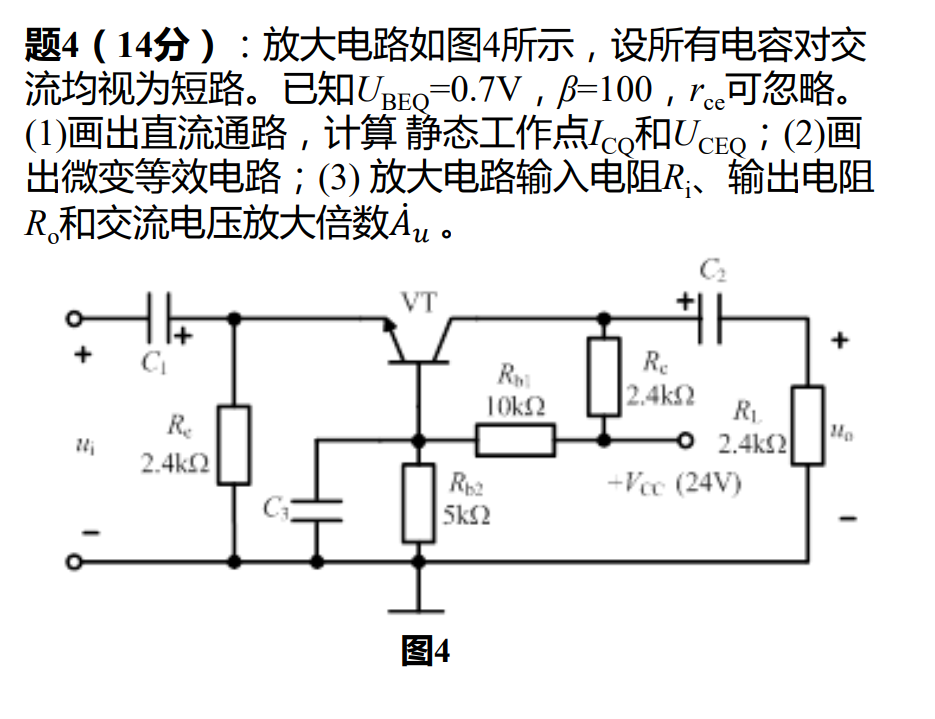
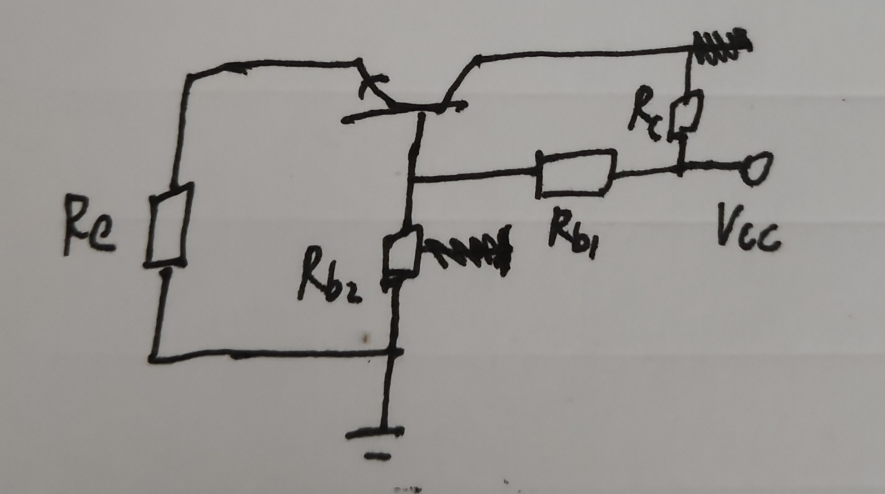
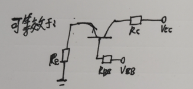
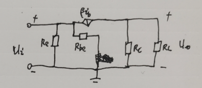

#circuit 
## 题目

这是一个**共基极（Common Base, CB）放大电路**， **NPN** 型晶体管。

### （1）画出直流通路，计算静态工作点 $I_{CQ}$ 和 $U_{CEQ}$

**计算静态工作点：**
为了更精确，我们使用戴维南等效电路来分析基极回路：

*   基极等效电源电压：
$$V_{BB} = V_{CC} \cdot \frac{R_{b2}}{R_{b1} + R_{b2}} = 24\text{ V} \cdot \frac{5\text{ k}\Omega}{10\text{ k}\Omega + 5\text{ k}\Omega} = 8\text{ V}$$
*   基极等效内阻：
$$R_{BB} = R_{b1} \parallel R_{b2} = \frac{10\text{ k}\Omega \cdot 5\text{ k}\Omega}{10\text{ k}\Omega + 5\text{ k}\Omega} = \frac{10}{3}\text{ k}\Omega \approx 3.33\text{ k}\Omega$$

*   列基极-发射极回路方程：
    $$V_{BB} = I_{BQ}R_{BB} + U_{BEQ} + I_{EQ}R_e$$
    已知 $I_{EQ} = (1+\beta)I_{BQ}$，代入得：
    $$I_{BQ} = \frac{V_{BB} - U_{BEQ}}{R_{BB} + (1+\beta)R_e} = \frac{8\text{ V} - 0.7\text{ V}}{3.33\text{ k}\Omega + (1+100) \cdot 2.4\text{ k}\Omega} = \frac{7.3}{3.33 + 242.4}\text{ mA} = \frac{7.3}{245.73}\text{ mA} \approx 0.0297\text{ mA}$$

*   计算集电极和发射极静态电流：
    $$I_{CQ} = \beta I_{BQ} = 100 \cdot 0.0297\text{ mA} = 2.97\text{ mA}$$
    $$I_{EQ} = (1+\beta) I_{BQ} = 101 \cdot 0.0297\text{ mA} \approx 3.00\text{ mA}$$
    *(注：如果采用近似估算法，由于 $(1+\beta)R_e \gg R_{BB}$，可直接认为 $V_B \approx 8V$，$V_E = 8-0.7=7.3V$，$I_E = 7.3/2.4 \approx 3.04mA$，$I_C \approx 3.04mA$。此处使用精确算法结果更严谨，且恰好得到 $I_{EQ}=3.0mA$ 的规整数值)*

*   计算管压降 $U_{CEQ}$：
$$U_{CEQ} = V_{CC} - I_{CQ}R_c - I_{EQ}R_e = 24 - (2.97 \cdot 2.4) - (3.00 \cdot 2.4) = 24 - 7.128 - 7.2 = 9.672\text{ V}$$

**结论：** 静态工作点 $I_{CQ} \approx 2.97\text{ mA}$， $U_{CEQ} \approx 9.67\text{ V}$。

### （2）画出微变等效电路

### （3）计算放大电路输入电阻 $R_i$ 、输出电阻 $R_o$ 和交流电压放大倍数 $\dot{A}_u$
在计算之前，需要先求出晶体管的输入电阻 $r_{be}$。题目未给出基区体电阻 $r_{bb'}$，按一般教材惯例，可假设 $r_{bb'} \approx 300\Omega$ （室温下热电压 $U_T \approx 26\text{ mV}$）：
$$r_{be} = r_{bb'} + (1+\beta)\frac{U_T}{I_{EQ}} \approx 300 + 101 \cdot \frac{26\text{ mV}}{3.00\text{ mA}} \approx 300 + 875 = 1175\ \Omega$$
**1. 输入电阻 $R_i$**
从输入端看进去，输入电阻等于 $R_e$ 与从发射极看入晶体管的等效电阻并联。

> [!为什么不考虑集电极电阻]
> ## 从 $i_b$ 和 $\beta i_b$ 的关系说起
> 
> 晶体管的电流关系是：
> 
> $$i_e = i_b + i_c = i_b + \beta i_b = (1+\beta)i_b$$
> 
> 这是一个**内部约束**。只要晶体管工作在放大区，不管集电极外面接的是 $R_c=1\text{k}\Omega$ 还是 $R_c=100\text{k}\Omega$，这个比例都成立。
> 
> 所以从发射极端口往晶体管内部看：
> 
> $$i_e = (1+\beta) i_b = (1+\beta) \cdot \frac{v_{be}}{r_{be}} = (1+\beta) \cdot \frac{v_{eb}}{r_{be}} = \frac{v_{eb}}{r_{be}/(1+\beta)}$$
> 
> 于是晶体管发射极到地的等效电阻就是：
> 
> $$r_e = \frac{r_{be}}{1+\beta}$$
> 
> **注意**：在这个推导中，$\beta i_b$ 已经**被包含在内**了。$r_{be}/(1+\beta)$ 这个式子本身就体现了"集电极有 $\beta i_b$ 分流"这一事实。正是因为大部分电流 $\beta i_b$ 去了集电极，只有很小一部分 $i_b$ 去基极，所以从发射极看进去的等效电阻才被"缩小"了 $(1+\beta)$ 倍。

从发射极看入晶体管的电阻约为 $\frac{r_{be}}{1+\beta}$（或称 $r_e$）。
$$R_i = R_e \parallel \left( \frac{r_{be}}{1+\beta} \right)$$
$$R_i = 2.4\text{ k}\Omega \parallel \left( \frac{1175}{101} \right)\Omega \approx 2400\ \Omega \parallel 11.63\ \Omega \approx 11.6\ \Omega$$
*(共基极电路的特点就是输入电阻极小)*

**2. 输出电阻 $R_o$**
求输出电阻时，将输入信号源短路（令 $u_i = 0$），断开负载 $R_L$。
当 $u_i = 0$ 时，发射极交流短路到地，$v_{be} = 0$，则 $i_b = 0$，受控源 $\beta i_b = 0$（视为开路）。此时从输出端看进去，只能看到电阻 $R_c$。
$$R_o = R_c = 2.4\text{ k}\Omega$$

**3. 交流电压放大倍数 $\dot{A}_u$**
根据微变等效电路：
*   输入电压 $u_i = -v_{be} = - (i_b \cdot r_{be})$，所以 $i_b = -\frac{u_i}{r_{be}}$
*   输出电压 $u_o$ 产生于受控电流流过并联的 $R_c$ 和 $R_L$。受控电流 $\beta i_b$ 流向发射极，因此流出集电极节点的电流总量为 $\beta i_b$，在并联电阻上产生的压降为：
    $$u_o = -\beta i_b \cdot (R_c \parallel R_L)$$
*   将 $i_b$ 代入：
$$u_o = -\beta \left(-\frac{u_i}{r_{be}}\right) \cdot (R_c \parallel R_L) = \frac{\beta (R_c \parallel R_L)}{r_{be}} u_i$$
*   电压放大倍数：
$$\dot{A}_u = \frac{u_o}{u_i} = \frac{\beta (R_c \parallel R_L)}{r_{be}}$$
    代入数值：$R_c \parallel R_L = 2.4\text{ k}\Omega \parallel 2.4\text{ k}\Omega = 1.2\text{ k}\Omega = 1200\ \Omega$，得：
$$\dot{A}_u = \frac{100 \cdot 1200}{1175} = \frac{120000}{1175} \approx 102.1$$

*(注：如果你的课程要求忽略 $r_{bb'}$，则 $r_{be} \approx 875\Omega$，此时 $\dot{A}_u \approx 137.1$，计算方法完全一致，只需替换 $r_{be}$ 的值即可。)
