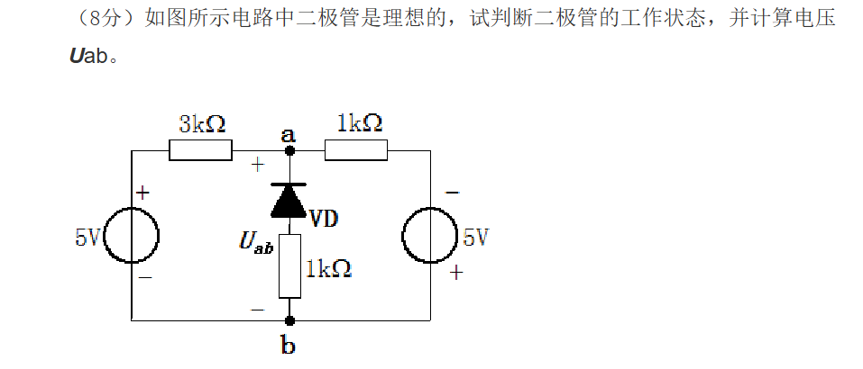
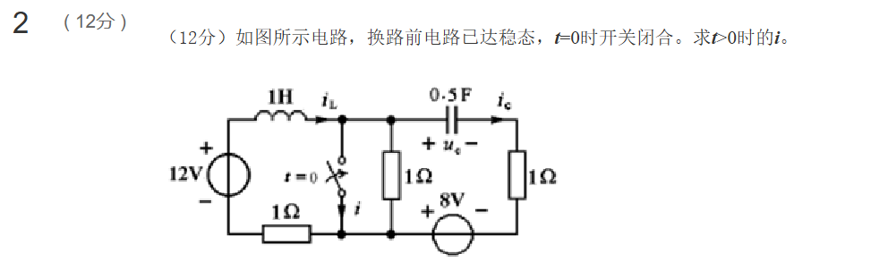
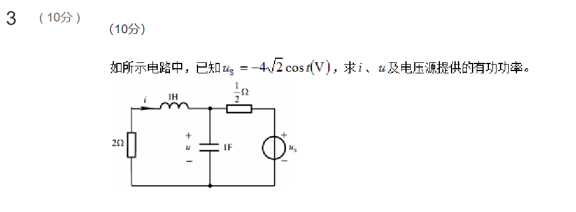

## 题1


## 题2

这是一道典型的一阶动态电路过渡过程分析题。我们可以通过**三要素法**来分步求解。
*三要素法求的是 **电感/电容** 本身的状态*

### 一、 确定换路前的初始状态（$t < 0$）

$t < 0$ 时电路处于直流稳态，电感短路、电容断路，开关断开。

左侧回路总电阻 $R = 1\Omega + 1\Omega = 2\Omega$，故：
$$i_L(0^-) = \frac{12\text{ V}}{2\Omega} = 6\text{ A}$$

由换路定律：
$$i_L(0^+) = i_L(0^-) = 6\text{ A}$$

中间 $1\Omega$ 电阻的压降为 $6\text{ V}$，即开关上端节点电位为 $6\text{ V}$。对右侧回路列 KVL：
$$6\text{ V} - u_c(0^-) + 8\text{ V} = 0 \implies u_c(0^-) = 14\text{ V}$$

由换路定律：
$$u_c(0^+) = u_c(0^-) = 14\text{ V}$$

---

### 二、 换路后分析（$t > 0$）

在 $t = 0$ 时开关闭合。此时：
- 开关所在支路成为短路，中间的 $1\Omega$ 电阻被短路，其两端电压为 0，电流为 0。
- 该短路支路将电路**完全解耦**为左右两个独立的一阶单回路：左侧为一阶 RL 电路，右侧为一阶 RC 电路。

我们需要分别求解这两个电路的响应。

#### 1. 左侧 RL 回路响应
该回路仅由 $12\text{ V}$ 电压源、电感 $L=1\text{ H}$、以及左下方电阻 $R_1=1\Omega$ 串联组成。
- 初始值：
  $$i_L(0^+) = 6\text{ A}$$
- 稳态值（$t \to \infty$ 时电感相当于短路）：
  $$i_L(\infty) = \frac{12\text{ V}}{1\Omega} = 12\text{ A}$$
- 时间常数：
  $$\tau_L = \frac{L}{R_1} = \frac{1\text{ H}}{1\Omega} = 1\text{ s}$$

利用三要素法公式：
$$i_L(t) = i_L(\infty) + [i_L(0^+) - i_L(\infty)]e^{-t/\tau_L}$$
$$i_L(t) = 12 + (6 - 12)e^{-t} = 12 - 6e^{-t}\text{ A} \quad (t > 0)$$

#### 2. 右侧 RC 回路响应
该回路仅由电容 $C=0.5\text{ F}$、右侧电阻 $R_2=1\Omega$、以及 $8\text{ V}$ 电压源串联组成。
- 初始值：
  $$u_c(0^+) = 14\text{ V}$$
- 稳态值（$t \to \infty$ 时电容相当于断路）：
  $$u_c(\infty) = 8\text{ V}$$
- 时间常数：
  $$\tau_C = R_2 C = 1\Omega \times 0.5\text{ F} = 0.5\text{ s}$$

利用三要素法公式求得电容电压：
$$u_c(t) = u_c(\infty) + [u_c(0^+) - u_c(\infty)]e^{-t/\tau_C}$$
$$u_c(t) = 8 + (14 - 8)e^{-t/0.5} = 8 + 6e^{-2t}\text{ V} \quad (t > 0)$$

根据电容的特性，求右侧支路电流 $i_c(t)$：
$$i_c(t) = C \frac{\mathrm{d}u_c(t)}{\mathrm{d}t} = 0.5 \times \frac{\mathrm{d}}{\mathrm{d}t}(8 + 6e^{-2t}) = 0.5 \times (-12e^{-2t}) = -6e^{-2t}\text{ A} \quad (t > 0)$$

---

### 三、 求解开关电流 $i(t)$

对开关上端的节点 A 列写基尔霍夫电流定律（KCL）方程：
- 电感电流 $i_L$ 流入该节点。
- 开关电流 $i$、电容电流 $i_c$ 流出该节点（中间 $1\Omega$ 电阻已被短路，其电流为 0）。

由此可得：
$$i_L(t) = i(t) + i_c(t) \implies i(t) = i_L(t) - i_c(t)$$

将 $i_L(t)$ 和 $i_c(t)$ 的表达式代入：
$$i(t) = (12 - 6e^{-t}) - (-6e^{-2t})$$
$$i(t) = 12 - 6e^{-t} + 6e^{-2t}\text{ A} \quad (t > 0)$$

---

### 四、 结论

$t > 0$ 时的开关电流 $i(t)$ 为：
$$i(t) = 12 - 6e^{-t} + 6e^{-2t}\text{ A}$$
## 题3


## 题4

这是一个典型的共集电极放大电路（也称射极输出器、共集电极双极型晶体管放大电路），其中晶体管为 **PNP** 型晶体管。

根据题目要求，逐步解答如下：

---

### （1）直流通路与计算静态工作点 $Q$

#### ① 直流通路
在直流通路中，所有电容（$C_{\text{b1}}$ 和 $C_{\text{b2}}$）均视为**开路**。电路中的交流信号源和负载 $R_{\text{L}}$ 均被隔离。直流通路拓扑结构描述如下：
- **基极 (B)**：通过基极电阻 $R_{\text{b1}} = 200\text{ k}\Omega$ 连接至直流电源 $V_{\text{CC}} = -12\text{ V}$。
- **发射极 (E)**：通过发射极电阻 $R_{\text{e}} = 1.2\text{ k}\Omega$ 连接至直流通路参考地（$0\text{ V}$）。
- **集电极 (C)**：通过集电极电阻 $R_{\text{c}} = 1\text{ k}\Omega$ 连接至直流电源 $V_{\text{CC}} = -12\text{ V}$。

**直流通路示意图**：
```text
                  Vcc = -12V
                 +------------+
                 |            |
                [Rb1]        [Rc] 
                200k         1k
                 |            |
                 +-----B    C-+
                        \  /
                        VT \ (PNP型晶体管，发射极箭头指向基极)
                        e|/
                         |
                         E
                         |
                        [Re] 1.2k
                         |
                        === (直流地 0V)
```

#### ② 计算静态工作点 $Q$
对 PNP 晶体管，电流实际从发射极（高电位 $0\text{ V}$）流向基极与集电极（负电位 $-12\text{ V}$）。
列出发射极-基极回路的 KVL 方程：
$$0 - I_{\text{EQ}} R_{\text{e}} - U_{\text{EBQ}} - I_{\text{BQ}} R_{\text{b1}} = V_{\text{CC}}$$

其中 $U_{\text{EBQ}} = - U_{\text{BEQ}} = 0.7\text{ V}$，且 $I_{\text{EQ}} = (1 + \beta) I_{\text{BQ}}$，代入上式整理得：
$$I_{\text{BQ}} R_{\text{b1}} + (1 + \beta) I_{\text{BQ}} R_{\text{e}} = -V_{\text{CC}} - U_{\text{EBQ}}$$
$$I_{\text{BQ}} = \frac{-V_{\text{CC}} - U_{\text{EBQ}}}{R_{\text{b1}} + (1 + \beta) R_{\text{e}}}$$

已知 $V_{\text{CC}} = -12\text{ V}$，$\beta = 50$，$R_{\text{b1}} = 200\text{ k}\Omega$，$R_{\text{e}} = 1.2\text{ k}\Omega$，代入数据计算：
$$I_{\text{BQ}} = \frac{12 - 0.7}{200 + 51 \times 1.2}\text{ mA} = \frac{11.3}{261.2}\text{ mA} \approx 0.0433\text{ mA} = 43.3\text{ }\mu\text{A}$$

接着计算集电极电流 $I_{\text{CQ}}$ 和发射极电流 $I_{\text{EQ}}$：
$$I_{\text{CQ}} = \beta I_{\text{BQ}} = 50 \times 0.0433\text{ mA} \approx 2.16\text{ mA}$$
$$I_{\text{EQ}} = (1 + \beta) I_{\text{BQ}} = 51 \times 0.0433\text{ mA} \approx 2.21\text{ mA}$$

计算各极静态对地电位及管压降：
$$V_{\text{EQ}} = - I_{\text{EQ}} R_{\text{e}} \approx -2.21\text{ mA} \times 1.2\text{ k}\Omega \approx -2.65\text{ V}$$
$$V_{\text{CQ}} = V_{\text{CC}} + I_{\text{CQ}} R_{\text{c}} = -12\text{ V} + 2.16\text{ mA} \times 1\text{ k}\Omega \approx -9.84\text{ V}$$

静态管压降 $U_{\text{CEQ}}$（或 $U_{\text{ECQ}}$）：
$$U_{\text{CEQ}} = V_{\text{CQ}} - V_{\text{EQ}} \approx -9.84\text{ V} - (-2.65\text{ V}) = -7.19\text{ V}$$
$$U_{\text{ECQ}} = V_{\text{EQ}} - V_{\text{CQ}} \approx 7.19\text{ V}$$

所以静态工作点为：
$$Q\text{ 点：}(I_{\text{BQ}} \approx 43.3\text{ }\mu\text{A},\ I_{\text{CQ}} \approx 2.16\text{ mA},\ U_{\text{CEQ}} \approx -7.19\text{ V} \text{ 或 } U_{\text{ECQ}} \approx 7.19\text{ V})$$

---

### （2）画出交流通路

在交流通路中，大电容 $C_{\text{b1}}$ 和 $C_{\text{b2}}$ 视为**短路**，直流电压源 $V_{\text{CC}}$ 视为**对地短路**（即交流地）。

**交流通路结构描述**：
- **输入端**：信号源 $u_{\text{s}}$ 串联 $R_{\text{s}}$ 接入基极 $B$，基极电阻 $R_{\text{b1}}$ 另一端变为交流接地。
- **输出端**：发射极 $E$ 接到并联的 $R_{\text{e}}$ 和负载 $R_{\text{L}}$，它们共同连接至交流地。
- **集电极**：通过 $R_{\text{c}}$ 连接至交流地。

**交流通路示意图**：
```text
           Rs     Cb1(短路)
   us (~)--[ ]--------+---------B       C----+
          1k          |        / \           |
                     [Rb1]     \ / VT       [Rc]
                     200k      e|/          1k
                      |         |            |
                     ===        E--+         ===
                                   |
                                  +----+
                                  |    |
                                 [Re] [RL] Cb2(短路)
                                 1.2k 1.8k
                                  |    |
                                 ===  ===
```

---

### （3）画出微变等效电路及性能指标计算

#### ① 微变等效电路
将晶体管用简化的 $h$ 参数小信号模型代替（对于交流小信号，PNP 和 NPN 晶体管具有完全相同的等效电路结构）：

```text
               ib      rbe             E
  B o----------->----[====]------------o--------+-------o (+)
    |                                  |        |
   [Rb1]                            ib |      [Re]     [RL]  uo
   200k                                v       1.2k     1.8k
    |                               /=====\     |        |
    |                         beta*ib | |       |        |
    |                               \=====/     |        |
    |                                  |        |        |
  --+----------------------------------+--------+--------+-- (-)
    |                                  |
    |                                 [Rc] 1k
    |                                  |
  ========================================================== (交流地)
```
*(注：由于集电极接入理想控制电流源，集电极电阻 $R_{\text{c}}$ 不会影响基极、发射极回路的电流与电压分布，故对各项动态参数的计算无实际影响。)*

#### ② 参数计算

**1. 发射结等效输入电阻 $r_{\text{be}}$ 的计算：**
根据半导体物理公式，在室温下（$U_{\text{T}} \approx 26\text{ mV}$）：
$$r_{\text{be}} \approx r_{\text{bb}'} + (1 + \beta) \frac{26\text{ mV}}{I_{\text{EQ}}\text{ (mA)}}$$

基区体电阻 $r_{\text{bb}'}$ 在不同教材中通常设为 $200\ \Omega$ 至 $300\ \Omega$ 之间：
- **若设 $r_{\text{bb}'} = 200\ \Omega$**：
  $$r_{\text{be}} \approx 200\ \Omega + 51 \times \frac{26}{2.21}\ \Omega \approx 200\ \Omega + 600\ \Omega = 800\ \Omega = 0.8\text{ k}\Omega$$
- **若设 $r_{\text{bb}'} = 300\ \Omega$**：
  $$r_{\text{be}} \approx 300\ \Omega + 51 \times \frac{26}{2.21}\ \Omega \approx 300\ \Omega + 600\ \Omega = 900\ \Omega = 0.9\text{ k}\Omega$$

*(后续计算中我们将分别代入这两种常见取值)*

---

**2. 电压放大倍数 $A_{\text{v}}$ 与 $A_{\text{vs}}$ 的计算：**
定义交流输出电阻 $R_{\text{L}}'$ 为 $R_{\text{e}}$ 和负载 $R_{\text{L}}$ 的并联：
$$R_{\text{L}}' = R_{\text{e}} \parallel R_{\text{L}} = 1.2\text{ k}\Omega \parallel 1.8\text{ k}\Omega = \frac{1.2 \times 1.8}{1.2 + 1.8}\text{ k}\Omega = 0.72\text{ k}\Omega = 720\ \Omega$$

输出电压：
$$u_{\text{o}} = (1 + \beta) i_{\text{b}} R_{\text{L}}'$$
输入电压（基极对地电压）：
$$u_{\text{i}} = i_{\text{b}} r_{\text{be}} + (1 + \beta) i_{\text{b}} R_{\text{L}}'$$

由此得到晶体管的电压放大倍数 $A_{\text{v}}$：
$$A_{\text{v}} = \frac{u_{\text{o}}}{u_{\text{i}}} = \frac{(1 + \beta) R_{\text{L}}'}{r_{\text{be}} + (1 + \beta) R_{\text{L}}'}$$

- **当 $r_{\text{be}} = 0.8\text{ k}\Omega$ 时**：
  $$A_{\text{v}} = \frac{51 \times 0.72}{0.8 + 51 \times 0.72} = \frac{36.72}{37.52} \approx 0.979 \approx 0.98$$
- **当 $r_{\text{be}} = 0.9\text{ k}\Omega$ 时**：
  $$A_{\text{v}} = \frac{51 \times 0.72}{0.9 + 51 \times 0.72} = \frac{36.72}{37.62} \approx 0.976 \approx 0.98$$

若考虑信号源内阻，源电压放大倍数 $A_{\text{vs}} = \frac{u_{\text{o}}}{u_{\text{s}}} = \frac{R_{\text{i}}}{R_{\text{s}} + R_{\text{i}}} A_{\text{v}}$（$R_{\text{i}}$ 见下文计算）：
- 无论 $r_{\text{be}}$ 取何值，其对应的源电压放大倍数均约为：
  $$A_{\text{vs}} \approx \frac{31.6}{1 + 31.6} \times 0.98 \approx 0.95$$

---

**3. 输入电阻 $R_{\text{i}}$ 的计算：**
从基极输入端看进去的输入电阻为 $R_{\text{b1}}$ 与晶体管基极等效输入电阻的并联：
$$R_{\text{i}} = R_{\text{b1}} \parallel [r_{\text{be}} + (1 + \beta) R_{\text{L}}']$$

- **当 $r_{\text{be}} = 0.8\text{ k}\Omega$ 时**：
  $$R_{\text{i}} = 200\text{ k}\Omega \parallel (0.8\text{ k}\Omega + 36.72\text{ k}\Omega) = 200\text{ k}\Omega \parallel 37.52\text{ k}\Omega = \frac{200 \times 37.52}{200 + 37.52}\text{ k}\Omega \approx 31.6\text{ k}\Omega$$
- **当 $r_{\text{be}} = 0.9\text{ k}\Omega$ 时**：
  $$R_{\text{i}} = 200\text{ k}\Omega \parallel (0.9\text{ k}\Omega + 36.72\text{ k}\Omega) = 200\text{ k}\Omega \parallel 37.62\text{ k}\Omega = \frac{200 \times 37.62}{200 + 37.62}\text{ k}\Omega \approx 31.7\text{ k}\Omega$$

---

**4. 输出电阻 $R_{\text{o}}$ 的计算：**
关于输出电阻，不同教材中对于是否计入信号源内阻 $R_{\text{s}}$ 存在两种定义方式，在此均给出计算：

- **方法一：计入信号源内阻 $R_{\text{s}}$ （标准整机输出电阻）**
  $$R_{\text{o}} = R_{\text{e}} \parallel \left[ \frac{r_{\text{be}} + (R_{\text{s}} \parallel R_{\text{b1}})}{1 + \beta} \right]$$
  由于 $R_{\text{s}} \parallel R_{\text{b1}} = 1\text{ k}\Omega \parallel 200\text{ k}\Omega \approx 0.995\text{ k}\Omega$：
  - **当 $r_{\text{be}} = 0.8\text{ k}\Omega$ 时**：
    $$R_{\text{o}} \approx 1.2\text{ k}\Omega \parallel \left[ \frac{0.8\text{ k}\Omega + 0.995\text{ k}\Omega}{51} \right] \approx 1200\ \Omega \parallel 35.2\ \Omega \approx 34.2\ \Omega$$
  - **当 $r_{\text{be}} = 0.9\text{ k}\Omega$ 时**：
    $$R_{\text{o}} \approx 1.2\text{ k}\Omega \parallel \left[ \frac{0.9\text{ k}\Omega + 0.995\text{ k}\Omega}{51} \right] \approx 1200\ \Omega \parallel 37.2\ \Omega \approx 36.1\ \Omega$$

- **方法二：不计入信号源内阻（仅考虑放大电路本身输入接地 $u_{\text{i}} = 0$）**
  $$R_{\text{o}}' = R_{\text{e}} \parallel \frac{r_{\text{be}}}{1 + \beta}$$
  - **当 $r_{\text{be}} = 0.8\text{ k}\Omega$ 时**：
    $$R_{\text{o}}' = 1200\ \Omega \parallel \frac{800\ \Omega}{51} = 1200\ \Omega \parallel 15.7\ \Omega \approx 15.5\ \Omega$$
  - **当 $r_{\text{be}} = 0.9\text{ k}\Omega$ 时**：
    $$R_{\text{o}}' = 1200\ \Omega \parallel \frac{900\ \Omega}{51} = 1200\ \Omega \parallel 17.6\ \Omega \approx 17.3\ \Omega$$
## 题5

## 题6

## 题7

这是一个经典的集成运算放大器双级负反馈电路。以下是对该电路的详细分析和解答：

### （1）判断电路中交流级间反馈的类型
**结论**：
电路中引入的交流级间反馈类型为**交流电压串联负反馈**。

### （2）定性说明此反馈对放大电路性能的影响

根据负反馈的基本理论，**电压串联负反馈**对放大电路各项性能指标的影响如下：

1. **增益（放大倍数）**：
   * **影响**：降低了放大电路的闭环电压增益（即放大倍数减小，其闭环增益 $A_{f} = \frac{A}{1+AF}$）。
   * **积极作用**：虽然牺牲了增益，但**显著提高了增益的稳定性**（即当温度变化、元器件参数波动时，闭环增益的变化量大大减小）。

2. **非线性失真**：
   * **影响**：能够**减小**由负反馈环路内部（即 $A_1$ 和 $A_2$）所产生的非线性失真。

3. **通频带（带宽）**：
   * **影响**：能够**展宽**通频带（使上限截止频率增加，下限截止频率降低，从而扩展了电路可不失真放大的频率范围）。

4. **输入电阻**：
   * **影响**：由于引入了**串联**负反馈，从通用的反馈组态理论上讲，它会使放大电路的**输入电阻增大**。
   * *补充分析*：针对该电路具体结构，输入信号 $U_i$ 是直接加在理想运放 $A_1$ 的反相输入端，运放本身的输入电阻本就极大。引入串联负反馈后，进一步阻碍了反馈端对输入端信号的影响，有助于使输入电阻维持在极高的状态。

5. **输出电阻**：
   * **影响**：由于引入了**电压**负反馈，它具有稳定输出电压的作用，会使放大电路的**输出电阻减小**（闭环输出电阻降低，这使得放大电路的带负载能力更强，输出电压更不容易随负载变化而波动）。
## 题8

为了求解电路中的电流 $i$，我们可以采用**节点电压法**进行分析。

### 1. 设定参考节点与节点电压
* 设电路最下方的导线为参考节点（接地，电位为 $0\text{ V}$）。
* 设 $6\,\Omega$ 电阻上方的节点为 **节点 1**，其电位即为电压 $u$。
* 设 $2\,\Omega$ 电阻上方的节点为 **节点 2**，其电位记为 $v_2$。

---

### 2. 分析节点 2
由于电流 $i$ 是流过 $2\,\Omega$ 电阻并流向地（参考节点）的电流，因此节点 2 的电位为：
$$v_2 = 2i$$

对节点 2 应用基尔霍夫电流定律（KCL），流入该节点的电流之和等于流出该节点的电流之和：
$$\frac{u - v_2}{4} + 3i = i$$

将 $v_2 = 2i$ 代入上式中：
$$\frac{u - 2i}{4} + 3i = i$$
$$\frac{u - 2i}{4} = -2i$$
$$u - 2i = -8i$$
$$u = -6i \implies i = -\frac{u}{6}$$

---

### 3. 分析节点 1
对节点 1 应用基尔霍夫电流定律（KCL），流出该节点的所有支路电流之和为零：
$$\frac{u - u_s}{12} + \frac{u}{6} + \frac{u - v_2}{4} = 0$$

两边同时乘以 12 以消去分母：
$$(u - u_s) + 2u + 3(u - v_2) = 0$$
$$6u - 3v_2 = u_s$$

再将 $v_2 = 2i$ 以及 $i = -\frac{u}{6}$（即 $v_2 = -\frac{u}{3}$）代入上式中：
$$6u - 3\left(-\frac{u}{3}\right) = u_s$$
$$6u + u = u_s$$
$$7u = u_s \implies u = \frac{u_s}{7}$$

---

### 4. 计算电流 $i$
已知电压源电压为：
$$u_s = 14\sqrt{2}\sin 100t \text{ (V)}$$

代入求得节点 1 的电压 $u$：
$$u = \frac{14\sqrt{2}\sin 100t}{7} = 2\sqrt{2}\sin 100t \text{ (V)}$$

最后计算电流 $i$：
$$i = -\frac{u}{6} = -\frac{2\sqrt{2}\sin 100t}{6} = -\frac{\sqrt{2}}{3}\sin 100t \text{ (A)}$$

也可以写成：
$$i \approx -0.471\sin 100t \text{ (A)} \quad \text{或} \quad i = \frac{\sqrt{2}}{3}\sin(100t \pm 180^\circ) \text{ (A)}$$

## 题9


本题为模拟电子技术中经典的**滞回比较器（施密特触发器）**与**三极管开关电路**的综合分析题。以下是详细的分析和解答过程：

---

### （1）分析运放输出电压 $u_{o1}$ 与输入电压 $u_i$ 的关系，并说明如何画出 $u_{o1}$ 的波形

#### ① $u_{o1}$ 与 $u_i$ 的关系分析
1. **确定运放的反馈类型**：
   运算放大器 A 的输出端 $u_{o1}$ 通过 $10\,\text{k}\Omega$ 电阻接回同相输入端（$+$），且反相输入端没有负反馈。因此，该电路处于**正反馈**状态，运放工作在非线性区，构成一个**反相滞回比较器（施密特触发器）**。
   
2. **确定输出极限值**：
   虽然运放的最大输出电压为 $U_{om} = \pm 14\text{V}$，但由于输出端 $u_{o1}$ 接有 $\pm 6\text{V}$ 的双向稳压管进行限幅，因此 $u_{o1}$ 的输出高、低电平被限幅为：
   $$U_{oH1} = +6\text{V}, \quad U_{oL1} = -6\text{V}$$

3. **求解同相端电压（阈值电压）**：
   由于理想运放输入电流为零，同相输入端电压 $u_+$ 由 $3\text{V}$ 参考源和输出电压 $u_{o1}$ 通过两个 $10\,\text{k}\Omega$ 的电阻分压决定。根据叠加原理：
   $$u_+ = \frac{3\text{V} \cdot 10\,\text{k}\Omega + u_{o1} \cdot 10\,\text{k}\Omega}{10\,\text{k}\Omega + 10\,\text{k}\Omega} = \frac{3 + u_{o1}}{2}$$
   
   - 当 $u_{o1} = U_{oH1} = +6\text{V}$ 时，上限阈值电压为：
     $$U_{T+} = \frac{3 + 6}{2} = 4.5\text{V}$$
   - 当 $u_{o1} = U_{oL1} = -6\text{V}$ 时，下限阈值电压为：
     $$U_{T-} = \frac{3 - 6}{2} = -1.5\text{V}$$

4. **输入与输出的关系**（回差特性）：
   由于输入信号 $u_i$ 接在反相输入端（$u_- = u_i$），该比较器为**反相输入**：
   - 当 $u_{o1} = +6\text{V}$ 时，若 $u_i$ 从负向增加，只有当 $u_i > U_{T+} = 4.5\text{V}$ 时，$u_{o1}$ 才会跳变为 $-6\text{V}$。
   - 当 $u_{o1} = -6\text{V}$ 时，若 $u_i$ 从正向减小，只有当 $u_i < U_{T-} = -1.5\text{V}$ 时，$u_{o1}$ 才会跳变为 $+6\text{V}$。

#### ② $u_{o1}$ 的波形绘制方法
输入电压为 $u_i = 8\sin\omega t\text{ (V)}$，其幅值 $8\text{V}$ 超过了两个阈值电压（$4.5\text{V}$ 和 $-1.5\text{V}$），因此波形会发生双向跳变：
- **跳变点 1（下降沿）**：当 $u_i$ 正向增长到 $4.5\text{V}$ 时，输出 $u_{o1}$ 由 $+6\text{V}$ 突变为 $-6\text{V}$。
  此时对应的相位角 $\omega t_1 = \arcsin(4.5 / 8) \approx 34.2^\circ$。
- **跳变点 2（上升沿）**：当 $u_i$ 负向减小到 $-1.5\text{V}$ 时，输出 $u_{o1}$ 由 $-6\text{V}$ 突变为 $+6\text{V}$。
  此时对应的相位角 $\omega t_2 = \pi + \arcsin(1.5 / 8) \approx 180^\circ + 10.8^\circ = 190.8^\circ$。

**波形特征**：$u_{o1}$ 为矩形波，高电平为 $+6\text{V}$，低电平为 $-6\text{V}$。在一个周期 $2\pi$ 内：
- $0 \sim \omega t_1$ 期间，$u_{o1} = +6\text{V}$；
- $\omega t_1 \sim \omega t_2$ 期间，$u_{o1} = -6\text{V}$；
- $\omega t_2 \sim 2\pi$ 期间，$u_{o1} = +6\text{V}$。

---

### （2）分析运放输出电压 $u_{o1}$ 与三极管输出电压 $u_o$ 的关系，并说明如何画出 $u_o$ 的波形

#### ① $u_{o1}$ 与 $u_o$ 的关系分析
三极管 VT 是**锗（Ge）材料的 NPN 型三极管**（发射极箭头朝外）。
对于锗三极管，其典型参数为：导通压降 $U_{BE} \approx 0.2\text{V}$（或 $0.3\text{V}$），饱和管压降 $U_{CES} \approx 0.1\text{V}$（或 $0.2\text{V}$）。

*   **情况 A：当 $u_{o1} = -6\text{V}$ 时**
    *   此时施加在三极管基极的电压为负，基射结反偏（$u_{BE} < 0.2\text{V}$），三极管 VT 处于**截止状态**。
    *   基极电流 $i_B = 0$，集电极电流 $i_C = 0$。
    *   输出电压 $u_o = V_{CC} - i_C \cdot R_C = 5\text{V} - 0 = +5\text{V}$。

*   **情况 B：当 $u_{o1} = +6\text{V}$ 时**
    *   基射结正偏导通，$u_{BE} \approx 0.2\text{V}$。
    *   此时的基极电流为：
        $$i_B = \frac{u_{o1} - U_{BE}}{100\,\text{k}\Omega} = \frac{6\text{V} - 0.2\text{V}}{100\,\text{k}\Omega} = 58\,\mu\text{A} = 0.058\,\text{mA}$$
    *   若三极管工作在放大区，则集电极电流应为：
        $$i_C = \beta i_B = 100 \times 0.058\,\text{mA} = 5.8\,\text{mA}$$
    *   而集电极饱和电流 $I_{CS}$ 约为：
        $$I_{CS} = \frac{V_{CC} - U_{CES}}{2\,\text{k}\Omega} \approx \frac{5\text{V} - 0.1\text{V}}{2\,\text{k}\Omega} = 2.45\,\text{mA}$$
    *   由于 $\beta i_B = 5.8\,\text{mA} > I_{CS} = 2.45\,\text{mA}$，三极管 VT 已经进入**深饱和状态**。
    *   因此，输出电压被钳位在饱和管压降：
        $$u_o = U_{CES} \approx 0.1\text{V} \quad (\text{或约 } 0.1\text{V} \sim 0.2\text{V})$$

**总结 $u_{o1}$ 与 $u_o$ 的数值对应关系**：
- 当 $u_{o1} = -6\text{V}$ 时，$u_o = 5\text{V}$；
- 当 $u_{o1} = +6\text{V}$ 时，$u_o \approx 0.1\text{V}$。

#### ② $u_o$ 的波形绘制方法
$u_o$ 的波形与 $u_{o1}$ 刚好**反相**（三极管起到了反相器的作用）：
- 当 $0 \sim \omega t_1$ 期间（$u_{o1} = +6\text{V}$），$u_o \approx 0.1\text{V}$；
- 当 $\omega t_1 \sim \omega t_2$ 期间（$u_{o1} = -6\text{V}$），$u_o = +5\text{V}$；
- 当 $\omega t_2 \sim 2\pi$ 期间（$u_{o1} = +6\text{V}$），$u_o \approx 0.1\text{V}$。

---

### （3）说明运放 A 和三极管 VT 的工作状态

1.  **运放 A 的工作状态**：
    由于引入了正反馈且没有负反馈，运放 A 工作在**非线性区（或称开关/饱和工作状态）**，具体作为**反相滞回比较器**运行。
2.  **三极管 VT 的工作状态**：
    三极管 VT 工作在**开关状态**，在**截止区**（当 $u_{o1} = -6\text{V}$ 时）与**饱和区**（当 $u_{o1} = +6\text{V}$ 时）之间进行交替转换。

---

### 波形图绘制参考对照

在纸上画图时，可以画出三路上下对齐的波形（横轴为 $\omega t$ 或 $t$）：

1.  **输入波形 $u_i$**：画一个完整的正弦波，峰值为 $+8\text{V}$，谷值为 $-8\text{V}$。在纵轴上标出 $4.5\text{V}$ 和 $-1.5\text{V}$ 两条虚线。
2.  **运放输出波形 $u_{o1}$**：
    *   在 $u_i$ 随正弦上升穿过 $4.5\text{V}$ 虚线时，画一条垂直向下的突变线，使 $u_{o1}$ 从 $+6\text{V}$ 降至 $-6\text{V}$；
    *   在 $u_i$ 随正弦下降穿过 $-1.5\text{V}$ 虚线时，画一条垂直向上的突变线，使 $u_{o1}$ 从 $-6\text{V}$ 升至 $+6\text{V}$。
3.  **最终输出波形 $u_o$**：
    *   突变位置与 $u_{o1}$ 保持对齐；
    *   当 $u_{o1}$ 为 $+6\text{V}$ 时，$u_o$ 对应为极低的电平 $0.1\text{V}$；
    *   当 $u_{o1}$ 为 $-6\text{V}$ 时，$u_o$ 对应为高电平 $5\text{V}$。