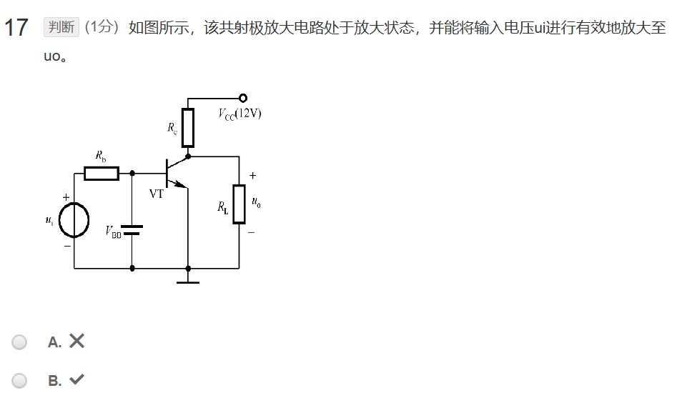
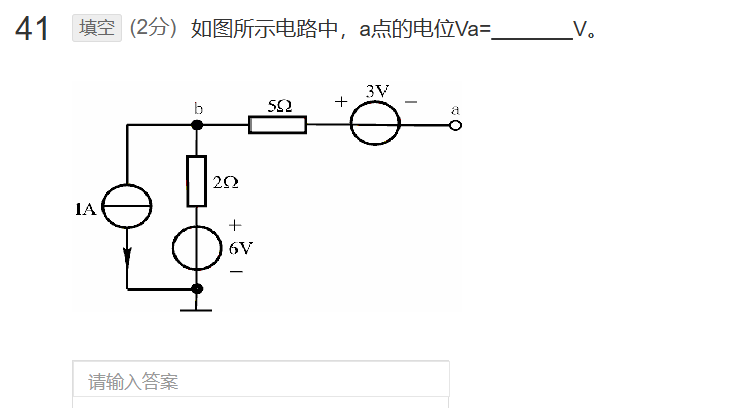
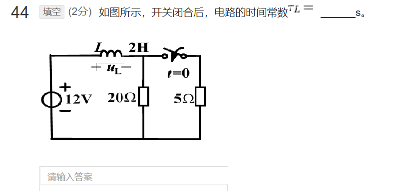
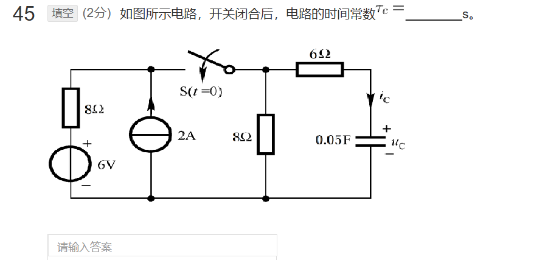
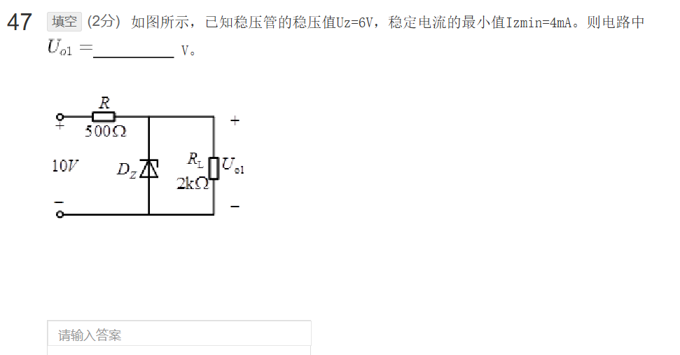
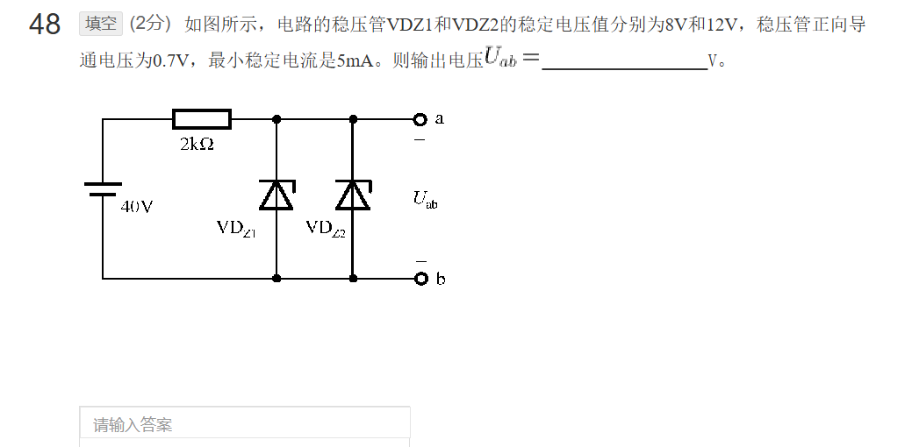

.

为了计算a点的电位 $V_a$，我们可以分步进行求解：

### 1. 分析支路由 $b$ 到 $a$ 的电流
因为端口 $a$ 是开路的（悬空），所以该支路没有构成闭合回路。
* 流过 $5\,\Omega$ 电阻和 $3\text{V}$ 电压源的电流为：
  $$I_{ba} = 0\text{ A}$$
* 因此，$5\,\Omega$ 电阻两端的电压降为 $0\text{ V}$。

### 2. 计算节点 $b$ 的电位 $V_b$
我们设最下方的接地端电位为 $0\text{ V}$。
根据基尔霍夫电流定律（KCL），对节点 $b$ 列出电流方程（设流出节点 $b$ 的电流为正）：
$$1\text{ A} + \frac{V_b - 6\text{ V}}{2\,\Omega} + I_{ba} = 0$$

代入 $I_{ba} = 0$：
$$1 + \frac{V_b - 6}{2} = 0$$
两边同乘以 2：
$$2 + V_b - 6 = 0$$
$$\mathbf{V_b = 4\text{ V}}$$

### 3. 计算 $a$ 点的电位 $V_a$
从节点 $b$ 沿支路到 $a$ 点，中途经过 $5\,\Omega$ 电阻和 $3\text{V}$ 的电压源：
* $5\,\Omega$ 电阻上无电压降。
* 遇到了 $3\text{V}$ 电压源，极性为左正右负（从 $b$ 到 $a$ 电位降低 $3\text{ V}$）。

因此，a点的电位为：
$$V_a = V_b - I_{ba} \times 5 - 3$$
$$V_a = 4 - 0 - 3 = 1\text{ V}$$

---

**答案：**
a点的电位 $V_a = \mathbf{1}\text{ V}$。

为了求解电路中 $U_{o1}$ 的电压，我们需要按以下步骤进行分析：

### 1. 初步判断稳压管是否能进入击穿（稳压）状态
首先，假设稳压管 $D_z$ 断开，计算此时负载电阻 $R_L$ 两端的分压 $U_{o1}'$：
$$U_{o1}' = V_{in} \cdot \frac{R_L}{R + R_L} = 10\text{ V} \cdot \frac{2\text{ k}\Omega}{500\ \Omega + 2\text{ k}\Omega} = 10\text{ V} \cdot \frac{2000}{2500} = 8\text{ V}$$

由于开路分压 $U_{o1}' = 8\text{ V} > U_z = 6\text{ V}$，其电压大于稳压管的稳压值，表明稳压管会进入反向击穿状态，开始发挥稳压作用。

---

### 2. 计算并验证稳压管的实际工作电流
当稳压管正常工作时，输出电压被维持在稳压值，即 $U_{o1} = U_z = 6\text{ V}$。此时计算各支路的电流：

* **总电流（流过电阻 $R$ 的电流）**：
  $$I = \frac{V_{in} - U_{o1}}{R} = \frac{10\text{ V} - 6\text{ V}}{500\ \Omega} = \frac{4\text{ V}}{500\ \Omega} = 8\text{ mA}$$

* **负载电流（流过 $R_L$ 的电流）**：
  $$I_L = \frac{U_{o1}}{R_L} = \frac{6\text{ V}}{2\text{ k}\Omega} = 3\text{ mA}$$

* **流过稳压管的电流 $I_z$**：
  $$I_z = I - I_L = 8\text{ mA} - 3\text{ mA} = 5\text{ mA}$$

比较实际稳压电流 $I_z$ 与最小稳定工作电流 $I_{z\min}$：
$$I_z = 5\text{ mA} \ge I_{z\min} = 4\text{ mA}$$

因为 $I_z$ 大于最小稳定电流，所以稳压管能够**稳定地工作在稳压状态**。

---

### 结论
电路中的输出电压 $U_{o1}$ 即为稳压管的稳压值：
$$U_{o1} = 6\text{ V}$$

**正确答案：**
**6**

为了提取并求出电路中的输出电压 $U_{ab}$，我们可以按照以下步骤进行详细分析：

### 1. 确定稳压管的工作状态（正偏还是反偏）
* 观察直流电源的符号，长线段为正极（在上），短粗线段为负极（在下）。因此，上方的导线（节点 $a$）电位高于下方的导线（节点 $b$）。
* 两个稳压管 $\text{VD}_{Z1}$ 和 $\text{VD}_{Z2}$ 的阴极（带横折的一端）均朝上连接到正电位，阳极（三角形底边）均朝下连接到负极。
* 这意味着在正常工作时，两个稳压管都处于**反向偏置**状态。

---

### 2. 分析并联稳压管的击穿先后顺序
两个反向并联的稳压管，其稳定电压（击穿电压）分别为：
* $\text{VD}_{Z1}$ 的稳压值 $U_{Z1} = 8\text{ V}$
* $\text{VD}_{Z2}$ 的稳压值 $U_{Z2} = 12\text{ V}$

当输入电压从 $0\text{ V}$ 逐渐上升时：
1. 一旦电压达到 $8\text{ V}$，$\text{VD}_{Z1}$ 首先进入反向击穿状态并开始稳压，将输出端的电压钳位在 $8\text{ V}$。
2. 此时，由于电路中并联的电压被限制在 $8\text{ V}$，未达到 $\text{VD}_{Z2}$ 的击穿电压 $12\text{ V}$，因此 $\text{VD}_{Z2}$ 保持截止状态，不起作用。

---

### 3. 验证稳压管是否能稳定工作
我们需要验证由于限流电阻的存在，流过 $\text{VD}_{Z1}$ 的电流是否大于它的最小稳定电流 $I_{z\min} = 5\text{ mA}$：

* 输出端 $a-b$ 为开路状态，总电流均流过 $\text{VD}_{Z1}$：
  $$I = \frac{V_{in} - U_{Z1}}{R} = \frac{40\text{ V} - 8\text{ V}}{2\text{ k}\Omega} = \frac{32\text{ V}}{2\text{ k}\Omega} = 16\text{ mA}$$

* 显然：
  $$I = 16\text{ mA} \ge I_{z\min} = 5\text{ mA}$$

因此，$\text{VD}_{Z1}$ 能够稳定地工作在反向击穿稳压状态，输出电压被稳定在 $8\text{ V}$。

---

### 结论
输出电压 $U_{ab}$ 为：
$$U_{ab} = 8\text{ V}$$

**正确答案：**
**8**