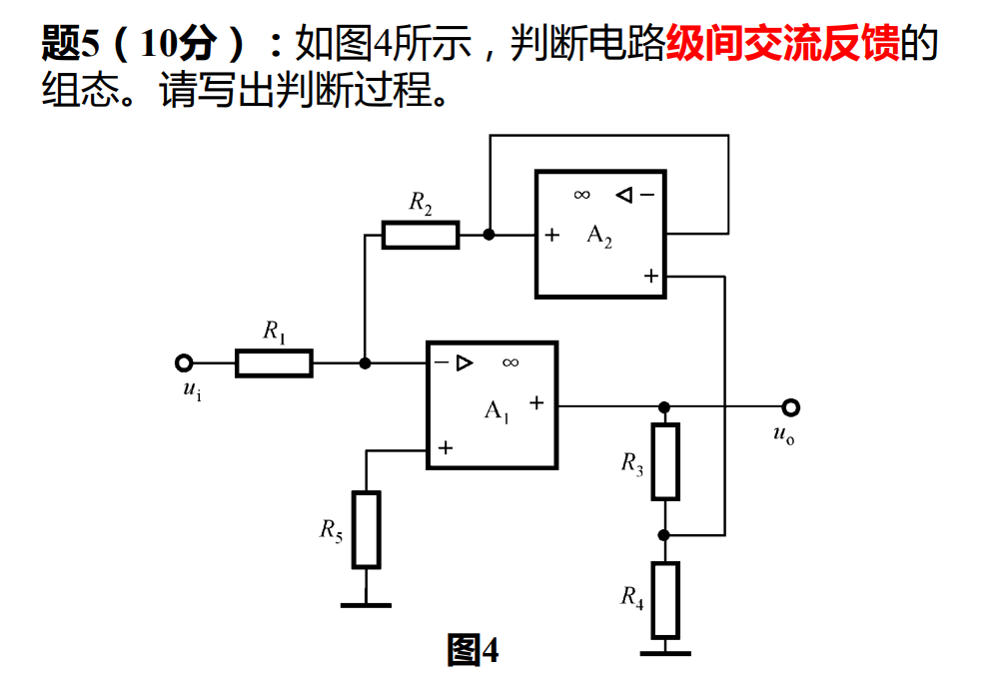

#circuit

## 题1

**判断结果：该电路级间交流反馈的组态为——电流串联负反馈。**

---

### 判断过程如下：

#### 1. 找出级间反馈元件
电阻 **$R_f$** 跨接在第一级（VT₁）发射极与第三级（VT₃）发射极之间，并涉及 $R_{e1}$、$R_{e3}$ 等，构成级间反馈网络。电容 $C_2$ 仅旁路 VT₂ 的发射极电阻，属于本级元件，不影响级间反馈通路的判断。

---

#### 2. 判断是“串联”还是“并联”反馈（看输入端连接方式）
- **输入信号** $u_I$ 经 $C_1$ 加在 **VT₁ 的基极**；
- **反馈信号** $u_f$ 经 $R_f$ 加在 **VT₁ 的发射极**。

在输入端，输入信号与反馈信号以**电压形式串联相减**，净输入为  
$$u_{be1}=u_I-u_f$$

因此，属于 **串联反馈**。

---

#### 3. 判断是“电压”还是“电流”反馈（看输出端取样对象）
采用**输出短路法**：假设将输出端 $u_O$（VT₃ 集电极）对地交流短路，即令 $u_O=0$。

- 此时 VT₃ 的集电极电位虽为零，但 VT₃ 仍有发射极电流 $i_{e3}\approx i_{c3}$（输出电流）流过 $R_{e3}$；
- 该电流在 $R_{e3}$ 上产生的压降经 $R_f$ 仍反馈回输入端，**反馈信号并未消失**。

说明反馈信号与**输出电流**成正比，故为 **电流反馈**。

---

#### 4. 判断反馈极性（正/负）——瞬时极性法
设输入信号 $u_I$ 瞬时极性为 **⊕**（VT₁ 基极电位升高）：

| 位置 | 组态/关系 | 瞬时极性 |
|------|-----------|----------|
| VT₁ 基极 | — | **⊕** |
| VT₁ 集电极 | 共射，反相 | **⊖** |
| VT₂ 基极 | 接 VT₁ 集电极 | **⊖** |
| VT₂ 集电极 | 共射，反相 | **⊕** |
| VT₃ 基极 | 接 VT₂ 集电极 | **⊕** |
| VT₃ 发射极 | 与基极同相跟随 | **⊕** |

该 **⊕** 极性经 $R_f$ 传至 **VT₁ 发射极**，使 VT₁ 发射极电位升高，导致净输入  
$$u_{be1}=u_{b1}-u_{e1}$$  
减小，反馈削弱了净输入，故为 **负反馈**。

---

### 结论
综合以上四点，电路中级间交流反馈的组态为：

$$\boxed{\text{ 电流串联负反馈 }}$$
## 题2

 **答：图4所示电路的级间交流反馈组态为：电压并联负反馈。**  

---

### 一、 判断过程

#### 1. 识别级间反馈通路
电路由两级集成运放组成：$A_1$ 为主放大级（第一级），$A_2$ 接成电压跟随器（缓冲/隔离级）。  
跨接在两级之间、将输出信号回送到输入端的网络构成**级间反馈通路**。  
由图可见，该通路包含 $R_3$、$R_4$（对输出分压）、运放 $A_2$（缓冲）和电阻 $R_2$（回送）。

#### 2. 判断是电压反馈还是电流反馈——“输出短路法”
**方法**：将输出端 $u_o$ 对地交流短路（令 $u_o=0$），看反馈信号是否消失。  
- 若 $u_o=0$，则 $R_3$、$R_4$ 分压点的电压也随之变为 0；  
- 经电压跟随器 $A_2$ 后，其输出端电位为 0，于是经 $R_2$ 送回的反馈信号消失。  

**结论**：反馈信号的取样对象是**输出电压**，属于 **电压反馈**。

#### 3. 判断是串联反馈还是并联反馈——看输入端连接方式
**方法**：观察输入信号与反馈信号在输入端的叠加方式。  
- 输入信号 $u_i$ 经 $R_1$ 接至 $A_1$ 的**反相输入端**；  
- 反馈信号同样经 $R_2$ 接至 **$A_1$ 的反相输入端**。  

二者在同一节点以**电流**形式进行叠加（满足 KCL），即并联叠加。  
**结论**：属于 **并联反馈**。

#### 4. 判断是正反馈还是负反馈——“瞬时极性法”
设输入信号 $u_i$ 某一瞬时极性为正（$\oplus$）：

| 步骤 | 位置 | 极性变化过程 | 结果 |
|------|------|--------------|------|
| ① | $u_i$ 经 $R_1$ | 加在 $A_1$ 反相端 | $\oplus$ |
| ② | $A_1$ 输出 | $A_1$ 为反相放大（同相端接地），输出与输入反相 | $\ominus$ |
| ③ | $u_o$ | 即 $A_1$ 输出端 | $\ominus$ |
| ④ | $R_3$、$R_4$ 分压点 | 跟随 $u_o$ 变化 | $\ominus$ |
| ⑤ | $A_2$ 输出 | $A_2$ 为电压跟随器，输出与输入同相 | $\ominus$ |
| ⑥ | 经 $R_2$ 回送 | 将 $\ominus$ 信号送回 $A_1$ 反相端 | **削弱** $u_i$ 的作用 |

- $u_i$ 使 $A_1$ 反相端电位升高，而反馈信号使该端电位降低；  
- **净输入信号被削弱**，故为 **负反馈**。

---

### 二、 最终结论
综合以上判断，该电路的级间交流反馈组态为：

> **电压并联负反馈**（Voltage-Shunt Negative Feedback）。

**简要特征总结**：  
- **电压**——反馈量取自输出电压 $u_o$；  
- **并联**——在输入端以电流形式叠加；  
- **负反馈**——净输入被削弱，电路工作稳定。
