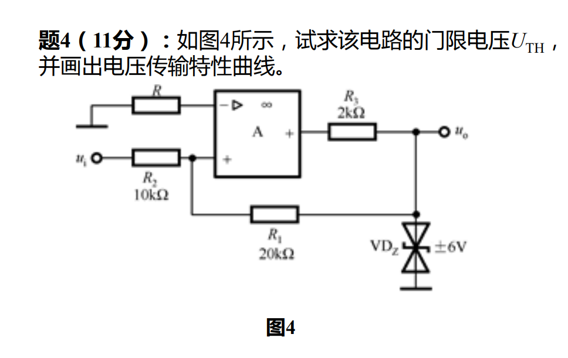

#circuit 

### 1. 求电路的门限电压 $U_{TH}$

**第一步：确定输出电平**
由电路图可知，运算放大器的输出端接有一个双向稳压管 $\text{VD}_Z$，其稳压值为 $\pm 6\text{V}$。电阻 $R_3$ (2kΩ) 起限流作用。因此，电路的输出电压 $u_o$ 会被钳位在稳压管的稳压值：
*   **输出高电平**：$U_{OH} = 6\text{V}$
*   **输出低电平**：$U_{OL} = -6\text{V}$

**第二步：计算同相端和反相端电压**
*   **反相端**：通过电阻 $R$ 接地，由于理想运放输入端不吸收电流，故反相端电压 $v_- = 0\text{V}$。
*   **同相端**：输入电压 $u_i$ 和输出电压 $u_o$ 共同作用于同相端。根据节点电压法（或叠加定理），同相端电压 $v_+$ 为：（参考例题：[6.3 基本运算电路](../6.3%20基本运算电路.md#电压跟随器)）
$$v_+ = \frac{u_i \cdot R_1 + u_o \cdot R_2}{R_1 + R_2}$$

**第三步：计算门限电压**
当电路状态发生翻转时，满足临界条件 $v_+ = v_- = 0$，即：
$$\frac{u_i \cdot R_1 + u_o \cdot R_2}{R_1 + R_2} = 0$$
代入已知电阻值 $R_1 = 20\text{k}\Omega$ 和 $R_2 = 10\text{k}\Omega$：
$$u_i = -\frac{10\text{k}\Omega}{20\text{k}\Omega} u_o = -0.5 u_o$$

*   **上限门限电压 $U_{TH+}$**（或记为 $U_{TU}$）：当输出保持在低电平 $U_{OL} = -6\text{V}$ 时，输入电压 $u_i$ 正向增大到引起电路翻转的临界值：
    $$U_{TH+} = -0.5 \times (-6\text{V}) = 3\text{V}$$
*   **下限门限电压 $U_{TH-}$**（或记为 $U_{TL}$）：当输出保持在高电平 $U_{OH} = 6\text{V}$ 时，输入电压 $u_i$ 反向减小到引起电路翻转的临界值：
    $$U_{TH-} = -0.5 \times (6\text{V}) = -3\text{V}$$

**结论**：该电路的门限电压为 **$U_{TH} = \pm 3\text{V}$**。

### 2. 画出电压传输特性曲线

由于信号从同相端输入，这是一个**同相**的电压传输特性，具有**逆时针方向**的滞回环。

**曲线特征描述**：
1.  横轴为输入电压 $u_i$，纵轴为输出电压 $u_o$。
2.  当 $u_i$ 从很小的负值逐渐增大时，输出 $u_o$ 保持在 $-6\text{V}$ 不变，直到 $u_i$ 达到上限门限电压 $3\text{V}$ 时，$u_o$ 突然跃变至 $6\text{V}$
3.  当 $u_i$ 从很大的正值逐渐减小时，输出 $u_o$ 保持在 $6\text{V}$ 不变，直到 $u_i$ 降至下限门限电压 $-3\text{V}$ 时，$u_o$ 突然跃变至 $-6\text{V}$

