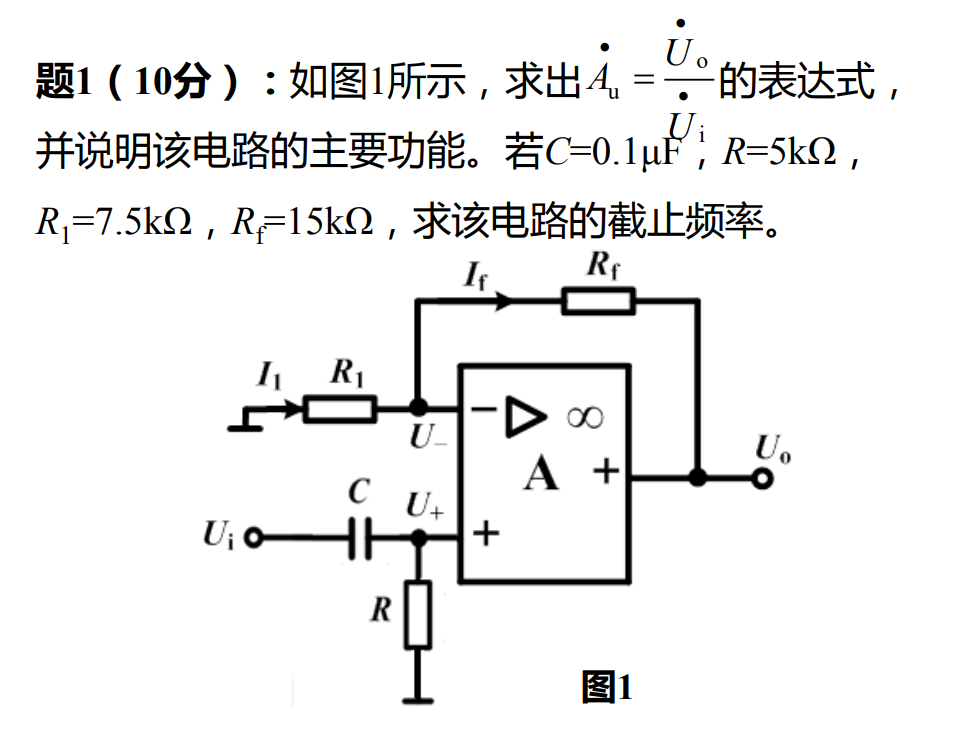
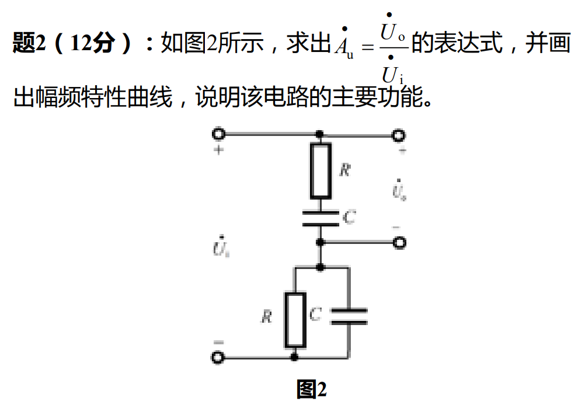

## 题1


这是一道典型的基于运算放大器的模拟电路分析题。我们可以分步骤来解答。

### 1. 求电压放大倍数 $\dot{A}_u$ 的表达式

根据理想运算放大器的特性，我们有以下两个基本原则：
*   **虚断 (Virtual Open)**：运算放大器输入端电流为零，即 $I_+ = I_- = 0$。
*   **虚短 (Virtual Short)**：运算放大器两个输入端电位相等，即 $\dot{U}_+ = \dot{U}_-$。

**分析同相输入端 (+)：**
输入电压 $\dot{U}_i$ 通过由电容 $C$ 和电阻 $R$ 组成的分压网络接入同相端。由于“虚断”，没有电流流入同相端，所以可以用分压公式求出 $\dot{U}_+$：
$$ \dot{U}_+ = \dot{U}_i \cdot \frac{R}{R + \frac{1}{j\omega C}} = \dot{U}_i \cdot \frac{j\omega RC}{1 + j\omega RC} $$

**分析反相输入端 (-)：**
反相端连接着电阻 $R_1$ 和反馈电阻 $R_f$。由于“虚断”，流过 $R_1$ 的电流等于流过 $R_f$ 的电流（即图中标示的 $I_1 = I_f$）。在节点 $\dot{U}_-$ 列 KCL 方程：
$$ \frac{0 - \dot{U}_-}{R_1} + \frac{\dot{U}_o - \dot{U}_-}{R_f} = 0 $$
整理可得（这是一个标准的同相放大电路反馈公式）：
$$ \dot{U}_o = \dot{U}_- \left( 1 + \frac{R_f}{R_1} \right) $$

**联立求解：**
根据“虚短”原则，将 $\dot{U}_+ = \dot{U}_-$ 代入上式：
$$ \dot{U}_o = \left[ \dot{U}_i \cdot \frac{j\omega RC}{1 + j\omega RC} \right] \cdot \left( 1 + \frac{R_f}{R_1} \right) $$

通过移项，求得电压放大倍数 $\dot{A}_u$ 的表达式为：
$$ \dot{A}_u = \frac{\dot{U}_o}{\dot{U}_i} = \left( 1 + \frac{R_f}{R_1} \right) \cdot \frac{j\omega RC}{1 + j\omega RC} $$

---

### 2. 说明该电路的主要功能

分析我们求出的传递函数表达式 $\dot{A}_u$：
*   **低频时**（当频率 $\omega \to 0$ 时）：项 $\frac{j\omega RC}{1 + j\omega RC} \to 0$，所以放大倍数 $|\dot{A}_u| \to 0$。低频信号被阻挡。
*   **高频时**（当频率 $\omega \to \infty$ 时）：项 $\frac{j\omega RC}{1 + j\omega RC} \approx \frac{j\omega RC}{j\omega RC} = 1$，所以放大倍数趋近于最大值 $|\dot{A}_u| \to 1 + \frac{R_f}{R_1}$。高频信号被放大并顺利通过。

**结论：**
该电路允许高频信号通过，同时阻止（或衰减）低频信号，并且带有电压放大功能。因此，该电路的主要功能是**一阶有源高通滤波器**（Active High-Pass Filter）。

---

### 3. 求该电路的截止频率

截止频率（Cutoff Frequency）是指输出电压幅值下降到通带最大幅值的 $\frac{1}{\sqrt{2}}$（即下降 3dB）时所对应的频率。
从表达式 $\dot{A}_u = \left( 1 + \frac{R_f}{R_1} \right) \cdot \frac{j\omega RC}{1 + j\omega RC}$ 可以看出，当分母实部与虚部大小相等，即 $\omega RC = 1$ 时，达到截止频率。

因此，角截止频率为：
$$ \omega_c = \frac{1}{RC} $$

对应的截止频率 $f_c$ 公式为：
$$ f_c = \frac{\omega_c}{2\pi} = \frac{1}{2\pi RC} $$

**代入已知参数：**
*   $R = 5 \text{ k}\Omega = 5 \times 10^3 \, \Omega$
*(注：计算截止频率只需输入端的 RC 参数，不需要 $R_1$ 和 $R_f$ 的值，它们只决定通带放大倍数)*

$$ f_c = \frac{1}{2\pi \times (5 \times 10^3) \times 10^{-7}} $$
$$ f_c = \frac{1}{2\pi \times 5 \times 10^{-4}} $$
$$ f_c = \frac{1}{10\pi \times 10^{-4}} = \frac{1000}{\pi} $$
$$ f_c \approx 318.3 \text{ Hz} $$

**最终答案汇总：**
1.  表达式： $\dot{A}_u = \left( 1 + \frac{R_f}{R_1} \right) \frac{j\omega RC}{1 + j\omega RC}$
2.  主要功能： **一阶有源高通滤波器**
3.  截止频率： **$f_c \approx 318.3 \text{ Hz}$** （或保留精确值 $\frac{1000}{\pi} \text{ Hz}$）

## 题2



根据您提供的电路图，这是一个由电阻和电容组成的交流电路，具体分析如下：

### 1. 求 $\dot{A_u} = \frac{\dot{U_o}}{\dot{U_i}}$ 的表达式

这是一个由两部分阻抗串联组成的分压电路。我们先定义上下两部分的阻抗：
*   **上半部分（串联 RC 支路）**设为 $Z_1$：
    $$Z_1 = R + \frac{1}{j\omega C} = \frac{1 + j\omega RC}{j\omega C}$$
*   **下半部分（并联 RC 支路）**设为 $Z_2$：
    $$Z_2 = R \parallel \frac{1}{j\omega C} = \frac{R \cdot \frac{1}{j\omega C}}{R + \frac{1}{j\omega C}} = \frac{R}{1 + j\omega RC}$$

观察电路图右侧的输出端子标记（+ 和 -），可以明确输出电压 $\dot{U_o}$ 是取自上半部分串联阻抗 $Z_1$ 的两端。根据串联分压原理：
$$\dot{U_o} = \dot{U_i} \cdot \frac{Z_1}{Z_1 + Z_2}$$

因此，电压传递函数（放大倍数）为：
$$\dot{A_u} = \frac{\dot{U_o}}{\dot{U_i}} = \frac{Z_1}{Z_1 + Z_2} = \frac{1}{1 + \frac{Z_2}{Z_1}}$$

接下来计算阻抗比 $\frac{Z_2}{Z_1}$：
$$\frac{Z_2}{Z_1} = \frac{\frac{R}{1 + j\omega RC}}{\frac{1 + j\omega RC}{j\omega C}} = \frac{j\omega RC}{(1 + j\omega RC)^2} = \frac{j\omega RC}{1 - \omega^2 R^2 C^2 + j2\omega RC}$$

将其代回 $\dot{A_u}$ 的表达式中：
$$\dot{A_u} = \frac{1}{1 + \frac{j\omega RC}{1 - \omega^2 R^2 C^2 + j2\omega RC}} = \frac{1 - \omega^2 R^2 C^2 + j2\omega RC}{1 - \omega^2 R^2 C^2 + j3\omega RC}$$

为了使物理意义更清晰，我们将分子分母同时除以 $j\omega RC$：
$$\dot{A_u} = \frac{\frac{1 - \omega^2 R^2 C^2}{j\omega RC} + 2}{\frac{1 - \omega^2 R^2 C^2}{j\omega RC} + 3} = \frac{2 + j(\omega RC - \frac{1}{\omega RC})}{3 + j(\omega RC - \frac{1}{\omega RC})}$$

令特征角频率（谐振角频率） **$\omega_0 = \frac{1}{RC}$**，可以得到最终的表达式：
$$ \dot{A_u} = \frac{2 + j(\frac{\omega}{\omega_0} - \frac{\omega_0}{\omega})}{3 + j(\frac{\omega}{\omega_0} - \frac{\omega_0}{\omega})} $$

---

### 2. 画出幅频特性曲线

对上面的传递函数取绝对值，得到幅频特性表达式：
$$ |\dot{A_u}| = \sqrt{\frac{4 + (\frac{\omega}{\omega_0} - \frac{\omega_0}{\omega})^2}{9 + (\frac{\omega}{\omega_0} - \frac{\omega_0}{\omega})^2}} $$

分析该函数的三个关键点：
*   **低频趋向**：当 $\omega \to 0$ 时，$(\frac{\omega}{\omega_0} - \frac{\omega_0}{\omega}) \to -\infty$，此时 $|\dot{A_u}| \to 1$。
*   **高频趋向**：当 $\omega \to \infty$ 时，$(\frac{\omega}{\omega_0} - \frac{\omega_0}{\omega}) \to +\infty$，此时 $|\dot{A_u}| \to 1$。
*   **中心频率点**：当 $\omega = \omega_0 = \frac{1}{RC}$ 时，$(\frac{\omega}{\omega_0} - \frac{\omega_0}{\omega}) = 0$，此时 $|\dot{A_u}|$ 取得极小值，为 **$|\dot{A_u}| = \sqrt{\frac{4}{9}} = \frac{2}{3}$**。

**曲线画法说明：**
横坐标为角频率 $\omega$（或频率 $f$），纵坐标为幅值 $|\dot{A_u}|$。曲线是一条中间下凹的平滑曲线。在两端（$\omega \to 0$ 和 $\omega \to \infty$）均渐近于 $1$；在中心频率 $\omega_0$ 处有一个谷底，谷底的纵坐标值为 $2/3$。

大致形状如下示意：
```text
  |\dot{A_u}|
   |
 1 |--------\                                   /--------
   |         \                                 /
   |          \                               /
2/3|           \                             /
   |            \___________       _________/
   |                        |_____|
   |
   +---------------------------+------------------------> \omega
                            \omega_0
```

---

### 3. 说明该电路的主要功能

结合幅频特性曲线可以看出，该电路对频率极低和极高的信号几乎没有衰减（增益趋近于 1），而对处于中心频率 $\omega_0 = 1/RC$ 附近的信号有明显的衰减作用（增益降至最低的 2/3）。

因此，该电路的主要功能是作为**带阻滤波器**（Band-stop filter），也常被称为陷波器的一种（尽管其阻带衰减不够深，无法完全滤除中心频率）。