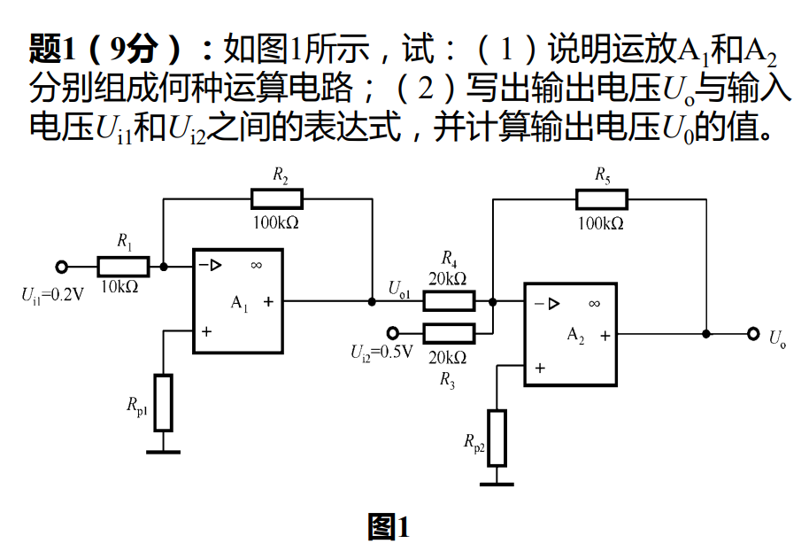

#circuit 

### （1）说明运放 $\text{A}_1$ 和 $\text{A}_2$ 分别组成何种运算电路

*   **运放 $\text{A}_1$**：输入信号 $U_{i1}$ 从反相端输入，同相端通过电阻接地，输出端通过反馈电阻 $R_2$ 连接到反相端。这种结构构成了**反相比例运算电路**（或反相比例放大器）。
*   **运放 $\text{A}_2$**：有两个输入信号（一个是 $\text{A}_1$ 的输出 $U_{o1}$，另一个是外部输入 $U_{i2}$），它们分别通过电阻 $R_4$ 和 $R_3$ 共同连接到反相端，同相端通过电阻接地，且有反馈电阻 $R_5$。这种结构构成了**反相求和运算电路**（或反相加法器）。

---

### （2）写出输出电压 $U_o$ 与输入电压 $U_{i1}$ 和 $U_{i2}$ 之间的表达式，并计算输出电压 $U_o$ 的值

**第一步：推导表达式**

1.  对于**运放 $\text{A}_1$**（反相比例电路）：
    $$U_{o1} = -\frac{R_2}{R_1} U_{i1}$$

2.  对于**运放 $\text{A}_2$**（反相求和电路）：
    $$U_o = -\left( \frac{R_5}{R_4} U_{o1} + \frac{R_5}{R_3} U_{i2} \right)$$

3.  将 $U_{o1}$ 的表达式代入 $U_o$ 的公式中，得到**最终的表达式**：
    $$U_o = -\left[ \frac{R_5}{R_4} \left( -\frac{R_2}{R_1} U_{i1} \right) + \frac{R_5}{R_3} U_{i2} \right]$$
    $$U_o = \frac{R_2 R_5}{R_1 R_4} U_{i1} - \frac{R_5}{R_3} U_{i2}$$

**第二步：计算输出电压值**

已知参数如下：
*   $U_{i1} = 0.2\text{V}$
*   $U_{i2} = 0.5\text{V}$
*   $R_1 = 10\text{k}\Omega$
*   $R_2 = 100\text{k}\Omega$
*   $R_3 = 20\text{k}\Omega$
*   $R_4 = 20\text{k}\Omega$
*   $R_5 = 100\text{k}\Omega$

代入得到：
$$U_o = 7.5\text{V}$$
计算过程如下：
**分步计算（为了清晰）：**
先计算中间级输出 $U_{o1}$：
$$U_{o1} = -\frac{100\text{k}\Omega}{10\text{k}\Omega} \times 0.2\text{V} = -10 \times 0.2\text{V} = -2\text{V}$$

再代入求和电路计算最终输出 $U_o$：
$$U_o = -\left( \frac{100\text{k}\Omega}{20\text{k}\Omega} \times U_{o1} + \frac{100\text{k}\Omega}{20\text{k}\Omega} \times U_{i2} \right)$$
$$U_o = -\left( 5 \times (-2\text{V}) + 5 \times 0.5\text{V} \right)$$
$$U_o = -(-10\text{V} + 2.5\text{V})$$
$$U_o = -(-7.5\text{V})$$
$$U_o = 7.5\text{V}$$

*(或者直接将数值代入推导出的总表达式：)*
$$U_o = \left( \frac{100 \times 100}{10 \times 20} \right) \times 0.2 - \left( \frac{100}{20} \right) \times 0.5$$
$$U_o = 50 \times 0.2 - 5 \times 0.5$$
$$U_o = 10 - 2.5$$
$$U_o = 7.5\text{V}$$

**最终答案：**
输出电压 $U_o$ 与输入电压 $U_{i1}$ 和 $U_{i2}$ 之间的表达式为：**$U_o = \frac{R_2 R_5}{R_1 R_4} U_{i1} - \frac{R_5}{R_3} U_{i2}$**
输出电压 $U_o$ 的值为：**$7.5\text{V}$**