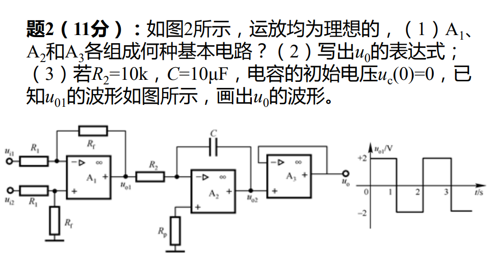

#review 

### （1）A₁、A₂和A₃各组成何种基本电路？

通过观察电路图中各个运放的反馈和输入连接方式，可以判断：
*   **A₁**：输入信号 $u_{i1}$ 和 $u_{i2}$ 分别通过电阻 $R_1$ 连接到反相和同相输入端，并且有反馈电阻 $R_f$。这是一个标准的**差分放大电路**（或称为**减法运算电路**）。
*   **A₂**：输入信号 $u_{o1}$ 通过电阻 $R_2$ 连接到反相输入端，反馈回路由电容 $C$ 构成。这是一个标准的**积分放大电路**（或**积分器**）。
*   **A₃**：输出端直接连接到反相输入端，输入信号 $u_{o2}$ 接在同相输入端，属于全负反馈。这是一个标准的**电压跟随器**（或**缓冲器**）。

### （2）写出 $u_0$ 的表达式

我们需要分级写出输入输出的关系：
1.  **对于 A₁ 组成的减法电路**：
    根据理想运放的“虚短”和“虚断”特性，可以推导出：
    $$u_{o1} = \frac{R_f}{R_1} (u_{i2} - u_{i1})$$
2.  **对于 A₂ 组成的积分电路**：
    流过 $R_2$ 的电流等于流过电容 $C$ 的电流（虚断），且反相端虚地（虚短），可得：
    $$\frac{u_{o1}}{R_2} = -C \frac{d u_{o2}}{dt}$$
    对上式两边积分，得：
    $$u_{o2}(t) = -\frac{1}{R_2 C} \int_{0}^{t} u_{o1}(\tau) d\tau + u_{o2}(0)$$
    题目已知电容初始电压 $u_c(0) = 0$，所以 $u_{o2}(0) = 0$。
3.  **对于 A₃ 组成的电压跟随器**：
    $$u_o = u_{o2}$$

**综合起来，得到 $u_0$ 关于 $u_{o1}$ 的表达式为：**
$$u_0(t) = -\frac{1}{R_2 C} \int_{0}^{t} u_{o1}(\tau) d\tau$$

*(注：如果要求写出关于输入 $u_{i1}, u_{i2}$ 的最终表达式，代入即可：$u_0(t) = -\frac{R_f}{R_1 R_2 C} \int_{0}^{t} (u_{i2} - u_{i1}) d\tau$)*

### （3）画出 $u_0$ 的波形
代入已知条件，得$u_o$：
$$u_0(t) = -10 \int_{0}^{t} u_{o1} dt$$
然后直接画，最后是两个三角形

