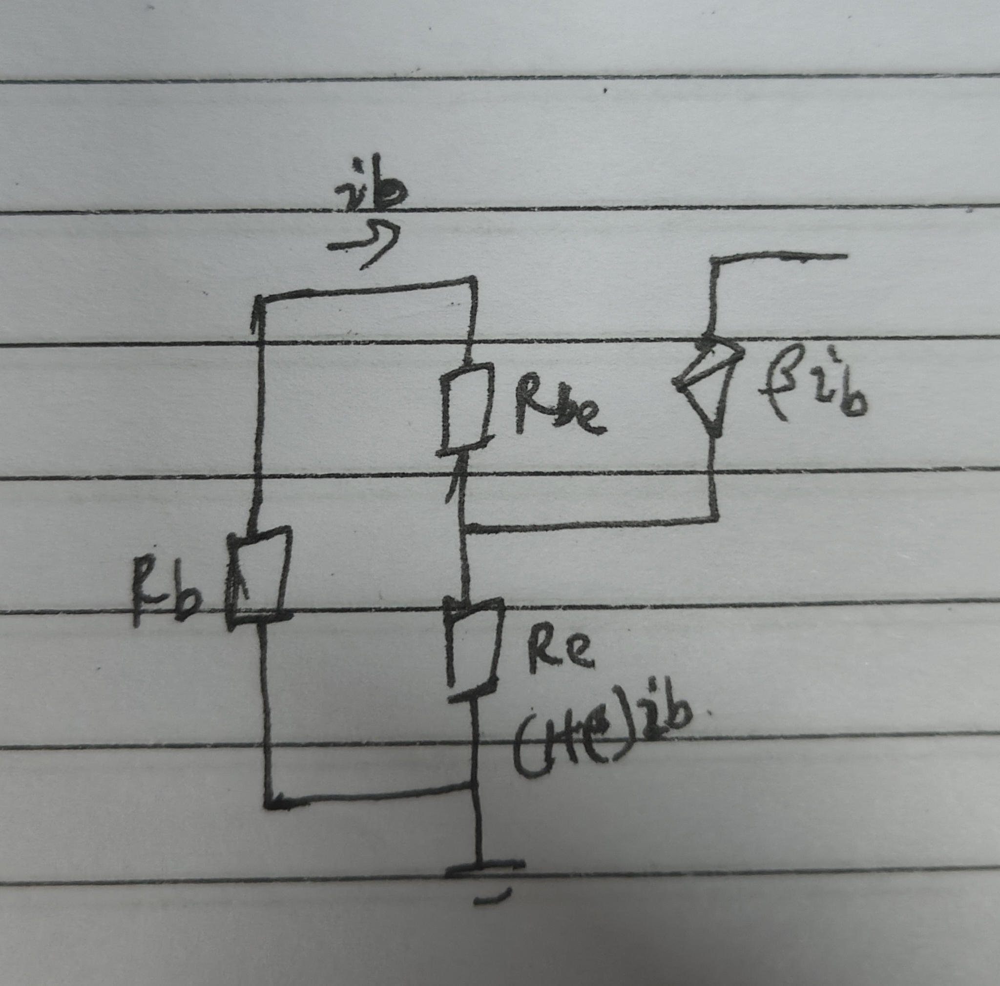

#review 
### 方向一：从“基极（B）”往“发射极（E）”看 —— 阻抗被“放大” $(1+\beta)$ 倍

假设在发射极（E）和地之间接了一个电阻 $R_e$。现在我们站在基极（B），往里看进去，相当于看到了多大的电阻？

这里的等效电阻是相对于基极来说的  (用**基极的电压** 除以 **基极的电流**)

基极施加在 $R_e$ 上的电压等于 $(1+\beta)i_b \cdot R_e$ , 这个电压没有任何放大和缩小
而基极提供的电流却只有 $i_b$
所以两者一除, $R_e$ 相对于基极的电阻变成了 $(1+\beta) \cdot R_e$

总电阻: 
$$R_{in(base)} = \frac{v_b}{i_b} = r_{be} + (1+\beta)R_e$$

---

### 方向二：从“发射极（E）”往“基极（B）”看 —— 阻抗被“缩小” $(1+\beta)$ 倍
*(使用的图片跟上面一样)*

发射极施加在 $R_b$和$R_{be}$ 上的电压等于$i_b \cdot (R_b+R_{be})$
而发射极提供的电流却有 $(1+\beta) \cdot i_b$
所以两者一除, $R_e$ 相对于基极的电阻变成了 :$$\frac{r_{be} + R_b}{1+\beta}$$
