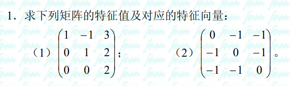

## 1

### **第 (1) 题**

设矩阵 $A = \begin{pmatrix} 1 & -1 & 3 \\ 0 & 1 & 2 \\ 0 & 0 & 2 \end{pmatrix}$。

#### **1. 求特征值**
计算特征多项式 $|\lambda E - A|$：
$$|\lambda E - A| = \begin{vmatrix} \lambda - 1 & 1 & -3 \\ 0 & \lambda - 1 & -2 \\ 0 & 0 & \lambda - 2 \end{vmatrix} = (\lambda - 1)^2(\lambda - 2) = 0$$

解得矩阵 $A$ 的特征值为：
$$\lambda_1 = \lambda_2 = 1 \text{（二重特征值）}, \quad \lambda_3 = 2$$

---

#### **2. 求对应的特征向量**

* **当 $\lambda_1 = \lambda_2 = 1$ 时：**
  解齐次线性方程组 $(E - A)x = 0$：
  $$E - A = \begin{pmatrix} 0 & 1 & -3 \\ 0 & 0 & -2 \\ 0 & 0 & -1 \end{pmatrix} \xrightarrow{\text{行化简}} \begin{pmatrix} 0 & 1 & 0 \\ 0 & 0 & 1 \\ 0 & 0 & 0 \end{pmatrix}$$
  方程组等价于 $\begin{cases} x_2 = 0 \\ x_3 = 0 \end{cases}$，$x_1$ 为自由未知量。
  
  取基础解系为 $\xi_1 = \begin{pmatrix} 1 \\ 0 \\ 0 \end{pmatrix}$。
  
  故对应于 $\lambda_1 = \lambda_2 = 1$ 的特征向量为：
  $$k_1 \begin{pmatrix} 1 \\ 0 \\ 0 \end{pmatrix} \quad (k_1 \neq 0)$$

* **当 $\lambda_3 = 2$ 时：**
  解齐次线性方程组 $(2E - A)x = 0$：
  $$2E - A = \begin{pmatrix} 1 & 1 & -3 \\ 0 & 1 & -2 \\ 0 & 0 & 0 \end{pmatrix} \xrightarrow{\text{行化简}} \begin{pmatrix} 1 & 0 & -1 \\ 0 & 1 & -2 \\ 0 & 0 & 0 \end{pmatrix}$$
  方程组等价于 $\begin{cases} x_1 = x_3 \\ x_2 = 2x_3 \end{cases}$，令 $x_3 = 1$，得基础解系 $\xi_2 = \begin{pmatrix} 1 \\ 2 \\ 1 \end{pmatrix}$。
  
  故对应于 $\lambda_3 = 2$ 的特征向量为：
  $$k_2 \begin{pmatrix} 1 \\ 2 \\ 1 \end{pmatrix} \quad (k_2 \neq 0)$$

---

### **第 (2) 题**

设矩阵 $B = \begin{pmatrix} 0 & -1 & -1 \\ -1 & 0 & -1 \\ -1 & -1 & 0 \end{pmatrix}$。

#### **1. 求特征值**
计算特征多项式 $|\lambda E - B|$：
$$|\lambda E - B| = \begin{vmatrix} \lambda & 1 & 1 \\ 1 & \lambda & 1 \\ 1 & 1 & \lambda \end{vmatrix}$$

将第 2、3 行加到第 1 行：
$$|\lambda E - B| = \begin{vmatrix} \lambda + 2 & \lambda + 2 & \lambda + 2 \\ 1 & \lambda & 1 \\ 1 & 1 & \lambda \end{vmatrix} = (\lambda + 2) \begin{vmatrix} 1 & 1 & 1 \\ 1 & \lambda & 1 \\ 1 & 1 & \lambda \end{vmatrix}$$

做初等行变换（$r_2 - r_1, r_3 - r_1$）：
$$= (\lambda + 2) \begin{vmatrix} 1 & 1 & 1 \\ 0 & \lambda - 1 & 0 \\ 0 & 0 & \lambda - 1 \end{vmatrix} = (\lambda + 2)(\lambda - 1)^2 = 0$$

解得矩阵 $B$ 的特征值为：
$$\lambda_1 = -2, \quad \lambda_2 = \lambda_3 = 1 \text{（二重特征值）}$$

---

#### **2. 求对应的特征向量**

* **当 $\lambda_1 = -2$ 时：**
  解齐次线性方程组 $(-2E - B)x = 0$：
  $$-2E - B = \begin{pmatrix} -2 & 1 & 1 \\ 1 & -2 & 1 \\ 1 & 1 & -2 \end{pmatrix} \xrightarrow{\text{行化简}} \begin{pmatrix} 1 & 0 & -1 \\ 0 & 1 & -1 \\ 0 & 0 & 0 \end{pmatrix}$$
  方程组等价于 $x_1 = x_2 = x_3$。
  
  取基础解系为 $\xi_1 = \begin{pmatrix} 1 \\ 1 \\ 1 \end{pmatrix}$。
  
  故对应于 $\lambda_1 = -2$ 的特征向量为：
  $$c_1 \begin{pmatrix} 1 \\ 1 \\ 1 \end{pmatrix} \quad (c_1 \neq 0)$$

* **当 $\lambda_2 = \lambda_3 = 1$ 时：**
  解齐次线性方程组 $(E - B)x = 0$：
  $$E - B = \begin{pmatrix} 1 & 1 & 1 \\ 1 & 1 & 1 \\ 1 & 1 & 1 \end{pmatrix} \xrightarrow{\text{行化简}} \begin{pmatrix} 1 & 1 & 1 \\ 0 & 0 & 0 \\ 0 & 0 & 0 \end{pmatrix}$$
  方程组等价于 $x_1 + x_2 + x_3 = 0$，即 $x_1 = -x_2 - x_3$。
  
  取基础解系：
  $$\xi_2 = \begin{pmatrix} -1 \\ 1 \\ 0 \end{pmatrix}, \quad \xi_3 = \begin{pmatrix} -1 \\ 0 \\ 1 \end{pmatrix}$$
  
  故对应于 $\lambda_2 = \lambda_3 = 1$ 的特征向量为：
  $$c_2 \begin{pmatrix} -1 \\ 1 \\ 0 \end{pmatrix} + c_3 \begin{pmatrix} -1 \\ 0 \\ 1 \end{pmatrix} \quad (c_2, c_3 \text{ 不全为 } 0)$$

