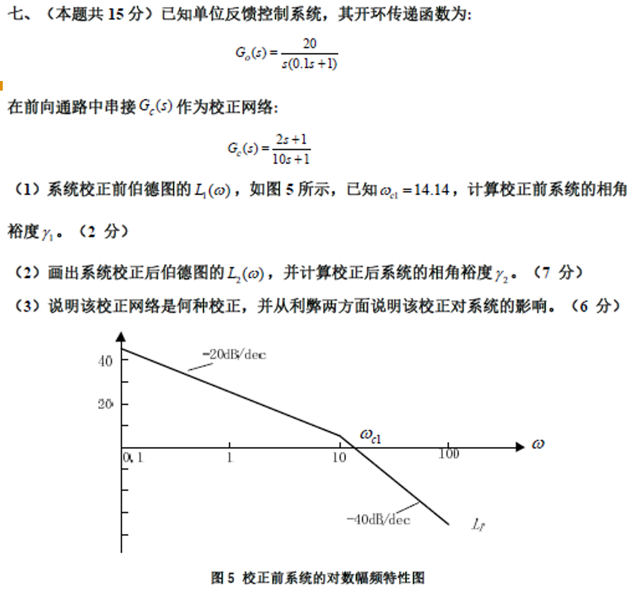

## 题目

### （1）计算校正前系统的相角裕度 $\gamma_1$

已知校正前系统的开环传递函数为：
$$G_0(s) = \frac{20}{s(0.1s + 1)}$$
将其写成频率特性形式（令 $s = j\omega$）：
$$G_0(j\omega) = \frac{20}{j\omega(1 + j0.1\omega)}$$
相频特性：
$$\angle G_0(j\omega) = -90^\circ - \arctan(0.1\omega)$$

校正前截止频率 $\omega_{c1} = 14.14 = 10\sqrt{2}$ rad/s（由渐近线求得），代入得：
$$\angle G_0(j\omega_{c1}) = -90^\circ - \arctan(1.414) \approx -90^\circ - 54.7^\circ = -144.7^\circ$$

由 $\gamma = 180^\circ + \angle G(j\omega_c)$：
$$\gamma_1 = 180^\circ - 144.7^\circ = \mathbf{35.3^\circ}$$

### （2）画出系统校正后伯德图的 $L_2(\omega)$，并计算相角裕度 $\gamma_2$

**① 确定校正后的开环传递函数及转折频率**
系统串接了校正网络 $G_c(s) = \frac{2s + 1}{10s + 1}$，因此校正后的开环传递函数为：
$$G_{open}(s) = G_c(s)G_0(s) = \frac{2s + 1}{10s + 1} \cdot \frac{20}{s(0.1s + 1)} = \frac{20(2s + 1)}{s(10s + 1)(0.1s + 1)}$$

从表达式可以得出系统的三个转折频率（从小到大排序）：
*   极点对应的转折频率：$\omega_1 = \frac{1}{10} = 0.1$ rad/s
*   零点对应的转折频率：$\omega_2 = \frac{1}{2} = 0.5$ rad/s
*   极点对应的转折频率：$\omega_3 = \frac{1}{0.1} = 10$ rad/s

> 这里不画图

**③ 计算校正后的截止频率 $\omega_{c2}$ 及相角裕度 $\gamma_2$**
我们需要找到 $L_2(\omega) = 0$ 的位置。观察中频段 ($0.5 < \omega < 10$) 的斜率为 -20 dB/dec，在此频段内，幅频特性的近似表达式为：（有时这里不能用近似）
$$|G_{open}(j\omega)| \approx \frac{20 \cdot 2\omega}{\omega \cdot 10\omega} = \frac{40\omega}{10\omega^2} = \frac{4}{\omega}$$
这里参考：[近似幅值求解](#近似幅值求解)

令近似幅值为 1（即 0 dB）：
$$\frac{4}{\omega_{c2}} = 1 \implies \omega_{c2} = 4 \text{ rad/s}$$
*(4 rad/s 在 0.5 到 10 之间，假设成立，故新的渐近线截止频率为 4 rad/s)*

将 $\omega_{c2} = 4$ 代入校正后的相频特性公式：
$$\angle G_{open}(j\omega) = -90^\circ + \arctan(2\omega) - \arctan(10\omega) - \arctan(0.1\omega)$$
$$\angle G_{open}(j4) = -90^\circ + \arctan(8) - \arctan(40) - \arctan(0.4)$$
查表或计算可知：$\arctan(8) \approx 82.9^\circ$；$\arctan(40) \approx 88.6^\circ$；$\arctan(0.4) \approx 21.8^\circ$。
$$\angle G_{open}(j4) = -90^\circ + 82.9^\circ - 88.6^\circ - 21.8^\circ = -117.5^\circ$$
则校正后的相角裕度为：
$$\gamma_2 = 180^\circ + \angle G_{open}(j4) = 180^\circ - 117.5^\circ = \mathbf{62.5^\circ}$$

### （3）说明该校正网络是何种校正，及其对系统的影响

**校正类型：**
该校正网络 $G_c(s) = \frac{2s + 1}{10s + 1} = \frac{1 + 2s}{1 + 10s}$。
其极点 $s = -0.1$ 离虚轴的距离比零点 $s = -0.5$ 更近（极点作用在先），因此在频率特性上表现为相位滞后。这属于**串联相位滞后校正（Lag Compensation）**。

**对系统的影响（利弊分析）：**

*   **利（优点）：**
    1.  **提高了系统的稳定性：** 相角裕度由原先的 $35.3^\circ$ 显著提高到了 $62.5^\circ$，系统的相对稳定性变好，超调量会随之减小。
    2.  **不影响稳态精度：** 滞后校正网络的低频增益 $G_c(0) = 1$，不会降低系统原有的开环放大倍数，因此静态误差系数不变，不损害系统的稳态精度。（**稳态误差不变**）
    3.  **抗高频干扰能力增强：** 滞后校正由于高频段衰减作用，使得系统的穿越频率降低，高频段幅值下降，抑制了高频噪声的影响。

*   **弊（缺点）：**
    1.  **降低了系统的响应速度：** 系统的截止频率由校正前的 $\omega_{c1} = 14.14$ rad/s 降低到了 $\omega_{c2} = 4$ rad/s，系统频带变窄，导致动态响应变慢（上升时间、调节时间变长），系统显得更加迟缓。

