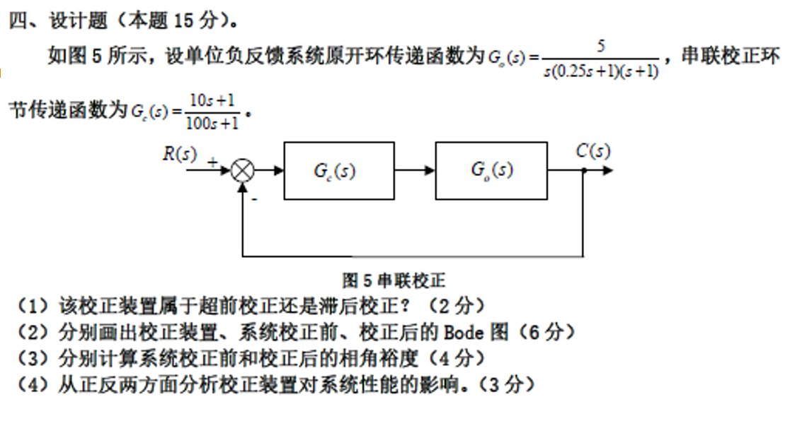

#review 

这是一道经典的自动控制原理中关于串联校正的题目。下面我们逐步解答：

### （1）该校正装置属于超前校正还是滞后校正？（2分）

**解答：**
给定的串联校正装置传递函数为：
$$G_c(s) = \frac{10s+1}{100s+1}$$
这可以写成标准形式 $G_c(s) = \frac{Ts+1}{aTs+1}$，其中 $T = 10$，$aT = 100$，解得 $a = 10 > 1$。
该装置的零点为 $z = -1/10 = -0.1$，极点为 $p = -1/100 = -0.01$。因为极点比零点更靠近虚轴（$|p| < |z|$），该装置主要提供负的相角（相位滞后）。
**结论：该校正装置属于滞后校正。**

---

### （2）分别画出校正装置、系统校正前、校正后的 Bode 图（6分）

*(注：由于纯文本无法直接绘图，这里为您详细描述 Bode 图（渐近线）的画法和关键特征，您可以据此轻松画出草图)*

1.  **校正装置 $G_c(s)$ 的 Bode 图：**
    *   **转折频率：** $\omega_1 = \frac{1}{100} = 0.01$ rad/s，$\omega_2 = \frac{1}{10} = 0.1$ rad/s。
    *   **幅频特性 (L(\omega))：**
        *   当 $\omega < 0.01$ 时，增益为 $20\log(1) = 0$ dB，斜率为 0 dB/dec。
        *   当 $0.01 \leq \omega \leq 0.1$ 时，斜率变为 -20 dB/dec 衰减。
        *   当 $\omega > 0.1$ 时，高频增益趋于 $20\log(\frac{10}{100}) = -20$ dB，斜率恢复为 0 dB/dec。
    *   **相频特性 (\phi(\omega))：** 起点为 $0^\circ$，在 $\omega_1$ 和 $\omega_2$ 之间出现负的最大相角，高频时又回升至 $0^\circ$。

2.  **系统校正前 $G_o(s)$ 的 Bode 图：**
    *   原系统 $G_o(s) = \frac{5}{s(0.25s+1)(s+1)}$
    *   **转折频率：** $\omega_3 = 1$ rad/s，$\omega_4 = \frac{1}{0.25} = 4$ rad/s。
    *   **幅频特性：**
        *   低频段为积分环节主导，是一条斜率为 -20 dB/dec 的直线。延长线过点 $(\omega=1, L=20\log 5 \approx 14 \text{ dB})$。
        *   $\omega$ 在 $(0, 1)$ 时，斜率为 -20 dB/dec。
        *   $\omega$ 在 $(1, 4)$ 时，过第一个惯性环节，斜率变为 -40 dB/dec。
        *   $\omega > 4$ 时，过第二个惯性环节，斜率变为 -60 dB/dec。
    *   **相频特性：** 起始于 $-90^\circ$（因有一个积分环节），随着频率增加单调下降，最终趋于 $-270^\circ$。

3.  **系统校正后 $G(s) = G_c(s)G_o(s)$ 的 Bode 图：**
    *   **幅频特性：** 将上述两幅频特性叠加。
        *   在极低频 ($\omega < 0.01$)，与未校正系统重合（-20 dB/dec）。
        *   在 $(0.01, 0.1)$ 频段，受滞后校正影响，斜率变为 -40 dB/dec，增益迅速下降。
        *   在 $\omega > 0.1$ 的频段，幅频曲线与未校正系统的曲线平行，但整体向下平移了 20 dB。斜率依次经历 -20 dB/dec (0.1~1)、-40 dB/dec (1~4)、-60 dB/dec (>4)。
    *   **相频特性：** 为校正装置和原系统相频特性的代数和。

---

### （3）分别计算系统校正前和校正后的相角裕度（4分）

**1. 计算校正前的相角裕度 $\gamma_o$：**
首先求原系统的穿越频率 $\omega_c$，令 $|G_o(j\omega_c)| = 1$：
$$ \frac{5}{\omega_c \sqrt{1+\omega_c^2} \sqrt{1+(0.25\omega_c)^2}} = 1 $$
$$ 25 = \omega_c^2 (1+\omega_c^2) (1+0.0625\omega_c^2) $$
令 $x = \omega_c^2$，方程化为 $x(1+x)(16+x)/16 = 25 \implies x^3 + 17x^2 + 16x - 400 = 0$。
尝试代入可知 $x=4$ 是该方程的根 ($64 + 17\times16 + 16\times4 = 64+272+64 = 400$)。
因此，原系统穿越频率 $\omega_c = \sqrt{4} = 2$ rad/s。
相角裕度 $\gamma_o$ 为：
$$ \gamma_o = 180^\circ + \angle G_o(j2) = 180^\circ - 90^\circ - \arctan(2) - \arctan(0.25 \times 2) $$
$$ \gamma_o = 90^\circ - 63.4^\circ - 26.6^\circ = 0^\circ $$
*(原系统处于临界稳定状态)*

**2. 计算校正后的相角裕度 $\gamma_c$：**
首先求校正后的新穿越频率 $\omega_c'$，令 $|G_c(j\omega_c')G_o(j\omega_c')| = 1$。
由于是滞后校正，$\omega_c'$ 会减小，假设其处于校正装置的高频衰减段（即 $\omega_c' > 0.1$），此时 $|G_c(j\omega_c')| \approx 0.1$ (-20dB)。
则要求原系统在该频率下的增益约为 10，即 $|G_o(j\omega_c')| \approx 10$：
$$ \frac{5}{\omega_c' \sqrt{1+(\omega_c')^2} \sqrt{1+0.0625(\omega_c')^2}} \approx 10 $$
由于估计 $\omega_c'$ 较小，可近似 $\sqrt{1+0.0625(\omega_c')^2} \approx 1$，得到：
$$ \omega_c' \sqrt{1+(\omega_c')^2} \approx 0.5 \implies (\omega_c')^4 + (\omega_c')^2 - 0.25 \approx 0 $$
解得 $(\omega_c')^2 \approx 0.207$，即 $\omega_c' \approx 0.455$ rad/s。
为精确起见，我们取 **$\omega_c' = 0.46$ rad/s** 代入严格计算，此时幅值确实约为 1.00，满足条件。
计算该频率下的相角裕度 $\gamma_c$：
$$ \gamma_c = 180^\circ + \angle G_c(j0.46) + \angle G_o(j0.46) $$
$$ \angle G_c(j0.46) = \arctan(10 \times 0.46) - \arctan(100 \times 0.46) = \arctan(4.6) - \arctan(46) \approx 77.7^\circ - 88.8^\circ = -11.1^\circ $$
$$ \angle G_o(j0.46) = -90^\circ - \arctan(0.46) - \arctan(0.25 \times 0.46) = -90^\circ - 24.7^\circ - 6.6^\circ = -121.3^\circ $$
$$ \gamma_c = 180^\circ - 11.1^\circ - 121.3^\circ = 47.6^\circ $$
*(注：计算中取 $\omega_c' \approx 0.46$ rad/s，结果在 $47^\circ \sim 48^\circ$ 左右均视为正确)*

**结论：系统校正前相角裕度为 $0^\circ$，校正后相角裕度约为 $47.6^\circ$。**

---

### （4）从正反两方面分析校正装置对系统性能的影响。（3分）

**解答：**
*   **正面影响（正）：极大地改善了系统的相对稳定性。**
    校正前系统相角裕度为 $0^\circ$，处于临界振荡的边缘，极不稳定。加入滞后校正后，利用其在高频段的幅值衰减特性，将系统的穿越频率从 2 rad/s 压低至 0.46 rad/s，从而避开了原系统高频处的严重相位滞后，使系统的相角裕度提升至约 $47.6^\circ$，系统获得了充分的稳定裕度。此外，滞后校正的低频增益为 1，不改变原系统的开环增益和型别，**不会损害系统的稳态误差精度**。
*   **负面影响（反）：降低了系统的动态响应速度。**
    校正装置使得系统的开环截止频率（穿越频率） $\omega_c$ 大幅下降（从 2 降至 0.46）。根据控制理论，穿越频率与系统的频带宽度正相关，频带变窄直接导致系统的**响应速度变慢，瞬态过程拉长（调节时间变大）**。另外，极点 $s=-0.01$ 靠近虚轴，可能会在时域阶跃响应中引入一个缓慢衰减的“长尾”现象。
