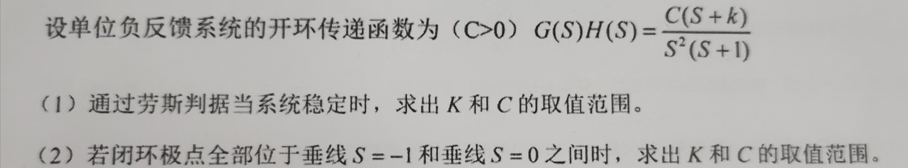
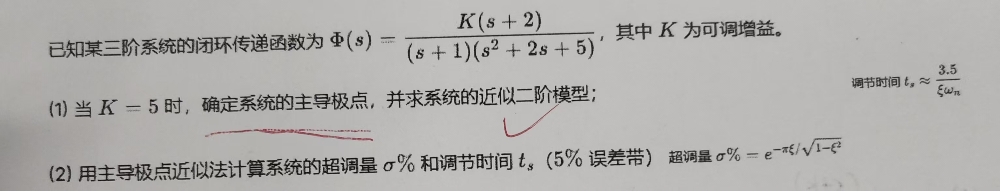
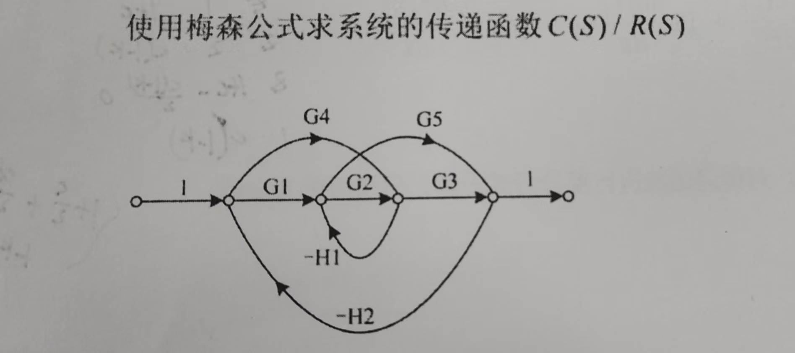

#review

## 题1

### （1）通过劳斯判据当系统稳定时，求出 $K$ 和 $C$ 的取值范围
闭环系统的特征方程为：
$$1 + G(s)H(s) = 0 \implies 1 + \frac{C(s+k)}{s^2(s+1)} = 0$$
展开整理得特征多项式为：
$$D(s) = s^3 + s^2 + Cs + Ck$$
根据特征多项式的系数，列出**劳斯（Routh）表**：

| 行 | 第一列 | 第二列 |
| :--- | :--- | :--- |
| $s^3$ | $1$ | $C$ |
| $s^2$ | $1$ | $Ck$ |
| $s^1$ | $\frac{1 \cdot C - 1 \cdot Ck}{1} = C(1-k)$ | $0$ |
| $s^0$ | $Ck$ | |

系统稳定充要条件为劳斯表第一列所有元素均大于 0。
已知 $C > 0$，所以有：
1. $C(1-k) > 0 \implies 1-k > 0 \implies k < 1$
2. $Ck > 0 \implies k > 0$

综上所述，当系统稳定时，参数 $K$（即 $k$）和 $C$ 的取值范围为：
* **$C > 0$**
* **$0 < K < 1$**

### （2）若闭环极点全部位于垂线 $S = -1$ 和垂线 $S = 0$ 之间时，求出 $K$ 和 $C$ 的取值范围

设闭环极点（即特征方程的根）为 $s_i$（$i=1,2,3$）。题目要求所有极点全部位于垂线 $s = -1$ 与 $s = 0$ 之间，即：
$$-1 < \text{Re}(s_i) < 0 \quad (i=1,2,3)$$

这是一个双侧约束，我们可以将其拆分为两个条件来求解：

#### 条件一：极点实部小于 0（$\text{Re}(s_i) < 0$）
这即是系统稳定的条件，由第（1）问可知，其对应的范围为：
$$C > 0 \quad \text{且} \quad 0 < k < 1$$

#### 条件二：极点实部大于 $-1$（$\text{Re}(s_i) > -1$）
为了应用劳斯判据，我们可以通过变量代换将这一边界平移到虚轴。
令新变量为 $w = -(s + 1)$，即 $s = -w - 1$。
则条件 $\text{Re}(s_i) > -1$ 对应于新变量实部满足：
$$\text{Re}(w_i) < 0$$
我们将 $s = -w - 1$ 代入特征方程 $D(s) = 0$ 中，整理得：
$$Q(w) = w^3 + 2w^2 + (1+C)w + C(1-k) = 0$$
>所以只要该式子满足劳斯判据，那么 $\text{Re}(w_i) < 0$，即 $\text{Re}(s_i) > -1$

要求所有根 $w_i$ 的实部均小于 $0$，我们可以对 $Q(w)$ 应用劳斯判据（或三阶多项式稳定性的赫尔维茨判据）：
对于三阶多项式 $w^3 + A_2 w^2 + A_1 w + A_0 = 0$，其稳定的充要条件为所有系数为正且 $A_2 A_1 > A_0$。
这里：
1. $A_2 = 2 > 0$（满足）
2. $A_1 = 1+C > 0 \implies C > -1$（由于已限制 $C > 0$，此条件自动满足）
3. $A_0 = C(1-k) > 0 \implies 1-k > 0 \implies k < 1$（由于已限制 $0 < k < 1$，此条件满足）
4. $A_2 A_1 > A_0 \implies 2(1+C) > C(1-k)$
   展开整理不等式：
   $$2 + 2C > C - Ck \implies C(1+k) + 2 > 0$$
   由于在条件一中我们已经有 $C > 0$ 且 $k > 0$，所以 $C(1+k) + 2$ 显然恒大于 0，该不等式自动成立。

因此，条件二在条件一的范围内是自然满足的。

### 最终取值范围：
* **$C > 0$**
* **$0 < K < 1$**

## 题2

### 主导极点（Dominant Poles）
在闭环系统的所有极点中，**距离虚轴最近**且**附近没有闭环零点抵消**的一对共轭复极点（或一个实极点）。
- **实际意义**：高阶系统可近似为以主导极点构成的**二阶系统**（或一阶系统）来分析，大幅简化计算。

## 题3

为了使用梅森公式（Mason's Gain Formula）求该系统的传递函数 $C(S)/R(S)$，我们需要找出图中的所有前向通路、所有单独回路，并计算图的特征式和各前向通路的余子式。

为了方便描述，我们按从左到右的顺序将四个内部节点分别标记为 $n_1, n_2, n_3, n_4$。
*   输入节点到 $n_1$ 的增益为 $1$
*   $n_4$ 到输出节点的增益为 $1$

梅森公式为：
$$ G = \frac{C(S)}{R(S)} = \frac{1}{\Delta} \sum_{k=1}^{n} P_k \Delta_k $$

**第一步：找出所有的前向通路（从输入到输出连续且不重复经过任何节点的路径）及其增益 $P_k$**

仔细观察信号流图，存在 $4$ 条前向通路：
1.  增益 $P_1 = \mathbf{G_1 G_2 G_3}$
2.  增益 $P_2 = \mathbf{G_3 G_4}$
3.  增益 $P_3 = \mathbf{G_1 G_5}$
4.  **交叉旁路 (容易遗漏)**: 增益 $P_4 = \mathbf{-G_4 G_5 H_1}$

**第二步：找出所有的单独回路（闭合且不重复经过任何节点的路径）及其增益 $L_m$**

共有 $5$ 个单独回路：
1.  增益 $L_1 = \mathbf{-G_2 H_1}$
2.  **外部主回路**: 经过 $n_1 \rightarrow n_2 \rightarrow n_3 \rightarrow n_4 \rightarrow n_1$
    增益 $L_2 = G_1 \cdot G_2 \cdot G_3 \cdot (-H_2) = \mathbf{-G_1 G_2 G_3 H_2}$
3.  **外部上侧回路**: 经过 $n_1 \rightarrow n_3 \rightarrow n_4 \rightarrow n_1$
    增益 $L_3 = G_4 \cdot G_3 \cdot (-H_2) = \mathbf{-G_3 G_4 H_2}$
4.  **外部下侧回路**: 经过 $n_1 \rightarrow n_2 \rightarrow n_4 \rightarrow n_1$
    增益 $L_4 = G_1 \cdot G_5 \cdot (-H_2) = \mathbf{-G_1 G_5 H_2}$
5.  **交叉大回路 (容易遗漏)**: 经过 $n_1 \rightarrow n_3 \rightarrow n_2 \rightarrow n_4 \rightarrow n_1$ (依次利用 $G_4, -H_1, G_5, -H_2$)
    增益 $L_5 = G_4 \cdot (-H_1) \cdot G_5 \cdot (-H_2) = \mathbf{G_4 G_5 H_1 H_2}$

**第三步：判断互不接触回路并计算特征式 $\Delta$**

观察所有的回路，它们都至少共享节点 $n_2$、$n_3$ 或同时共享节点 $n_1, n_4$。因此，**不存在**互不接触的回路（即没有哪两个回路是完全没有交点的）。
所以，特征式 $\Delta$ 的计算公式简化为：$\Delta = 1 - \sum L_m$

将上面的回路增益代入：
$$\Delta = 1 - (L_1 + L_2 + L_3 + L_4 + L_5)$$
$$\Delta = 1 - (-G_2 H_1 - G_1 G_2 G_3 H_2 - G_3 G_4 H_2 - G_1 G_5 H_2 + G_4 G_5 H_1 H_2)$$
$$\mathbf{\Delta = 1 + G_2 H_1 + G_1 G_2 G_3 H_2 + G_3 G_4 H_2 + G_1 G_5 H_2 - G_4 G_5 H_1 H_2}$$

**第四步：计算各前向通路的余子式 $\Delta_k$**

余子式 $\Delta_k$ 是将信号流图中与第 $k$ 条前向通路接触的部分去掉后，剩下部分的特征式。
*   所有的前向通路 ($P_1, P_2, P_3, P_4$) 在穿过时，都与所有的回路 ($L_1 \sim L_5$) 存在至少一个共同的节点（发生了接触）。
*   因此，所有去掉接触部分后的剩余图都为空（特征式为1）。
$$\mathbf{\Delta_1 = 1, \quad \Delta_2 = 1, \quad \Delta_3 = 1, \quad \Delta_4 = 1}$$

**第五步：代入梅森公式求传递函数**

将上述结果代入梅森公式：
$$ \frac{C(S)}{R(S)} = \frac{P_1 \Delta_1 + P_2 \Delta_2 + P_3 \Delta_3 + P_4 \Delta_4}{\Delta} $$

$$ \frac{C(S)}{R(S)} = \frac{G_1 G_2 G_3 \cdot 1 + G_3 G_4 \cdot 1 + G_1 G_5 \cdot 1 + (-G_4 G_5 H_1) \cdot 1}{1 + G_2 H_1 + G_1 G_2 G_3 H_2 + G_3 G_4 H_2 + G_1 G_5 H_2 - G_4 G_5 H_1 H_2} $$

最终系统的传递函数为：
$$ \mathbf{\frac{C(S)}{R(S)} = \frac{G_1 G_2 G_3 + G_3 G_4 + G_1 G_5 - G_4 G_5 H_1}{1 + G_2 H_1 + G_1 G_2 G_3 H_2 + G_3 G_4 H_2 + G_1 G_5 H_2 - G_4 G_5 H_1 H_2}} $$