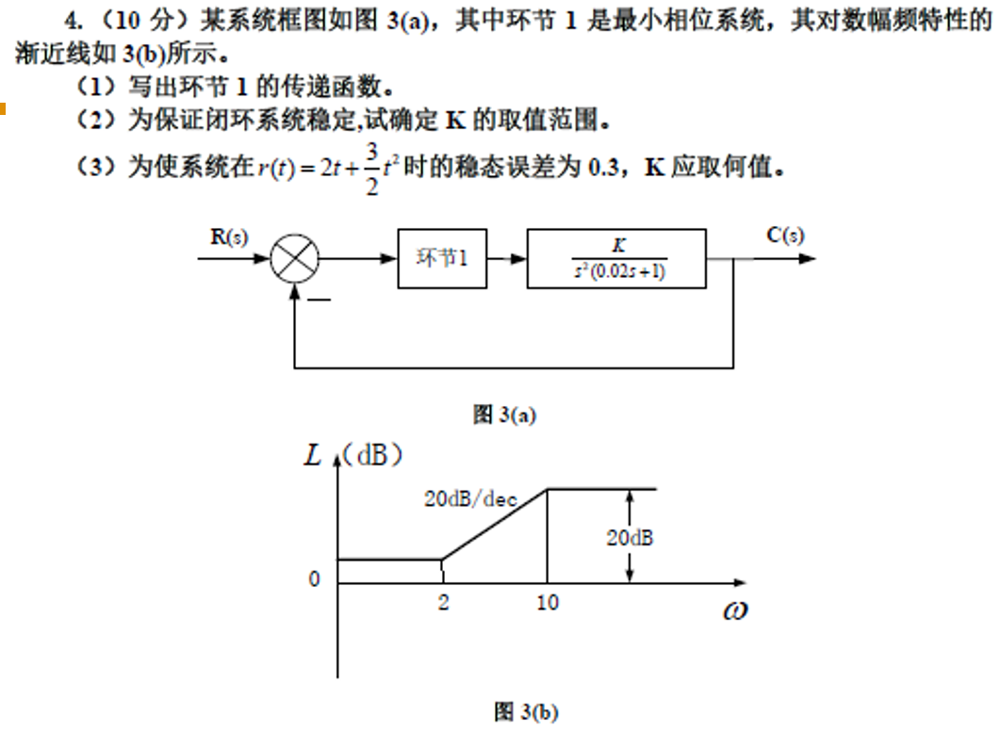

#review 

### (1) 写出环节 1 的传递函数。

由图观察到，环节 1 的传递函数形式为：
$$G_1(s) = K_1 \frac{0.5s + 1}{0.1s + 1}$$

**求解增益 $K_1$：**
从图 3(b) 可知，当 $\omega \ge 10$ 时（高频段），对数幅频特性的值为 $20 \text{ dB}$。
系统的高频增益为 $\lim_{\omega \to \infty} |G_1(j\omega)| = \lim_{\omega \to \infty} \left| K_1 \frac{0.5j\omega + 1}{0.1j\omega + 1} \right| = K_1 \frac{0.5}{0.1} = 5K_1$。
根据图象有：
$$20\log_{10}(5K_1) = 20$$
解得：
$$5K_1 = 10^{20/20} = 10 \implies K_1 = 2$$
> 这里也可以用斜率求出$20\lg K_1=20-20(\lg 10 - \lg2)=20\lg 2$

所以,  环节 1 的传递函数为：
$$G_1(s) = \frac{2(0.5s + 1)}{0.1s + 1} = \frac{s + 2}{0.1s + 1}$$

### (2) 为保证闭环系统稳定，试确定 $K$ 的取值范围。

**分析与计算：**
系统的开环传递函数为 $G_{ol}(s) = G_1(s) \cdot G_2(s)$：
$$G_{ol}(s) = \left( \frac{s + 2}{0.1s + 1} \right) \cdot \left( \frac{K}{s^2(0.02s + 1)} \right) = \frac{K(s + 2)}{s^2(0.1s + 1)(0.02s + 1)}$$

闭环系统的特征方程为 $1 + G_{ol}(s) = 0$：
$$1 + \frac{K(s + 2)}{s^2(0.1s + 1)(0.02s + 1)} = 0$$
展开并整理得到：
$$s^2(0.1s + 1)(0.02s + 1) + K(s + 2) = 0$$
$$s^2(0.002s^2 + 0.12s + 1) + Ks + 2K = 0$$
$$0.002s^4 + 0.12s^3 + s^2 + Ks + 2K = 0$$

为了方便计算，将等式两边同乘 500，得到各项系数为整数的特征方程：
$$s^4 + 60s^3 + 500s^2 + 500Ks + 1000K = 0$$

> 除了劳斯判据,也可以使用根轨迹法: 代入$s=j\omega$, 令实部和虚部都为零, 求出K

列出劳斯阵列（Routh Array）：
$$
\begin{array}{c|ccc}
s^4 & 1 & 500 & 1000K \\
s^3 & 60 & 500K & 0 \\
s^2 & \frac{60 \times 500 - 1 \times 500K}{60} & 1000K & 0 \\
s^1 & \frac{s^2_{col1} \times 500K - 60 \times 1000K}{s^2_{col1}} & 0 & \\
s^0 & 1000K & &
\end{array}
$$

化简阵列中的项：
*   $s^2$ 行第 1 列： $A = \frac{30000 - 500K}{60} = 500 - \frac{25}{3}K$
*   $s^1$ 行第 1 列： $B = \frac{A \cdot 500K - 60000K}{A} = \frac{500K(A - 120)}{A}$

根据劳斯判据，系统稳定的充要条件是劳斯阵列第一列所有元素均大于零：
1.  $60 > 0$ （显然成立）
2.  $A > 0 \implies 500 - \frac{25}{3}K > 0 \implies 1500 > 25K \implies K < 60$
3.  因为系统要稳定，$K$ 必大于 $0$ 且 $A > 0$，所以要使 $B > 0$，只需分子中的 $(A - 120) > 0$：
    $$500 - \frac{25}{3}K - 120 > 0 \implies 380 > \frac{25}{3}K \implies 1140 > 25K \implies K < 45.6$$
4.  $1000K > 0 \implies K > 0$

**结论：**
综合上述条件，取交集可得，为保证闭环系统稳定，$K$ 的取值范围为：
$$0 < K < 45.6$$

---

### (3) 为使系统在 $r(t)=2t+\frac{3}{2}t^2$ 时的稳态误差为 0.3，$K$ 应取何值。

**分析与计算：**
观察开环传递函数 $G_{ol}(s) = \frac{K(s + 2)}{s^2(0.1s + 1)(0.02s + 1)}$，分母中含有 $s^2$ 项，可知该系统是一个 **II 型系统**。

> 这里也可以直接代公式$e_{ss}=\dots$

输入信号 $r(t) = 2t + \frac{3}{2}t^2$，由两部分组成：
1.  **斜坡输入 $r_1(t) = 2t$**：对于 II 型系统，其对斜坡输入的稳态误差为 $0$（因为速度误差系数 $K_v = \infty$）。
2.  **抛物线输入 $r_2(t) = \frac{3}{2}t^2 = 3 \cdot (\frac{1}{2}t^2)$**：对应标准抛物线输入 $\frac{1}{2}Rt^2$ 中 $R = 3$。其稳态误差由加速度误差系数 $K_a$ 决定。

计算加速度误差系数 $K_a$：
$$K_a = \lim_{s \to 0} s^2 G_{ol}(s) = \lim_{s \to 0} s^2 \frac{K(s + 2)}{s^2(0.1s + 1)(0.02s + 1)} = \frac{K(0 + 2)}{(0 + 1)(0 + 1)} = 2K$$

计算总稳态误差 $e_{ss}$：
根据叠加原理，总稳态误差等于各输入分量引起的稳态误差之和。
$$e_{ss} = e_{ss1} + e_{ss2} = 0 + \frac{R}{K_a} = \frac{3}{2K}$$

根据题意，稳态误差为 0.3：
$$\frac{3}{2K} = 0.3$$
解得：
$$2K = \frac{3}{0.3} = 10 \implies K = 5$$

最后，校验求得的 $K$ 值是否使系统稳定。由第 (2) 问可知稳定区间为 $0 < K < 45.6$，求得的 $K=5$ 处于该区间内，系统是稳定的，因此结果有效。

**结论：**
为使系统满足要求的稳态误差，$K$ 应取值为：
$$K = 5$$

