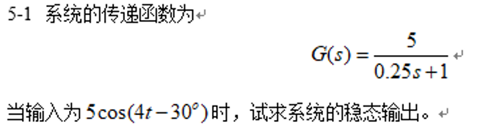
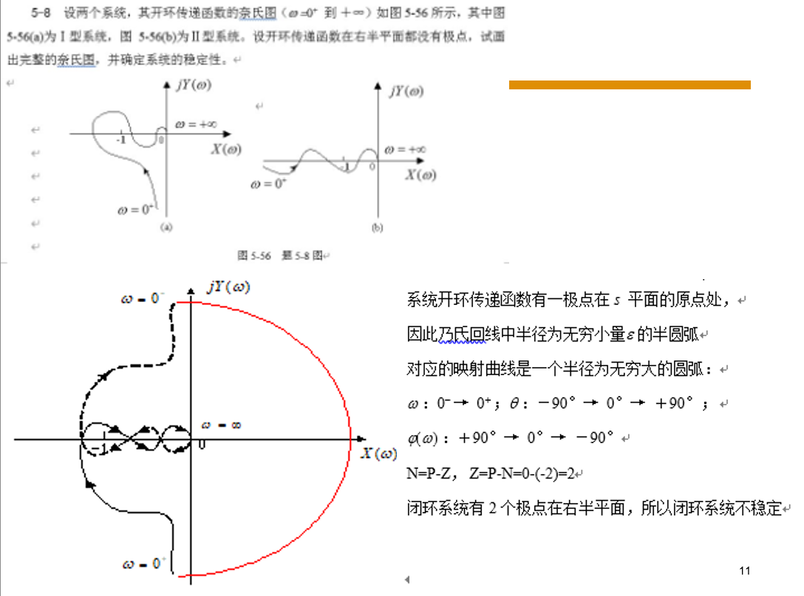
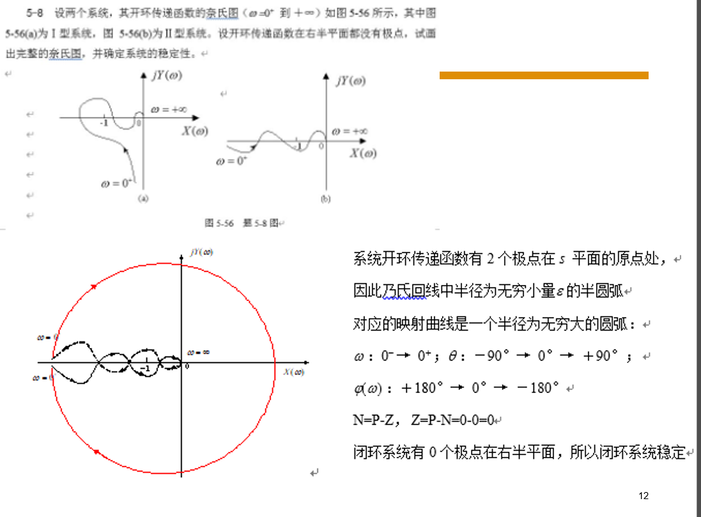

## 题1

解：系统的频率特性为 $G(j\omega) = \frac{5}{0.25j\omega + 1}$

系统的幅频特性和相频特性分别为 $A(\omega) = \frac{5}{\sqrt{(0.25\omega)^2 + 1}}$　　$\varphi(\omega) = -\arctan(0.25\omega)$

输入 $r(t) = 5\cos(4t - 30^\circ) = 5\sin(4t + 60^\circ)$　　$\omega = 4$

$A(4) = \frac{5}{\sqrt{(0.25 \times 4)^2 + 1}} = 2.5\sqrt{2}$　　$\varphi(4) = -\arctan(0.25 \times 4) = -45^\circ$

系统的稳态输出为
$c(t) = A(4) \times 5\cos[4t - 30^\circ + \varphi(4)]$
$\quad\ \ = 2.5\sqrt{2} \times 5\cos(4t - 30^\circ - 45^\circ)$
$\quad\ \ = 17.68\cos(4t - 75^\circ) = 17.68\sin(4t + 15^\circ)$

对于 $\cos$ 信号输入下的稳态输出计算规律与 $\sin$ 信号作用下计算相同。

## 题2

