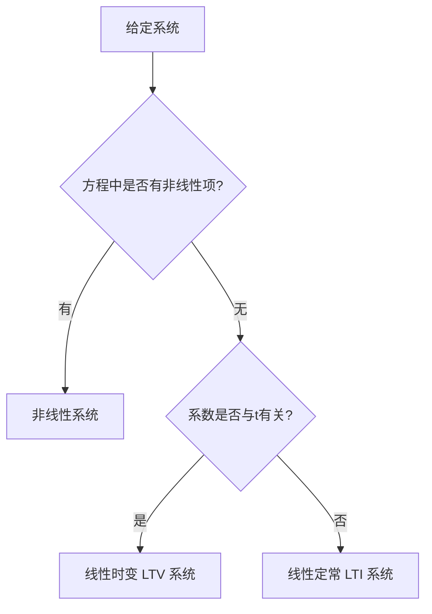

p8 1-6
## 系统基本分类

在自动控制原理中，系统主要按以下两个维度分类：

- **线性与非线性**
- **时变与时不变（定常）**

最常用、最易分析的一类系统是**线性定常系统（LTI，Linear Time-Invariant）**。

---

## 1. 线性系统 vs 非线性系统

### 定义
一个系统若同时满足**叠加性**和**齐次性**，则称为线性系统。

设系统输入为 $x(t)$，输出为 $y(t)$，则对任意常数 $\alpha,\beta$ 有：
$$
y[\alpha x_1(t)+\beta x_2(t)] = \alpha y[x_1(t)] + \beta y[x_2(t)]
$$

### 判断方法
1. 观察系统微分/差分方程中是否只包含输入、输出及其各阶导数（或差分）的**线性组合**，且**系数与输入输出无关**。
2. 检查系统是否同时满足**齐次性**和**叠加性**。
3. 若方程中出现输入或输出的**乘积项**、**高次方项**（如 $x^2(t)$、$x(t)\cdot y(t)$、$\sin x(t)$ 等），则为非线性系统。

**示例**：
- 线性：$\ddot{y}+3\dot{y}+2y = \dot{x}+x$
- 非线性：$\ddot{y}+y\dot{y} = x$（含 $y\dot{y}$ 乘积项）

---

## 2. 时不变（定常）系统 vs 时变系统

### 定义
- **时不变系统（定常系统）**：系统的特性不随时间变化。若输入 $x(t)$ 产生输出 $y(t)$，则延迟后的输入 $x(t-\tau)$ 产生的输出也为 $y(t-\tau)$。
- **时变系统**：系统参数随时间变化，特性与时间有关。

### 数学表示
- **线性定常（LTI）** 系统微分方程系数均为**常数**：
  $$
  a_n\frac{d^n y}{dt^n} + \cdots + a_1\dot{y} + a_0 y = b_m\frac{d^m x}{dt^m} + \cdots + b_0 x
  $$
- **线性时变（LTV）** 系统系数是 $t$ 的函数（如 $a_0(t), b_i(t)$）。

### 判断方法（核心）
1. **时域判断**：
   - 将输入延迟 $\tau$，观察输出是否也恰好延迟 $\tau$。
   - 若系统方程中**系数与时间 $t$ 显式相关**（如含 $t$、$\sin t$、$e^{-t}$ 等），则为时变系统。

2. **参数判断**：
   - 系统参数（电阻、电感、增益、质量等）是否随时间变化。
   - 电路中若出现时变元件（如变容二极管、变压器随时间移动），则为时变系统。

**示例**：
- **线性定常**：$RC$ 电路（$R,C$ 为常数）
- **线性时变**：$y(t) = t \cdot x(t)$（系数含 $t$）
- **非线性时不变**：$y(t) = x^2(t)$
- **非线性时变**：$y(t) = t \cdot x^2(t)$

---

## 3. 线性定常系统（LTI）的意义

LTI 系统具有以下重要性质：
- 满足**叠加原理**
- 可用**卷积积分**描述：$y(t) = h(t)*x(t)$
- 存在**传递函数** $G(s) = \frac{Y(s)}{X(s)}$
- 可用**状态空间**模型 $\dot{\mathbf{x}}=A\mathbf{x}+B\mathbf{u}$ 表示（$A,B$ 为常数矩阵）
- 频率响应分析、根轨迹、 Bode 图等经典方法均适用于 LTI 系统

---

## 4. 判断流程（推荐）

**快速判断口诀**：
- 看**乘积和高次方** → 非线性
- 看**系数是否含t** → 时变
- 两者都没有 → **线性定常（LTI）**

---

## 5. 典型例题

**例1** 判断下列系统是否为线性定常系统：
1. $y(t) = 3x(t)+2$
2. $\ddot{y}+2\dot{y}+y = x(t-1)$
3. $y(t) = tx(t)+\sin x(t)$

**答案**：
1. 非线性（含常数项，不满足齐次性）
2. 线性定常（LTI）
3. 非线性且时变

---

**参考标签**：`#自动控制原理 #系统分类 #线性系统 #LTI #LTV`

---

**笔记使用建议**：
- 可与《传递函数》、《状态空间》、《时域分析》笔记建立双向链接
- 建议后续补充**连续 vs 离散系统**、**确定性 vs 随机系统**内容

需要我补充**相图**、**更多例题**、**LTI系统性质证明**还是**与非线性系统对比表格**？